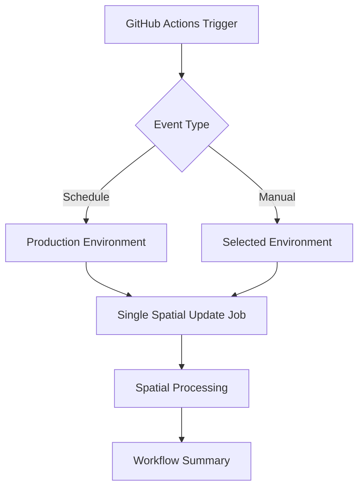

# GitHub Actions Workflows

This directory contains automated workflows for the CAMS Utilities project.

## 🔄 Spatial Field Updater Workflow

The `spatial-field-updater.yml` workflow provides automated daily processing of weed location spatial assignments.

### 🎯 Features

- **🕰️ Scheduled Runs**: Daily execution at 6 AM UTC (7-8 PM NZ time) on production environment
- **⚡ Manual Triggers**: On-demand execution with configurable options
- **🌍 Environment Selection**: Choose development or production environment
- **📊 Processing Modes**: Changed records (incremental) or full dataset processing
- **📈 Workflow Summary**: Real-time statistics showing updated and unassigned points
- **💾 Audit Table Storage**: Timestamps stored in ArcGIS audit table for reliable state management
- **⚡ Streamlined**: Simplified single-job execution with minimal overhead

### 🔧 Setup Instructions

#### 1. Configure GitHub Secrets

Add the following secrets to your repository (`Settings` → `Secrets and variables` → `Actions`):

**Development Environment:**
- `ARCGIS_USERNAME_DEV` - ArcGIS username for development
- `ARCGIS_PASSWORD_DEV` - ArcGIS password for development  
- `ARCGIS_PORTAL_URL_DEV` - ArcGIS portal URL for development

**Production Environment:**
- `ARCGIS_USERNAME_PROD` - ArcGIS username for production
- `ARCGIS_PASSWORD_PROD` - ArcGIS password for production
- `ARCGIS_PORTAL_URL_PROD` - ArcGIS portal URL for production

#### 2. Environment Configuration

Ensure your `spatial_field_updater/config/environment_config.json` contains the required layer IDs for each environment. See the [spatial field updater configuration documentation](../spatial_field_updater/README.md#configuration) for details.

### 🚀 Usage

#### Scheduled Execution
The workflow runs automatically daily at 6 AM UTC (7-8 PM NZ time) on the `production` environment using the `changed` mode (incremental processing).

#### Manual Execution
Go to `Actions` → `CAMS Spatial Field Updater` → `Run workflow`

**Options:**
- **Environment**: Choose `development` or `production`
- **Processing Mode**: 
  - `changed` - Only process records modified since last run (recommended)
  - `all` - Process all records (use for testing or data refresh)
- **Sample Size**: Specify a number to process only a subset (for testing)

### 📊 Workflow Steps

1. **🏗️ Setup**: Checkout code, install Python, install dependencies
2. **🔧 Configure**: Set environment variables and credentials
3. **🎯 Process**: Run the spatial field updater script (handles timestamp management internally)
4. **📊 Summary**: Generate processing statistics

### 💾 State Storage

**Timestamp Storage** (permanent):
- **ArcGIS Audit Table**: Timestamps stored in "CAMS Process Audit" table
- **Per-Environment**: Separate records for development and production environments
- **Process-Specific**: Supports multiple CAMS utilities sharing the same audit table
- **Reliable**: Direct integration with ArcGIS platform eliminates external dependencies

### 🔍 Monitoring

#### Success Indicators
- ✅ All steps complete without errors
- ✅ Spatial assignments updated successfully
- ✅ Workflow summary generated with statistics
- ✅ Timestamp stored in ArcGIS audit table

#### Failure Scenarios
- ❌ Authentication failures (check secrets)
- ❌ Network issues (automatic retry built-in)
- ❌ Data validation errors (check source data)

### 🛠️ Troubleshooting

#### Common Issues

**"Environment not found in configuration"**
- Verify `spatial_field_updater/config/environment_config.json` contains the specified environment
- Check that all required layer IDs are present

**"Authentication failed"**
- Verify GitHub secrets are correctly set
- Check that credentials have access to the specified portal and layers

**"No features to process"** 
- Normal for incremental runs when no changes occurred
- Use `mode: all` to force processing all records

**"Processing all records unexpectedly"**
- Check if audit table contains timestamp records for the environment
- Verify script can access the ArcGIS audit table (table ID: eb9b12249d794244ad82e54ad42dd58e)
- First run on an environment will process all records and create initial audit record

**Timestamp/State Issues**
- Timestamps are stored in the "CAMS Process Audit" ArcGIS table
- Each environment (dev/prod) maintains separate audit records
- ProcessName field identifies the specific utility ("spatial_field_updater")

#### Debugging Steps

1. **Review Logs**: Check detailed logs in the workflow run page
2. **Test Manually**: Use `workflow_dispatch` with sample size for testing
3. **Check Permissions**: Ensure service account has edit permissions on target layers
4. **Check Summary**: Review workflow summary for processing statistics

### 📈 Performance

Expected processing times:
- **5,000 records**: ~2-5 minutes
- **54,000 records**: ~10-15 minutes  
- **100,000+ records**: ~20-30 minutes

The workflow has a 30-minute timeout for streamlined execution.

### 🔒 Security

- **Credentials**: Stored securely in GitHub Secrets
- **Environment Separation**: Dev/prod credentials are completely separate
- **Principle of Least Privilege**: Each environment uses dedicated service accounts
- **Audit Trail**: All runs are logged with detailed workflow summaries

### 🏗️ Architecture

This simplified workflow provides reliable, automated spatial field updates with streamlined execution and comprehensive statistics.