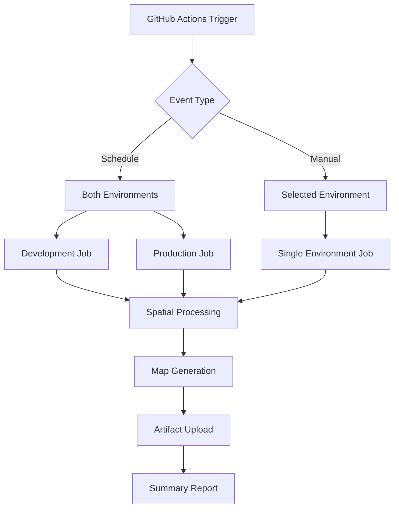

# GitHub Actions Workflows

This directory contains automated workflows for the CAMS Utilities project.

## 🔄 Spatial Field Updater Workflow

The `spatial-field-updater.yml` workflow provides automated daily processing of weed location spatial assignments.

### 🎯 Features

- **🕰️ Scheduled Runs**: Daily execution at 6 AM UTC (7-8 PM NZ time)
- **⚡ Manual Triggers**: On-demand execution with configurable options
- **🌍 Multi-Environment**: Support for development and production environments
- **📊 Processing Modes**: Changed records (incremental) or full dataset processing
- **🗺️ Map Generation**: Optional visualization maps and analysis reports
- **📦 Artifact Storage**: Logs, maps, and reports stored for 30 days
- **🔔 Error Notifications**: Failure alerts for scheduled runs

### 🔧 Setup Instructions

#### 1. Configure GitHub Secrets

Add the following secrets to your repository (`Settings` → `Secrets and variables` → `Actions`):

**Development Environment:**
- `ARCGIS_USERNAME_DEV` - ArcGIS username for development
- `ARCGIS_PASSWORD_DEV` - ArcGIS password for development  
- `ARCGIS_PORTAL_URL_DEV` - ArcGIS portal URL for development

**Production Environment:**
- `ARCGIS_USERNAME_PROD` - ArcGIS username for production
- `ARCGIS_PASSWORD_PROD` - ArcGIS password for production
- `ARCGIS_PORTAL_URL_PROD` - ArcGIS portal URL for production

#### 2. Environment Configuration

Ensure your `config/environment_config.json` contains the required layer IDs:

```json
{
  "development": {
    "weed_locations_layer_id": "your_dev_layer_id",
    "region_layer_id": "your_region_layer_id",
    "district_layer_id": "your_district_layer_id"
  },
  "production": {
    "weed_locations_layer_id": "your_prod_layer_id",
    "region_layer_id": "your_region_layer_id", 
    "district_layer_id": "your_district_layer_id"
  }
}
```

### 🚀 Usage

#### Scheduled Execution
The workflow runs automatically daily at 6 AM UTC. It processes both development and production environments using the `changed` mode (incremental processing).

#### Manual Execution
Go to `Actions` → `CAMS Spatial Field Updater` → `Run workflow`

**Options:**
- **Environment**: Choose `development` or `production`
- **Processing Mode**: 
  - `changed` - Only process records modified since last run (recommended)
  - `all` - Process all records (use for testing or data refresh)
- **Generate Maps**: Enable/disable visualization map generation
- **Sample Size**: Specify a number to process only a subset (for testing)

### 📊 Workflow Steps

1. **🏗️ Setup**: Checkout code, install Python, install dependencies
2. **🔧 Configuration**: Set environment variables and validate configuration
3. **🎯 Spatial Processing**: Run the spatial field updater script
4. **🗺️ Map Generation**: Create visualization maps (optional)
5. **📊 Reporting**: Generate summary reports
6. **📦 Artifacts**: Upload logs, maps, and reports
7. **🔔 Notifications**: Alert on failures (scheduled runs only)

### 📁 Artifacts

Each workflow run generates artifacts containing:
- **Logs**: Detailed execution logs for each step
- **Summary Report**: Markdown report with run details and status
- **Maps**: PNG/HTML visualization maps (if enabled)
- **Timestamps**: Last run timestamp files for change detection

Artifacts are retained for 30 days and can be downloaded from the workflow run page.

### 🔍 Monitoring

#### Success Indicators
- ✅ All steps complete without errors
- ✅ Spatial assignments updated successfully
- ✅ Maps generated (if enabled)
- ✅ Artifacts uploaded

#### Failure Scenarios
- ❌ Authentication failures (check secrets)
- ❌ Configuration errors (check environment_config.json)
- ❌ Network issues (automatic retry built-in)
- ❌ Data validation errors (check source data)

### 🛠️ Troubleshooting

#### Common Issues

**"Environment not found in configuration"**
- Verify `config/environment_config.json` contains the specified environment
- Check that all required layer IDs are present

**"Authentication failed"**
- Verify GitHub secrets are correctly set
- Check that credentials have access to the specified portal and layers

**"No features to process"** 
- Normal for incremental runs when no changes occurred
- Use `mode: all` to force processing all records

**Map generation failures**
- Maps are optional and won't fail the main processing
- Check if spatial data is valid and accessible

#### Debugging Steps

1. **Check Configuration**: Review the "Validate Configuration" step output
2. **Review Logs**: Download artifacts and check detailed logs
3. **Test Manually**: Use `workflow_dispatch` with sample size for testing
4. **Check Permissions**: Ensure service account has edit permissions on target layers

### 📈 Performance

Expected processing times:
- **5,000 records**: ~2-5 minutes
- **54,000 records**: ~10-15 minutes  
- **100,000+ records**: ~20-30 minutes

The workflow has a 60-minute timeout to accommodate large datasets.

### 🔒 Security

- **Credentials**: Stored securely in GitHub Secrets
- **Environment Separation**: Dev/prod credentials are completely separate
- **Principle of Least Privilege**: Each environment uses dedicated service accounts
- **Audit Trail**: All runs are logged and artifacts stored

### 🏗️ Architecture



This workflow provides reliable, automated spatial field updates with comprehensive monitoring and error handling.