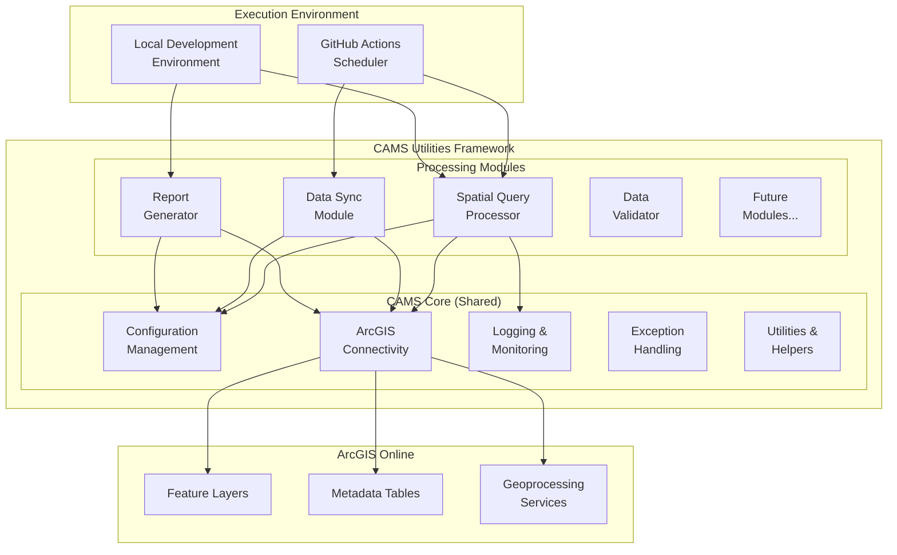
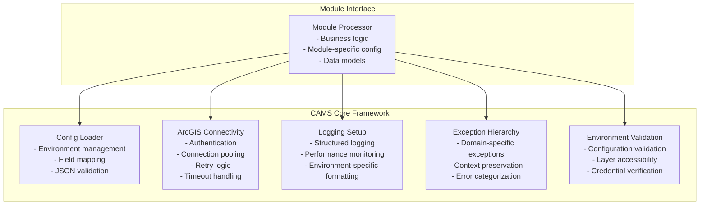
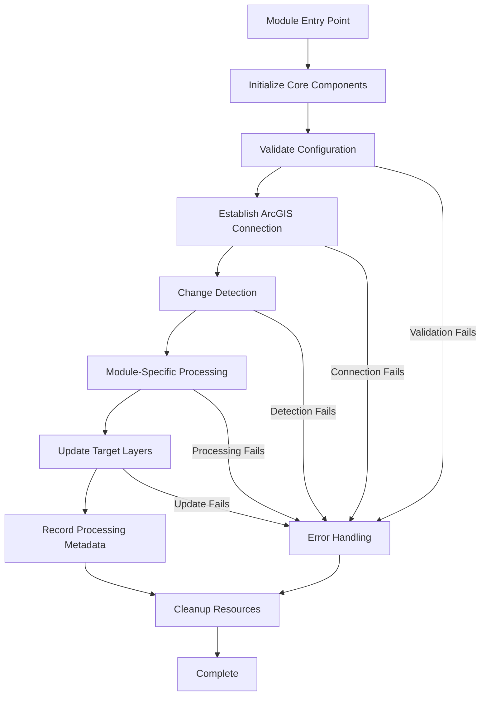
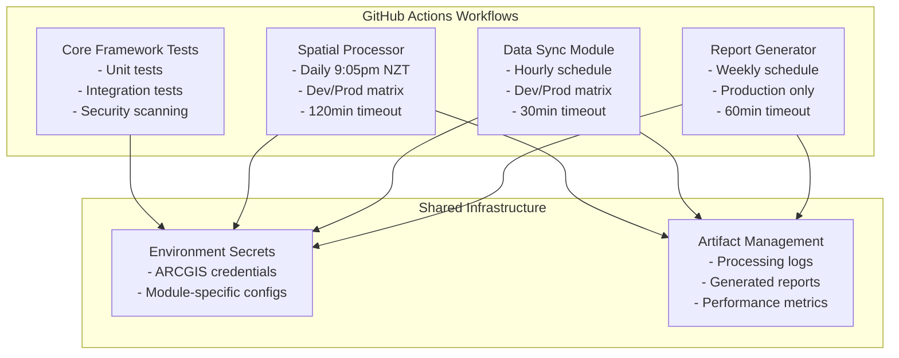

# CAMS Utilities - System Architecture and Design

## Overview

This document defines the modular architecture for CAMS Utilities, a shared framework for building ArcGIS-based automation tools for the CAMS (Conservation Activity Management System) platform. The architecture supports multiple processing modules through a common core, with the Spatial Query Optimization system as the first implementation.

## Business Context

The CAMS platform requires various automated processing tasks that interact with ArcGIS Online data. Rather than building separate, standalone tools, this architecture provides a shared foundation for multiple processing modules.

### Initial Use Case: Spatial Query Optimization
- **Problem**: CAMS dashboard experiences slow response times due to real-time spatial queries when filtering 50,000+ weed records by region/district
- **Solution**: Daily batch processing to pre-calculate spatial relationships
- **Benefit**: Sub-second dashboard response times and improved user experience

### Future Use Cases
- **Data Synchronization**: Automated sync between different ArcGIS layers
- **Report Generation**: Scheduled report creation from CAMS data
- **Data Validation**: Automated quality checks and corrections
- **Annual Rollover Process**: Automated year-end data archival and new year setup
- **Workflow Automation**: Complex business process automation

## Architecture Principles

### Modularity
- **Shared Core**: Common functionality abstracted into reusable components
- **Pluggable Modules**: Processing modules can be independently developed and deployed
- **Clear Interfaces**: Well-defined contracts between core and modules
- **Independent Configuration**: Each module manages its own specific configuration

### Reliability
- **Idempotent Operations**: All processes can be safely rerun without data corruption
- **Fail-Safe Processing**: No metadata updates on any processing failures
- **Incremental Processing**: Only process changed data to minimize resource usage
- **Isolated Failures**: Module failures don't affect core infrastructure

### Maintainability
- **Configuration-Driven**: External configuration files for environment-specific settings
- **Environment Separation**: Clear separation between development and production
- **Logging and Monitoring**: Comprehensive process tracking and status reporting
- **Code Reuse**: Shared components reduce duplication across modules

### Scalability
- **Extensible Design**: Architecture supports unlimited additional modules
- **Batch Processing**: Optimized for handling growing data volumes
- **Resource Efficiency**: Minimal processing through change detection
- **Horizontal Scaling**: Multiple modules can run concurrently

## System Architecture

### High-Level Modular Architecture



### Modular Design Benefits

- **Code Reuse**: Core components shared across all modules
- **Independent Development**: Modules can be developed and deployed separately  
- **Flexible Deployment**: Run individual modules or combinations as needed
- **Easier Testing**: Core components tested once, modules focus on business logic
- **Simplified Maintenance**: Bug fixes in core benefit all modules

### Technology Stack

#### Core Framework
- **Python 3.12**: Latest version supported by ArcGIS API for Python
- **ArcGIS API for Python ≥2.4.1**: ArcGIS Online integration
- **Tenacity ≥8.0.0**: Retry patterns for API resilience  
- **func-timeout ≥4.3.0**: Request timeouts for reliability
- **python-dateutil ≥2.8.0**: Date parsing and timezone handling
- **python-dotenv ≥1.0.0**: Environment variable management
- **jsonschema ≥4.17.0**: Configuration validation

#### Development & Testing
- **pytest ≥7.0.0**: Testing framework
- **pytest-cov ≥4.0.0**: Test coverage reporting
- **requests ≥2.28.0**: HTTP client library
- **urllib3 ≥1.26.0**: URL handling utilities

#### Module-Specific Dependencies
- Modules can define additional dependencies in their own requirements files
- Core dependencies are inherited by all modules
- Version compatibility maintained through shared requirements

### Modular Project Structure

```
cams-utilities/
├── README.md                        # Project overview and setup
├── requirements.txt                 # Core framework dependencies
├── example_usage.py                 # Demonstration of all modules
│
├── src/                             # CAMS Core Framework (Shared)
│   ├── __init__.py
│   ├── config/                      # Configuration management
│   │   ├── __init__.py
│   │   └── config_loader.py        # Environment and field mapping
│   ├── connection/                  # ArcGIS connectivity
│   │   ├── __init__.py
│   │   ├── auth_handler.py         # Authentication management
│   │   ├── arcgis_connector.py     # Connection with retry/timeout
│   │   ├── environment_validator.py # Environment validation
│   │   └── connection_tester.py    # Connectivity testing
│   ├── utils/                       # Shared utilities
│   │   ├── __init__.py
│   │   └── logging_setup.py        # Structured logging
│   └── exceptions/                  # Exception hierarchy
│       ├── __init__.py
│       └── custom_exceptions.py    # Domain-specific exceptions
│
├── config/                          # Shared configuration files
│   ├── environment_config.json     # Environment-specific settings
│   └── field_mapping.json          # ArcGIS field definitions
│
├── modules/                         # Processing modules
│   ├── spatial_query_processor/    # Spatial optimization module
│   │   ├── __init__.py
│   │   ├── main.py                 # Module entry point
│   │   ├── config/
│   │   │   └── spatial_config.json # Module-specific configuration
│   │   ├── processor/              # Spatial processing logic
│   │   │   ├── __init__.py
│   │   │   ├── spatial_processor.py
│   │   │   ├── change_detector.py
│   │   │   └── metadata_manager.py
│   │   ├── models/                 # Data models
│   │   │   ├── __init__.py
│   │   │   ├── weed_location.py
│   │   │   └── process_metadata.py
│   │   └── tests/                  # Module-specific tests
│   │       ├── __init__.py
│   │       ├── test_spatial_processor.py
│   │       └── test_change_detector.py
│   │
│   ├── data_sync_module/           # Future: Data synchronization
│   │   ├── __init__.py
│   │   ├── main.py
│   │   ├── config/
│   │   ├── sync/
│   │   └── tests/
│   │
│   └── report_generator/           # Future: Automated reporting
│       ├── __init__.py
│       ├── main.py
│       ├── config/
│       ├── reports/
│       └── tests/
│
├── tests/                          # Core framework tests
│   ├── __init__.py
│   ├── config/
│   │   └── test_config_loader.py
│   ├── connection/
│   │   ├── test_auth_handler.py
│   │   └── test_arcgis_connector.py
│   ├── utils/
│   │   └── test_logging.py
│   └── exceptions/
│       └── test_exceptions.py
│
├── .github/                        # CI/CD workflows
│   └── workflows/
│       ├── spatial-processor.yml   # Spatial query processor
│       ├── data-sync.yml          # Data sync module
│       └── core-tests.yml         # Core framework tests
│
├── docs/                           # Documentation
│   ├── project/
│   │   ├── ARCHITECTURE.md         # This document
│   │   └── ROADMAP.md             # Development roadmap
│   └── modules/                    # Module-specific documentation
│       ├── spatial_query_processor/
│       ├── data_sync_module/
│       └── report_generator/
│
└── logs/                           # Log output directory
    ├── spatial_processor/
    ├── data_sync/
    └── core/
```

### Module Development Pattern

Each processing module follows a consistent structure:

```
modules/{module_name}/
├── __init__.py                     # Module interface
├── main.py                        # CLI entry point
├── config/                        # Module configuration
│   └── {module}_config.json
├── {domain}/                      # Core business logic
│   ├── __init__.py
│   └── {module}_processor.py
├── models/                        # Data models (if needed)
├── tests/                         # Module tests
└── README.md                      # Module documentation
```

## Core Framework Components

### Shared Core Architecture

The CAMS Core provides shared functionality that all processing modules can leverage:



### Module Interface Contract

All processing modules must implement a standard interface:

```python
class ModuleProcessor(ABC):
    """Base interface for all CAMS processing modules."""
    
    @abstractmethod
    def __init__(self, config_loader: ConfigLoader):
        """Initialize module with shared configuration."""
        pass
    
    @abstractmethod
    def validate_configuration(self) -> bool:
        """Validate module-specific configuration."""
        pass
    
    @abstractmethod
    def process(self, dry_run: bool = False) -> ProcessingResult:
        """Execute module processing logic."""
        pass
    
    @abstractmethod
    def get_status(self) -> ModuleStatus:
        """Get current module processing status."""
        pass
```

### Core Component Details

#### ConfigLoader (Shared)
- **Purpose**: Centralized configuration management
- **Features**: Environment-specific settings, field mapping, JSON validation
- **Caching**: LRU cache for performance optimization
- **Extension**: Modules can extend with additional configuration files

#### ArcGIS Connectivity (Shared)
- **Components**: AuthHandler, ArcGISConnector, EnvironmentValidator, ConnectionTester
- **Features**: Retry logic, timeout handling, connection pooling, environment validation
- **Security**: No credential logging, secure authentication management
- **Testing**: Built-in connectivity and layer access testing

#### Logging Infrastructure (Shared)
- **Format**: JSON structured logging for production, standard format for development
- **Performance**: Built-in performance monitoring decorators
- **Rotation**: Automatic log rotation and archival
- **Module Support**: Module-specific log channels and formatting

#### Exception Handling (Shared)
- **Hierarchy**: CAMSBaseException with context preservation
- **Categories**: Authentication, Configuration, Connection, Processing, Validation
- **Context**: Rich error context for debugging and monitoring
- **Module Extensions**: Modules can define domain-specific exceptions

## Data Architecture

### Shared Data Management

The framework provides standardized patterns for data access and management that all modules can leverage:

#### Environment Configuration Pattern
- **Development/Production Separation**: All modules use environment-specific layer IDs and settings
- **Shared Layer Configuration**: Common layers (regions, districts) shared across modules
- **Module-Specific Layers**: Each module can define additional layers in their configuration

#### Field Mapping Pattern
- **Standardized Mapping**: JSON-based field name mapping for consistent ArcGIS access
- **Data Type Validation**: Built-in validation for field types and constraints
- **Module Extensions**: Modules can extend field mappings for domain-specific fields

#### Metadata Management Pattern
- **Processing Status Tracking**: Standardized metadata tables for all modules
- **Version Control**: Layer version tracking for change detection
- **Environment Naming**: Consistent DEV suffixes for development metadata

### Example: Spatial Query Processor Data Model

As the first implemented module, the Spatial Query Processor demonstrates the data architecture patterns:

#### Primary Data Layers

**WeedLocations Layer (Module-Specific)**:
- **Purpose**: Primary feature layer containing weed instances
- **Key Fields**: OBJECTID, GlobalID, RegionCode, DistrictCode, EditDate_1, geometry
- **Environment Config**: Separate dev/prod layer IDs in environment_config.json

**Area Boundary Layers (Shared)**:
- **Region Layer**: Layer ID 7759fbaecd4649dea39c4ac2b07fc4ab
  - Source Field: REGC_code (region codes)
  - Target Field: RegionCode in WeedLocations
- **District Layer**: Layer ID c8f6ba6b968c4d31beddfb69abfe3df0
  - Source Field: TALB_code (district codes)  
  - Target Field: DistrictCode in WeedLocations

#### Module Metadata Table

**Weeds Area Metadata Table**:
- **Purpose**: Track spatial processing status and layer versions
- **Fields**: ProcessTimestamp, RegionLayerID, RegionLayerUpdated, DistrictLayerID, DistrictLayerUpdated, ProcessStatus, RecordsProcessed
- **Environment Naming**: 
  - Production: `Weeds Area Metadata`
  - Development: `XXX Weeds Area Metadata DEV`

### Data Architecture for Future Modules

New modules follow the same patterns:

#### Data Sync Module (Future)
- **Source/Target Layers**: Module-specific layer configurations
- **Sync Metadata Table**: Track synchronization status and timestamps
- **Shared Components**: Reuse region/district layers as needed

#### Report Generator Module (Future)
- **Input Layers**: Configurable layer selection for report generation
- **Report Metadata Table**: Track report generation status and output locations
- **Template Management**: Reusable report templates and formatting

## Core Processing Architecture

### Framework Processing Patterns

The CAMS Framework defines standard processing patterns that all modules implement:



### Standard Processing Components

All modules leverage these shared processing components:

#### Core Workflow Manager
- **Purpose**: Orchestrate module execution with standard error handling
- **Features**: Dry-run support, progress tracking, resource cleanup
- **Interface**: Common entry point for all modules

#### Change Detection Framework
- **Purpose**: Identify data that requires processing
- **Strategies**: Timestamp-based, metadata comparison, full reprocessing
- **Optimization**: Skip unchanged data to minimize processing time

#### ArcGIS Integration Layer
- **Purpose**: Reliable ArcGIS Online interactions
- **Features**: Connection pooling, retry logic, timeout handling, batch operations
- **Performance**: Optimized for large-scale data operations

#### Metadata Management Framework
- **Purpose**: Track processing status and data versions
- **Pattern**: Fail-safe updates (only write on success)
- **Monitoring**: Standardized status reporting for all modules

### Example: Spatial Query Processor Implementation

The Spatial Query Processor demonstrates the framework patterns:

#### Spatial Processing Workflow
1. **Change Detection**: Compare area layer metadata and check EditDate_1 for modified weeds
2. **Spatial Analysis**: Perform intersection queries between weed locations and boundaries
3. **Assignment Updates**: Update RegionCode and DistrictCode fields in WeedLocations
4. **Metadata Recording**: Write processing status and layer versions to metadata table

#### Spatial-Specific Components

**SpatialProcessor**: Implements ModuleProcessor interface with spatial query logic
- Uses shared ArcGIS connectivity for layer access
- Leverages change detection framework for incremental processing
- Follows standard metadata management patterns

**SpatialChangeDetector**: Extends change detection framework
- Compares area layer "Date updated" with stored metadata
- Identifies weeds modified since last processing via EditDate_1
- Determines full vs incremental reprocessing needs

**SpatialMetadataManager**: Implements metadata framework patterns
- Tracks area layer versions and processing timestamps
- Only updates metadata on successful completion
- Provides status information for dashboard consumption

### Framework Features

#### Dry-Run Mode (Framework-Wide)
**Purpose**: Enable testing and validation across all modules without data modification

**Standard Implementation**: All modules support `--dry-run` flag that:
- Performs all processing logic including queries and change detection
- Logs all planned updates without executing them
- Validates configuration and processing logic
- Reports potential changes and processing metrics
- Provides safe testing for new module development

#### Module Execution Modes
- **Single Module**: Execute individual modules independently
- **Module Chain**: Execute multiple modules in sequence with dependency management
- **Parallel Processing**: Run compatible modules concurrently for efficiency

## Configuration Management

### Multi-Level Configuration Architecture

The framework uses a hierarchical configuration approach:

```
Configuration Hierarchy:
├── Core Framework Config (Shared)
│   ├── environment_config.json    # Environment-specific settings
│   └── field_mapping.json         # Common field definitions
├── Module-Specific Config
│   ├── spatial_config.json        # Spatial processor settings
│   ├── sync_config.json          # Data sync settings
│   └── report_config.json        # Report generator settings
└── Environment Variables
    ├── ARCGIS_DEV_USERNAME/PASSWORD  # Development credentials
    └── ARCGIS_USERNAME/PASSWORD      # Production credentials
```

### Shared Core Configuration

#### Environment Configuration (environment_config.json)
**Purpose**: Environment-specific settings shared across all modules

**Settings Structure**:
```json
{
  "development": {
    "weed_locations_layer_id": "dev-layer-id",
    "metadata_table_suffix": " DEV",
    "log_level": "DEBUG"
  },
  "production": {
    "weed_locations_layer_id": "prod-layer-id", 
    "metadata_table_suffix": "",
    "log_level": "INFO"
  }
}
```

#### Shared Field Mapping (field_mapping.json)
**Purpose**: Standardized ArcGIS field definitions for consistent access

**Common Mappings**:
- **RegionCode**: 2-character target field across modules
- **DistrictCode**: 5-character target field across modules
- **EditDate_1**: Change detection timestamp field
- **REGC_code**: Source field in Region layer
- **TALB_code**: Source field in District layer

### Module-Specific Configuration

Each module extends the shared configuration with domain-specific settings:

#### Spatial Processor Configuration
- **Area Layer Mappings**: Region and district layer configuration
- **Processing Rules**: Spatial relationship types and filters
- **Performance Settings**: Batch sizes and timeout values

#### Future Module Configurations
- **Data Sync Module**: Source/target layer mappings, sync rules
- **Report Generator**: Template definitions, output formats, scheduling
- **Data Validator**: Validation rules, error thresholds, correction policies

### Configuration Management Features

#### Runtime Validation
- **Schema Validation**: JSON schema validation for all configuration files
- **Environment Consistency**: Validate settings match target environment
- **Module Dependencies**: Verify required configuration sections exist

#### Configuration Caching
- **Performance Optimization**: LRU cache for frequently accessed configuration
- **Change Detection**: Automatic reload on configuration file changes  
- **Memory Efficiency**: Lazy loading of module-specific configurations

## Deployment Architecture

### Multi-Module Deployment Strategy

The framework supports flexible deployment patterns for different operational needs:



### Deployment Patterns

#### Individual Module Deployment
- **Single Module Execution**: Each module has its own GitHub Actions workflow
- **Independent Scheduling**: Modules run on their own schedules (daily, hourly, weekly)
- **Environment Matrix**: All modules support dev/prod environment deployment
- **Resource Isolation**: Module failures don't affect other modules

#### Composite Module Deployment
- **Module Chains**: Sequential execution with dependency management
- **Shared Data Flow**: Output from one module becomes input for another
- **Coordinated Scheduling**: Related modules run in sequence
- **Error Propagation**: Chain stops on any module failure

#### Parallel Module Deployment
- **Concurrent Execution**: Multiple modules run simultaneously
- **Resource Optimization**: Shared ArcGIS connections and caching
- **Independent Results**: Modules produce separate outputs
- **Scalable Performance**: Horizontal scaling across multiple runners

### Environment Management

#### Development Environment
- **Safe Testing**: All modules run against development layers
- **Extended Logging**: Debug-level logging for troubleshooting
- **Relaxed Timeouts**: Longer execution windows for testing
- **Manual Triggers**: On-demand execution for development

#### Production Environment  
- **Optimized Performance**: Production-tuned logging and timeouts
- **Automated Scheduling**: Reliable cron-based execution
- **Monitoring Integration**: Enhanced status reporting
- **Backup Strategies**: Automated data backup before processing

### Dependency Management Strategy

#### Core Framework Dependencies
- **Shared requirements.txt**: Core dependencies for all modules
- **Version Compatibility**: Maintained compatibility matrix
- **Security Updates**: Automated Dependabot scanning
- **Regression Testing**: Core framework tests protect all modules

#### Module-Specific Dependencies
- **Module requirements.txt**: Additional dependencies per module
- **Isolated Updates**: Module dependencies updated independently
- **Compatibility Validation**: Automated testing against core framework
- **Dependency Conflicts**: Automated detection and resolution

### Environment Protection & Validation

#### Multi-Module Environment Safety
- **Cross-Module Validation**: Ensure modules target correct environments
- **Shared Layer Protection**: Prevent conflicts in shared data layers
- **Metadata Isolation**: Module-specific metadata tables and prefixes
- **Configuration Validation**: Runtime validation for all modules

#### Deployment Safety Mechanisms
- **Pre-execution Validation**: Validate environment and configuration
- **Resource Locking**: Prevent concurrent modifications to shared layers
- **Rollback Capabilities**: Automated rollback on critical failures
- **Health Checks**: Post-deployment validation for all modules

## Error Handling and Monitoring

### Framework-Wide Error Handling

The CAMS Framework provides standardized error handling across all modules:

#### Exception Hierarchy
```
CAMSBaseException
├── CAMSAuthenticationError        # Authentication failures
├── CAMSConfigurationError         # Configuration issues
├── CAMSConnectionError           # ArcGIS connectivity problems
├── CAMSProcessingError           # Module processing failures
│   ├── SpatialQueryException     # Spatial analysis failures
│   ├── DataSyncException         # Synchronization failures
│   └── ReportGenerationException # Report creation failures
└── CAMSValidationError           # Data validation failures
```

#### Error Handling Patterns
- **Fail-Safe Processing**: Any error prevents metadata updates to ensure data integrity
- **Context Preservation**: Rich error context for debugging and monitoring
- **Module Isolation**: Module errors don't affect core framework or other modules
- **Graceful Degradation**: Non-critical errors allow partial processing to continue

### Monitoring and Logging Strategy

#### Structured Logging Framework
- **JSON Format**: Machine-readable logs for production monitoring
- **Consistent Schema**: Standard fields across all modules
- **Performance Tracking**: Built-in execution time and resource usage monitoring
- **Module Identification**: Clear module and component attribution

#### Multi-Level Logging
```
Log Levels by Environment:
├── Development: DEBUG, INFO, WARNING, ERROR, CRITICAL
├── Production: INFO, WARNING, ERROR, CRITICAL
└── Module-Specific: Configurable per module requirements
```

#### Monitoring Categories
- **Health Monitoring**: Module health checks and availability
- **Performance Monitoring**: Execution times, resource usage, throughput
- **Business Monitoring**: Processing metrics, data quality, success rates
- **Security Monitoring**: Authentication events, access patterns

### Comprehensive Testing Strategy

#### Core Framework Testing
- **Unit Tests**: Individual component testing with comprehensive mocking
- **Integration Tests**: ArcGIS connectivity, authentication, and layer access
- **Performance Tests**: Load testing and resource usage validation
- **Security Tests**: Authentication, authorization, and data protection

#### Module Testing Patterns
Each module implements standardized testing approaches:

```
Testing Structure per Module:
├── Unit Tests
│   ├── Business Logic Testing
│   ├── Configuration Validation
│   └── Error Handling Scenarios
├── Integration Tests  
│   ├── ArcGIS Layer Interactions
│   ├── End-to-End Processing
│   └── Cross-Module Dependencies
├── Performance Tests
│   ├── Large Data Set Processing
│   ├── Memory Usage Validation
│   └── Execution Time Benchmarks
└── Contract Tests
    ├── Module Interface Compliance
    ├── Configuration Schema Validation
    └── API Compatibility
```

#### Specialized Testing
- **Spatial Processor**: Spatial relationship testing, geometry validation, intersection accuracy
- **Data Sync Module**: Data consistency, synchronization accuracy, conflict resolution
- **Report Generator**: Template rendering, data aggregation, output formatting

#### Continuous Testing
- **Automated Test Execution**: All tests run on every commit
- **Test Environment Management**: Isolated test environments for each module
- **Regression Testing**: Comprehensive testing before deployments
- **Performance Regression**: Automated detection of performance degradation

## Security Considerations

### Framework Security Architecture

#### Multi-Module Secrets Management
- **Centralized Credential Management**: Shared ArcGIS credentials across all modules
- **Environment-Specific Secrets**: Separate credentials for development and production
- **Module-Specific Secrets**: Additional secrets for module-specific external systems
- **Secret Rotation**: Automated credential rotation and validation

**Secret Naming Convention**:
```
Core Framework Secrets:
├── ARCGIS_USERNAME / ARCGIS_PASSWORD           # Production credentials
├── ARCGIS_DEV_USERNAME / ARCGIS_DEV_PASSWORD   # Development credentials
└── GITHUB_TOKEN                                # Repository access

Module-Specific Secrets:
├── REPORT_EMAIL_CREDENTIALS                    # Report generator
├── EXTERNAL_API_KEYS                          # Data sync module
└── BACKUP_STORAGE_CREDENTIALS                  # Backup services
```

#### Data Protection Strategy
- **Environment Isolation**: Strict separation between development and production data
- **Access Control**: Role-based access to different layer types
- **Data Encryption**: Sensitive data encrypted in transit and at rest
- **Audit Logging**: Comprehensive access and modification logging

#### Module Security Isolation
- **Shared Security Context**: All modules inherit core security policies
- **Module Permissions**: Least-privilege access for each module
- **Cross-Module Protection**: Modules cannot access each other's sensitive data
- **Configuration Security**: Secure handling of module-specific configurations

### Security Validation Framework
- **Pre-execution Security Checks**: Validate credentials and permissions
- **Runtime Security Monitoring**: Detect and respond to security anomalies
- **Post-execution Auditing**: Log all data access and modifications
- **Environment Verification**: Ensure operations target correct environment

## Performance Considerations

### Framework Performance Architecture

#### Shared Performance Optimizations
The core framework provides performance optimizations that benefit all modules:

- **Connection Pooling**: Shared ArcGIS connection management across modules
- **Caching Strategy**: LRU caching for configuration and frequently accessed data
- **Batch Processing Framework**: Standardized batch operations for all modules
- **Resource Management**: Automatic cleanup and resource optimization

#### Module-Specific Performance Patterns

**Incremental Processing Framework**:
- **Change Detection**: Timestamp-based change detection across all modules
- **Delta Processing**: Only process modified records to minimize resource usage
- **Checkpoint Recovery**: Resume processing from last successful checkpoint
- **Progress Tracking**: Real-time progress monitoring and reporting

**Performance Isolation**:
- **Module Resource Limits**: Each module has defined resource constraints
- **Parallel Execution**: Modules can run concurrently without interference
- **Resource Prioritization**: Critical modules get priority resource allocation
- **Performance Monitoring**: Per-module performance tracking and optimization

### Scalability Architecture

#### Current Scale Metrics
```
Framework Scale (Current):
├── Spatial Query Processor
│   ├── 50,000 weed locations
│   ├── 20,000 records/year growth
│   └── 2-hour processing window
├── Data Sync Module (Planned)
│   ├── 100,000+ synchronized records
│   ├── Hourly execution cycles
│   └── 30-minute processing window
└── Report Generator (Planned)
    ├── Multi-source data aggregation
    ├── Weekly execution cycles
    └── 60-minute processing window
```

#### Performance Optimization Strategies

**Spatial Query Processor**:
- **Spatial Indexing**: Optimized spatial relationship queries
- **Geometry Simplification**: Reduce complexity for large polygons
- **Batch Size**: 100 records per update operation
- **Memory Management**: Streaming processing for large datasets

**Cross-Module Optimizations**:
- **Shared Layer Caching**: Cache frequently accessed layers across modules
- **Coordinated Scheduling**: Optimize module execution timing to reduce conflicts
- **Resource Sharing**: Shared ArcGIS tokens and connection pools
- **Performance Benchmarking**: Continuous performance monitoring and optimization

### Horizontal Scaling Strategy

#### Module Scaling Patterns
- **Independent Scaling**: Modules scale based on their individual needs
- **Shared Infrastructure Scaling**: Core components scale to support all modules
- **Load Distribution**: Distribute processing across multiple execution environments
- **Elastic Resource Allocation**: Dynamic resource allocation based on current demands

#### Future Scaling Considerations
- **Multi-Region Deployment**: Support for geographically distributed processing
- **Cloud Integration**: Cloud-based scaling for peak processing demands
- **Container Orchestration**: Kubernetes-based module deployment and scaling
- **Microservice Architecture**: Potential migration to microservice-based modules

## Future Extensibility

### Modular Extensibility Framework

The CAMS Utilities architecture is designed for unlimited extensibility through standardized module development patterns:

### Module Development Framework

#### Creating New Modules

New modules can be rapidly developed using the established patterns:

```
Module Development Checklist:
├── Implement ModuleProcessor Interface
├── Define Module-Specific Configuration
├── Create Domain Models (if needed)
├── Implement Business Logic
├── Add Module Tests
├── Create GitHub Actions Workflow
├── Document Module Functionality
└── Integrate with Core Framework
```

#### Supported Module Types

**Data Processing Modules**:
- **Batch Processing**: Large-scale data transformations and updates
- **Real-time Processing**: Event-driven processing with webhooks
- **Scheduled Processing**: Cron-based regular data maintenance
- **On-Demand Processing**: Manual trigger-based operations

**Integration Modules**:
- **External System Sync**: Synchronize with non-ArcGIS systems
- **API Integration**: Connect with external APIs and services
- **File Processing**: Import/export data from various file formats
- **Database Integration**: Connect with external databases

**Analysis Modules**:
- **Statistical Analysis**: Advanced analytics on CAMS data
- **Predictive Modeling**: Machine learning and forecasting
- **Quality Assessment**: Automated data quality checks
- **Compliance Reporting**: Regulatory compliance automation

### Planned Module Roadmap

#### Phase 2: Data Management Modules
```
Data Sync Module:
├── Purpose: Automated data synchronization between systems
├── Features: Bidirectional sync, conflict resolution, audit trails
└── Schedule: Hourly execution with configurable frequency

Backup & Archive Module:
├── Purpose: Automated data backup and archival
├── Features: Incremental backups, retention policies, restore capabilities
└── Schedule: Daily backups with weekly full backups
```

#### Phase 3: Analytics & Reporting Modules
```
Report Generator Module:
├── Purpose: Automated report generation and distribution
├── Features: Template-based reports, multi-format output, scheduling
└── Schedule: Weekly/monthly reports with ad-hoc capability

Data Analytics Module:
├── Purpose: Advanced analytics and insights generation
├── Features: Statistical analysis, trend detection, predictive modeling
└── Schedule: Monthly analysis with real-time dashboards
```

#### Phase 4: Advanced Automation Modules
```
Workflow Automation Module:
├── Purpose: Complex business process automation
├── Features: Multi-step workflows, approval processes, notifications
└── Schedule: Event-driven execution

Quality Assurance Module:
├── Purpose: Automated data quality monitoring and correction
├── Features: Rule-based validation, anomaly detection, auto-correction
└── Schedule: Continuous monitoring with daily reporting
```

### Framework Evolution Strategy

#### Core Framework Enhancements
- **Plugin Architecture**: Hot-swappable module loading
- **Advanced Caching**: Distributed caching across modules
- **Event System**: Inter-module communication and coordination
- **Configuration UI**: Web-based configuration management
- **Monitoring Dashboard**: Real-time module status and performance monitoring

#### Architecture Future-Proofing
- **Cloud-Native Support**: Kubernetes and container orchestration
- **Microservice Migration**: Gradual migration to microservice architecture
- **API Gateway**: Centralized API management and routing
- **Service Mesh**: Advanced service-to-service communication
- **Multi-Tenant Support**: Support for multiple CAMS instances

### Module Ecosystem Growth

#### Community Modules
- **Open Source Components**: Reusable modules for common tasks
- **Module Marketplace**: Repository of community-contributed modules
- **Module Templates**: Standardized templates for rapid module development
- **Best Practices**: Shared patterns and practices across modules

#### Enterprise Modules
- **Custom Business Logic**: Organization-specific processing modules
- **Integration Modules**: Connect with enterprise systems (SAP, Oracle, etc.)
- **Compliance Modules**: Industry-specific regulatory compliance
- **Advanced Analytics**: Machine learning and AI-powered modules