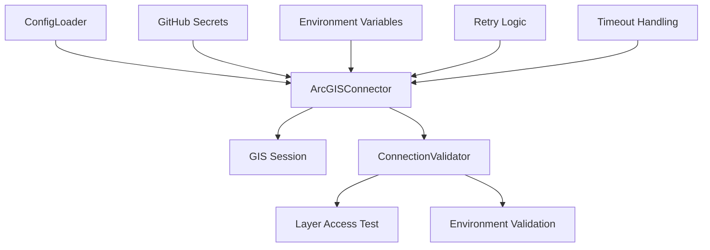

# ArcGIS Connectivity and Authentication – PRP (Product Requirement Plan)

## References
- [ArcGIS API for Python Documentation](https://github.com/esri/arcgis-python-api) - Authentication patterns and best practices
- [CAMS Project Roadmap](docs/project/ROADMAP.md) - Item 2 specifications
- [CAMS Architecture](docs/project/ARCHITECTURE.md) - Technical context and constraints
- [Foundation PRP](docs/prp/1-foundation/PRP.md) - Dependency baseline

## Requirements

**Feature Description:** Implement secure, robust connection to ArcGIS Online with comprehensive authentication handling, retry logic, and environment validation.

**Type:** New Feature

**Required Tools:**
- Python 3.12+
- ArcGIS API for Python ≥2.4.1
- Tenacity library (already available)
- Func-timeout library (already available)
- Existing ConfigLoader foundation from Phase 1

## Major Changes

**New Components:**
1. `ArcGISConnector` class for authenticated connections
2. `ConnectionValidator` for environment and layer verification  
3. Environment-specific authentication management
4. Connection health monitoring and testing

**Configuration Updates:**
- GitHub secrets integration for secure credential storage
- Environment variable validation enhancement

**Architecture Integration:**

## Dependencies
- **Foundation PRP (Phase 1):** ConfigLoader, custom exceptions, logging setup
- **External:** ArcGIS API for Python authentication patterns
- **Infrastructure:** GitHub secrets for credential management

## Development Plan

### Task 1: Simple ArcGIS Authentication
**Deliverable:** Basic username/password authentication for development environment

**Implementation Steps:**
1. Create `src/connection/auth_handler.py`:
   - Support username/password authentication only
   - Environment variable credential loading
   - Basic credential validation
   
2. Add basic environment variable support:
   - `ARCGIS_DEV_USERNAME` and `ARCGIS_DEV_PASSWORD`
   - Simple credential format validation

3. Implement basic security:
   - No credential logging/exposure
   - Basic authentication failure handling

**Testing Requirements:**
- Unit tests for username/password authentication
- Mock authentication scenarios
- Basic credential validation tests

**Documentation Updates:**
- Add basic authentication setup to README
- Document required dev environment variables

### Task 2: Basic ArcGIS Connector
**Deliverable:** Simple ArcGIS connection class with basic retry logic

**Implementation Steps:**
1. Create `src/connection/arcgis_connector.py`:
   - Initialize GIS connection using ConfigLoader
   - Basic retry logic (tenacity) for connection failures
   - Simple timeout handling (func-timeout)
   
2. Add basic connection handling:
   - Simple connection establishment
   - Basic error handling and logging

3. Basic startup validation:
   - Verify connection can be established
   - Basic layer accessibility check

**Testing Requirements:**
- Integration tests with dev ArcGIS connection
- Unit tests for basic retry scenarios
- Basic timeout behavior testing

**Documentation Updates:**
- Basic connection configuration examples
- Simple troubleshooting guide

### Task 3: Basic Environment Validation
**Deliverable:** Simple dev environment validation

**Implementation Steps:**
1. Create `src/connection/environment_validator.py`:
   - Validate dev environment configuration
   - Basic layer ID validation
   
2. Add basic layer validation:
   - Check configured layers exist and are accessible
   - Basic layer metadata verification

3. Simple environment checks:
   - Ensure dev environment variables are set
   - Basic configuration validation

**Testing Requirements:**
- Dev environment validation tests
- Basic layer accessibility tests
- Configuration validation tests

**Documentation Updates:**
- Dev environment setup instructions
- Basic layer configuration guide

### Task 4: Basic Connection Testing
**Deliverable:** Simple connection and layer accessibility testing

**Implementation Steps:**
1. Create `src/connection/connection_tester.py`:
   - Basic connectivity testing
   - Layer access verification
   - Simple connection diagnostics

2. Add basic layer verification:
   - Test access to configured dev layers
   - Basic layer metadata checks
   - Simple connection validation

**Testing Requirements:**
- Basic connectivity testing
- Layer access verification tests
- Simple connection validation tests

**Documentation Updates:**
- Basic connection testing procedures

### Task 5: Basic GitHub Secrets for Dev
**Deliverable:** Simple credential management for development

**Implementation Steps:**
1. Define basic GitHub secrets:
   - `ARCGIS_DEV_USERNAME`
   - `ARCGIS_DEV_PASSWORD`
   
2. Update authentication for dev secrets:
   - Environment variable mapping
   - Local development .env file support

**Testing Requirements:**
- Basic GitHub secrets integration testing
- Local development credential testing

**Documentation Updates:**
- Basic GitHub secrets setup for dev
- Local development environment setup

### Task 6: Basic Integration Testing
**Deliverable:** Simple integrated ArcGIS connectivity

**Implementation Steps:**
1. Create integration module `src/connection/__init__.py`:
   - Export main connector interfaces
   - Integration with existing ConfigLoader

2. Add basic example usage:
   - Update `example_usage.py` with connection examples
   - Show basic authentication and layer access

**Testing Requirements:**
- Basic integration test suite
- End-to-end connectivity testing

**Documentation Updates:**
- Basic integration guide
- Updated README with connection examples

## Quality Assurance

**Unit Test Coverage:** ≥95% for all connection components
**Integration Tests:** Complete ArcGIS Online connectivity testing
**Security Testing:** Credential handling and environment isolation
**Performance Testing:** Connection speed and retry behavior verification

## Success Metrics

- ✅ Successful authentication to development environment
- ✅ Basic connection established with retry logic
- ✅ Dev layer accessibility verification working
- ✅ Zero credential exposure in logs or error messages
- ✅ Basic GitHub secrets integration functional
- ✅ Basic error handling and logging

## Timeline

**Estimated Effort:** 3-4 days
**Dependencies:** Foundation Phase 1 (complete)
**Testing:** 1 day  
**Documentation:** 0.5 days

## Acceptance Testing

- [ ] ArcGIS connection established to development environment
- [ ] All configured dev layers accessible
- [ ] Basic retry logic handles temporary connection failures
- [ ] Basic timeout handling prevents hanging connections
- [ ] GitHub secrets properly integrated for dev credentials
- [ ] Basic connection testing functional
- [ ] Basic error handling and logging working
- [ ] No credential exposure in logs or error messages
- [ ] Integration tests pass for dev environment
- [ ] Documentation updated with connection examples

---

This PRP builds directly on the foundation phase and implements secure, robust ArcGIS connectivity as specified in roadmap item 2. The design prioritizes security, reliability, and maintainability while providing the connection infrastructure needed for subsequent roadmap items. 