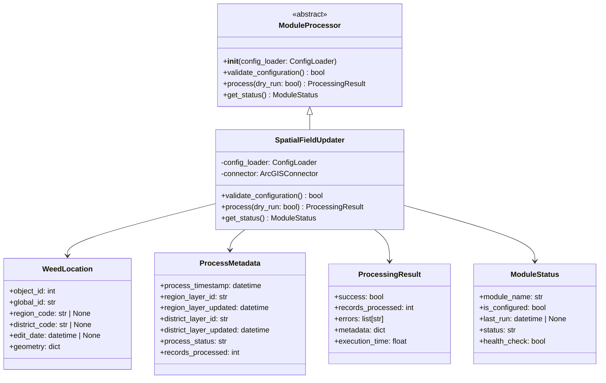

# Spatial Field Updater Module Structure – PRP (Product Requirement Plan)

## References
- [Pydantic Documentation](https://github.com/pydantic/pydantic) - Data validation and modeling best practices
- [CAMS Project Roadmap](docs/project/ROADMAP.md) - Item 3 specifications
- [CAMS Architecture](docs/project/ARCHITECTURE.md) - ModuleProcessor interface and module patterns
- [Foundation PRP](docs/prp/1-foundation/PRP.md) - Configuration foundation dependency
- [ArcGIS Connectivity PRP](docs/prp/2-arcgis-connectivity/PRP.md) - Connection infrastructure dependency

## Requirements

**Feature Description:** Implement the complete Spatial Field Updater module structure with ModuleProcessor interface compliance, data models, and integration with the shared core framework.

**Type:** New Feature Implementation

**Required Tools:**
- Python 3.12+
- Pydantic ≥2.0 for data modeling and validation
- Existing CAMS Core Framework (src/)
- Existing configuration and connectivity infrastructure

## Major Changes

### 1. Module Interface Implementation
- Create abstract ModuleProcessor base class in shared core
- Implement SpatialFieldUpdater class inheriting from ModuleProcessor
- Define standardized ProcessingResult and ModuleStatus data models

### 2. Data Models Architecture


### 3. Module Configuration Enhancement
- Extend field_updater_config.json with processing parameters
- Add validation schemas for all configuration sections
- Implement configuration validation methods

### 4. Testing Infrastructure
- Comprehensive unit tests for all new components
- Integration tests with core framework
- Mock-based testing for ArcGIS interactions

## Dependencies

1. **Foundation PRP (1-foundation)** - COMPLETED ✅
   - ConfigLoader infrastructure
   - Basic project structure
   - Exception handling framework

2. **ArcGIS Connectivity PRP (2-arcgis-connectivity)** - COMPLETED ✅
   - ArcGISConnector implementation
   - Authentication handling
   - Connection testing capabilities

## Development Plan

### Task 1: Abstract ModuleProcessor Interface Implementation

**Goal:** Create the shared abstract base class that all processing modules will implement.

**Implementation Steps:**
1. Create `src/interfaces/` directory and `__init__.py`
2. Implement `src/interfaces/module_processor.py`:
   ```python
   from abc import ABC, abstractmethod
   from pydantic import BaseModel
   from typing import Optional
   from datetime import datetime
   
   class ProcessingResult(BaseModel):
       success: bool
       records_processed: int
       errors: list[str] = []
       metadata: dict = {}
       execution_time: float
   
   class ModuleStatus(BaseModel):
       module_name: str
       is_configured: bool
       last_run: Optional[datetime] = None
       status: str  # 'ready', 'running', 'error', 'disabled'
       health_check: bool
   
   class ModuleProcessor(ABC):
       """Base interface for all CAMS processing modules."""
       
       @abstractmethod
       def __init__(self, config_loader):
           """Initialize module with shared configuration."""
           pass
       
       @abstractmethod
       def validate_configuration(self) -> bool:
           """Validate module-specific configuration."""
           pass
       
       @abstractmethod
       def process(self, dry_run: bool = False) -> ProcessingResult:
           """Execute module processing logic."""
           pass
       
       @abstractmethod
       def get_status(self) -> ModuleStatus:
           """Get current module processing status."""
           pass
   ```

3. Update `src/__init__.py` to export new interfaces
4. Add dependency to requirements.txt: `pydantic>=2.0.0`

**Automated Tests:**
- Create `tests/interfaces/test_module_processor.py`
- Test ProcessingResult and ModuleStatus model validation
- Test abstract class cannot be instantiated
- Test interface compliance checking

**Documentation:**
- Update README.md with ModuleProcessor interface documentation
- Add docstrings to all interface methods
- Document ProcessingResult and ModuleStatus models

### Task 2: Spatial Field Updater Data Models

**Goal:** Implement Pydantic data models for spatial processing domain objects.

**Implementation Steps:**
1. Enhance `modules/spatial_field_updater/models/weed_location.py`:
   ```python
   from pydantic import BaseModel, Field, field_validator
   from typing import Optional, Dict, Any
   from datetime import datetime
   
   class WeedLocation(BaseModel):
       """Data model for weed location records with spatial assignments."""
       
       object_id: int = Field(..., description="ArcGIS OBJECTID primary key")
       global_id: str = Field(..., description="ArcGIS GlobalID unique identifier")
       region_code: Optional[str] = Field(None, max_length=2, description="2-character region assignment")
       district_code: Optional[str] = Field(None, max_length=5, description="5-character district assignment")
       edit_date: Optional[datetime] = Field(None, description="Last modification timestamp")
       geometry: Dict[str, Any] = Field(..., description="ArcGIS geometry object")
       
       @field_validator('region_code')
       @classmethod
       def validate_region_code(cls, v):
           if v is not None and len(v) != 2:
               raise ValueError('Region code must be exactly 2 characters')
           return v
       
       @field_validator('district_code')
       @classmethod
       def validate_district_code(cls, v):
           if v is not None and len(v) != 5:
               raise ValueError('District code must be exactly 5 characters')
           return v
   ```

2. Create `modules/spatial_field_updater/models/process_metadata.py`:
   ```python
   from pydantic import BaseModel, Field
   from datetime import datetime
   from typing import Literal
   
   class ProcessMetadata(BaseModel):
       """Data model for spatial processing metadata tracking."""
       
       process_timestamp: datetime = Field(..., description="Processing start time")
       region_layer_id: str = Field(..., max_length=50, description="Region layer identifier")
       region_layer_updated: datetime = Field(..., description="Region layer version timestamp")
       district_layer_id: str = Field(..., max_length=50, description="District layer identifier")
       district_layer_updated: datetime = Field(..., description="District layer version timestamp")
       process_status: Literal['Success', 'Error'] = Field(..., description="Processing completion status")
       records_processed: int = Field(ge=0, description="Count of updated records")
   ```

3. Update `modules/spatial_field_updater/models/__init__.py`:
   ```python
   """Spatial Field Updater Data Models"""
   
   from .weed_location import WeedLocation
   from .process_metadata import ProcessMetadata
   
   __all__ = ['WeedLocation', 'ProcessMetadata']
   ```

**Automated Tests:**
- Create `modules/spatial_field_updater/tests/test_models.py`
- Test WeedLocation model validation (valid and invalid data)
- Test ProcessMetadata model validation
- Test field validators for region_code and district_code
- Test model serialization and deserialization

**Documentation:**
- Add comprehensive docstrings to all model classes
- Document field validation rules
- Add usage examples in model docstrings

### Task 3: SpatialFieldUpdater Class Implementation

**Goal:** Implement the main processor class that implements the ModuleProcessor interface.

**Implementation Steps:**
1. Create `modules/spatial_field_updater/processor/spatial_field_updater.py`:
   ```python
   from typing import Optional
   from datetime import datetime
   import logging
   
   from src.interfaces.module_processor import ModuleProcessor, ProcessingResult, ModuleStatus
   from src.config.config_loader import ConfigLoader
   from src.connection.arcgis_connector import ArcGISConnector
   from ..models import WeedLocation, ProcessMetadata
   
   logger = logging.getLogger(__name__)
   
   class SpatialFieldUpdater(ModuleProcessor):
       """Spatial field updater implementing ModuleProcessor interface."""
       
       def __init__(self, config_loader: ConfigLoader):
           """Initialize spatial field updater with shared configuration."""
           self.config_loader = config_loader
           self.connector: Optional[ArcGISConnector] = None
           self._last_run: Optional[datetime] = None
           self._module_config = self._load_module_config()
       
       def _load_module_config(self) -> dict:
           """Load module-specific configuration."""
           # Implementation to load field_updater_config.json
           pass
       
       def validate_configuration(self) -> bool:
           """Validate module-specific configuration."""
           try:
               # Validate field_updater_config.json structure
               # Check required configuration sections
               # Validate layer IDs and processing parameters
               return True
           except Exception as e:
               logger.error(f"Configuration validation failed: {e}")
               return False
       
       def process(self, dry_run: bool = False) -> ProcessingResult:
           """Execute spatial field update processing logic."""
           start_time = datetime.now()
           
           try:
               if not self.validate_configuration():
                   return ProcessingResult(
                       success=False,
                       records_processed=0,
                       errors=["Configuration validation failed"],
                       execution_time=0.0
                   )
               
               # Placeholder implementation - will be expanded in subsequent tasks
               logger.info(f"Starting spatial field update process (dry_run={dry_run})")
               
               # TODO: Implement actual processing logic
               records_processed = 0
               
               self._last_run = datetime.now()
               execution_time = (datetime.now() - start_time).total_seconds()
               
               return ProcessingResult(
                   success=True,
                   records_processed=records_processed,
                   errors=[],
                   metadata={"dry_run": dry_run},
                   execution_time=execution_time
               )
               
           except Exception as e:
               execution_time = (datetime.now() - start_time).total_seconds()
               logger.error(f"Processing failed: {e}")
               return ProcessingResult(
                   success=False,
                   records_processed=0,
                   errors=[str(e)],
                   execution_time=execution_time
               )
       
       def get_status(self) -> ModuleStatus:
           """Get current module processing status."""
           is_configured = self.validate_configuration()
           
           return ModuleStatus(
               module_name="spatial_field_updater",
               is_configured=is_configured,
               last_run=self._last_run,
               status="ready" if is_configured else "error",
               health_check=self._health_check()
           )
       
       def _health_check(self) -> bool:
           """Perform module health check."""
           try:
               # Check configuration validity
               # Check connectivity to required services
               return self.validate_configuration()
           except Exception:
               return False
   ```

2. Update `modules/spatial_field_updater/processor/__init__.py`:
   ```python
   """Spatial Field Update Processing Logic"""
   
   from .spatial_field_updater import SpatialFieldUpdater
   
   __all__ = ['SpatialFieldUpdater']
   ```

**Automated Tests:**
- Create `modules/spatial_field_updater/tests/test_spatial_field_updater.py`
- Test initialization with valid configuration
- Test validate_configuration() method
- Test process() method with dry_run=True and False
- Test get_status() method
- Test error handling and logging
- Mock ArcGISConnector for isolated testing

**Documentation:**
- Add comprehensive class and method docstrings
- Document the ModuleProcessor interface implementation
- Add usage examples

### Task 4: Enhanced Module Configuration

**Goal:** Extend the module configuration with comprehensive validation and structure.

**Implementation Steps:**
1. Enhance `modules/spatial_field_updater/config/field_updater_config.json`:
   ```json
   {
     "area_layers": {
       "region": {
         "layer_id": "7759fbaecd4649dea39c4ac2b07fc4ab",
         "source_code_field": "REGC_code",
         "target_field": "RegionCode",
         "description": "Region boundary polygons for spatial intersection"
       },
       "district": {
         "layer_id": "c8f6ba6b968c4d31beddfb69abfe3df0",
         "source_code_field": "TALB_code",
         "target_field": "DistrictCode",
         "description": "District boundary polygons for spatial intersection"
       }
     },
     "processing": {
       "batch_size": 100,
       "max_retries": 3,
       "timeout_seconds": 1800,
       "spatial_relationship": "intersects"
     },
     "metadata_table": {
       "production_name": "Weeds Area Metadata",
       "development_name": "XXX Weeds Area Metadata DEV"
     },
     "validation": {
       "required_fields": ["object_id", "global_id", "geometry"],
       "field_mappings": {
         "object_id": "OBJECTID",
         "global_id": "GlobalID",
         "edit_date": "EditDate_1",
         "region_code": "RegionCode",
         "district_code": "DistrictCode"
       }
     }
   }
   ```

2. Create `modules/spatial_field_updater/config/config_validator.py`:
   ```python
   from pydantic import BaseModel, Field, ValidationError
   from typing import Dict, List, Literal
   import json
   from pathlib import Path
   
   class AreaLayerConfig(BaseModel):
       layer_id: str = Field(..., description="ArcGIS layer identifier")
       source_code_field: str = Field(..., description="Source field containing codes")
       target_field: str = Field(..., description="Target field for assignment")
       description: str = Field(..., description="Layer description")
   
   class ProcessingConfig(BaseModel):
       batch_size: int = Field(gt=0, le=1000, description="Records per batch")
       max_retries: int = Field(ge=0, le=10, description="Maximum retry attempts")
       timeout_seconds: int = Field(gt=0, description="Processing timeout")
       spatial_relationship: Literal["intersects", "contains", "within"] = Field(
           "intersects", description="Spatial relationship type"
       )
   
   class MetadataConfig(BaseModel):
       production_name: str = Field(..., description="Production metadata table name")
       development_name: str = Field(..., description="Development metadata table name")
   
   class ValidationConfig(BaseModel):
       required_fields: List[str] = Field(..., description="Required data fields")
       field_mappings: Dict[str, str] = Field(..., description="Field name mappings")
   
   class FieldUpdaterConfig(BaseModel):
       area_layers: Dict[str, AreaLayerConfig]
       processing: ProcessingConfig
       metadata_table: MetadataConfig
       validation: ValidationConfig
   
   def validate_config_file(config_path: Path) -> FieldUpdaterConfig:
       """Validate module configuration file."""
       try:
           with open(config_path) as f:
               config_data = json.load(f)
           return FieldUpdaterConfig(**config_data)
       except ValidationError as e:
           raise ValueError(f"Configuration validation failed: {e}")
       except FileNotFoundError:
           raise ValueError(f"Configuration file not found: {config_path}")
   ```

**Automated Tests:**
- Create `modules/spatial_field_updater/tests/test_config_validation.py`
- Test valid configuration validation
- Test invalid configuration scenarios
- Test missing file handling
- Test configuration schema validation

**Documentation:**
- Document configuration schema and validation rules
- Add configuration examples and usage guide

### Task 5: Main Module Integration and CLI Enhancement

**Goal:** Integrate the SpatialFieldUpdater with the module's main entry point and enhance CLI functionality.

**Implementation Steps:**
1. Update `modules/spatial_field_updater/main.py`:
   ```python
   """Spatial Field Updater Module Entry Point"""
   
   import argparse
   import sys
   import logging
   from typing import Optional
   from pathlib import Path
   
   from src.config.config_loader import ConfigLoader
   from src.utils.logging_setup import setup_logging
   from .processor.spatial_field_updater import SpatialFieldUpdater
   
   def main(args: Optional[list] = None) -> int:
       """Main entry point for the spatial field updater module."""
       parser = argparse.ArgumentParser(
           description="CAMS Spatial Field Updater - Pre-calculate spatial field assignments"
       )
       parser.add_argument(
           "--dry-run",
           action="store_true",
           help="Perform all processing logic without making actual updates"
       )
       parser.add_argument(
           "--environment",
           choices=["development", "production"],
           default="development",
           help="Environment to run against (default: development)"
       )
       parser.add_argument(
           "--config-dir",
           type=Path,
           default="config",
           help="Configuration directory path (default: config)"
       )
       parser.add_argument(
           "--log-level",
           choices=["DEBUG", "INFO", "WARNING", "ERROR"],
           default="INFO",
           help="Logging level (default: INFO)"
       )
       
       parsed_args = parser.parse_args(args)
       
       # Setup logging
       setup_logging(level=parsed_args.log_level, environment=parsed_args.environment)
       logger = logging.getLogger(__name__)
       
       try:
           # Initialize configuration
           config_loader = ConfigLoader(str(parsed_args.config_dir))
           
           # Initialize spatial field updater
           updater = SpatialFieldUpdater(config_loader)
           
           # Check module status
           status = updater.get_status()
           logger.info(f"Module status: {status.status}")
           
           if not status.is_configured:
               logger.error("Module configuration validation failed")
               return 1
           
           # Execute processing
           logger.info(f"Starting processing (dry_run={parsed_args.dry_run})")
           result = updater.process(dry_run=parsed_args.dry_run)
           
           # Report results
           if result.success:
               logger.info(f"Processing completed successfully")
               logger.info(f"Records processed: {result.records_processed}")
               logger.info(f"Execution time: {result.execution_time:.2f}s")
               return 0
           else:
               logger.error(f"Processing failed: {'; '.join(result.errors)}")
               return 1
               
       except Exception as e:
           logger.error(f"Unexpected error: {e}")
           return 1
   
   if __name__ == "__main__":
       sys.exit(main())
   ```

2. Update `modules/spatial_field_updater/__init__.py`:
   ```python
   """Spatial Field Updater Module
   
   This module provides automated spatial intersection processing to pre-calculate
   region and district assignments for weed locations, eliminating real-time spatial
   queries from the CAMS dashboard.
   """
   
   from .processor.spatial_field_updater import SpatialFieldUpdater
   from .models import WeedLocation, ProcessMetadata
   
   __all__ = ['SpatialFieldUpdater', 'WeedLocation', 'ProcessMetadata']
   ```

**Automated Tests:**
- Create `modules/spatial_field_updater/tests/test_main.py`
- Test CLI argument parsing
- Test main() function with various arguments
- Test integration with ConfigLoader
- Test error handling and exit codes
- Mock SpatialFieldUpdater for isolated testing

**Documentation:**
- Update module README with usage examples
- Document CLI options and parameters
- Add troubleshooting guide

### Task 6: Comprehensive Integration Testing

**Goal:** Create integration tests that verify the module works correctly with the core framework.

**Implementation Steps:**
1. Create `modules/spatial_field_updater/tests/test_integration.py`:
   ```python
   """Integration tests for Spatial Field Updater module."""
   
   import pytest
   from unittest.mock import Mock, patch
   from pathlib import Path
   
   from src.config.config_loader import ConfigLoader
   from ..processor.spatial_field_updater import SpatialFieldUpdater
   
   class TestSpatialFieldUpdaterIntegration:
       """Integration tests for SpatialFieldUpdater with core framework."""
       
       def test_module_initialization_with_config_loader(self, tmp_path):
           """Test module initializes correctly with ConfigLoader."""
           # Setup test configuration files
           config_dir = tmp_path / "config"
           config_dir.mkdir()
           
           # Create test environment config
           env_config = {
               "development": {"weed_locations_layer_id": "test-layer"},
               "production": {"weed_locations_layer_id": "prod-layer"}
           }
           (config_dir / "environment_config.json").write_text(json.dumps(env_config))
           
           # Create test field mapping
           field_mapping = {"layers": {"weed_locations": {"fields": {}}}}
           (config_dir / "field_mapping.json").write_text(json.dumps(field_mapping))
           
           # Initialize ConfigLoader
           config_loader = ConfigLoader(str(config_dir))
           
           # Test module initialization
           updater = SpatialFieldUpdater(config_loader)
           assert updater.config_loader is config_loader
       
       def test_end_to_end_dry_run_processing(self, tmp_path):
           """Test complete dry-run processing workflow."""
           # Setup test environment and configuration
           # Mock ArcGIS connections
           # Execute dry-run processing
           # Verify results and logging
           pass
       
       def test_module_status_reporting(self, tmp_path):
           """Test module status reporting functionality."""
           # Test status reporting with valid/invalid configurations
           # Verify health checks
           pass
   ```

2. Create `modules/spatial_field_updater/tests/conftest.py`:
   ```python
   """Pytest configuration for spatial field updater tests."""
   
   import pytest
   from unittest.mock import Mock
   import tempfile
   import json
   from pathlib import Path
   
   @pytest.fixture
   def mock_config_loader():
       """Mock ConfigLoader for testing."""
       mock = Mock()
       mock.load_environment_config.return_value = {
           "development": {"weed_locations_layer_id": "test-layer"}
       }
       mock.load_field_mapping.return_value = {"layers": {}}
       return mock
   
   @pytest.fixture
   def test_config_dir(tmp_path):
       """Create test configuration directory."""
       config_dir = tmp_path / "config"
       config_dir.mkdir()
       
       # Create minimal test configurations
       env_config = {"development": {"weed_locations_layer_id": "test"}}
       (config_dir / "environment_config.json").write_text(json.dumps(env_config))
       
       field_config = {"layers": {"weed_locations": {"fields": {}}}}
       (config_dir / "field_mapping.json").write_text(json.dumps(field_config))
       
       return config_dir
   ```

**Automated Tests:**
- Integration tests with real ConfigLoader instances
- End-to-end workflow testing with mocked ArcGIS
- Module interface compliance verification
- Error handling and recovery testing

**Documentation:**
- Document integration testing approach
- Add testing guidelines for future development

### Task 7: Documentation and Examples

**Goal:** Create comprehensive documentation and usage examples.

**Implementation Steps:**
1. Create `modules/spatial_field_updater/README.md`:
   ```markdown
   # Spatial Field Updater Module
   
   Automated spatial intersection processing to pre-calculate region and district assignments for weed locations.
   
   ## Overview
   
   This module implements the ModuleProcessor interface to provide:
   - Automated spatial field updates for conservation data
   - Integration with CAMS core framework
   - Configurable processing parameters
   - Comprehensive error handling and logging
   
   ## Usage
   
   ### Command Line Interface
   
   ```bash
   # Basic dry-run execution
   python -m modules.spatial_field_updater.main --dry-run
   
   # Production processing
   python -m modules.spatial_field_updater.main --environment production
   
   # Custom configuration directory
   python -m modules.spatial_field_updater.main --config-dir /path/to/config
   ```
   
   ### Programmatic Usage
   
   ```python
   from src.config.config_loader import ConfigLoader
   from modules.spatial_field_updater import SpatialFieldUpdater
   
   # Initialize
   config_loader = ConfigLoader("config")
   updater = SpatialFieldUpdater(config_loader)
   
   # Check status
   status = updater.get_status()
   print(f"Module configured: {status.is_configured}")
   
   # Execute processing
   result = updater.process(dry_run=True)
   print(f"Success: {result.success}")
   print(f"Records processed: {result.records_processed}")
   ```
   
   ## Configuration
   
   The module uses `field_updater_config.json` for spatial processing configuration:
   
   - `area_layers`: Layer definitions for spatial intersection
   - `processing`: Processing parameters and timeouts
   - `metadata_table`: Metadata table configuration
   - `validation`: Field validation and mapping rules
   
   ## Testing
   
   ```bash
   # Run module tests
   python -m pytest modules/spatial_field_updater/tests/
   
   # Run with coverage
   python -m pytest modules/spatial_field_updater/tests/ --cov=modules.spatial_field_updater
   ```
   
   ## Architecture
   
   The module implements the standard CAMS ModuleProcessor interface:
   
   - `validate_configuration()`: Validate module configuration
   - `process(dry_run)`: Execute spatial processing logic
   - `get_status()`: Report module status and health
   
   ## Dependencies
   
   - CAMS Core Framework (src/)
   - Pydantic for data modeling
   - ArcGIS API for Python for spatial operations
   ```

2. Update project `README.md` with module information:
   ```markdown
   ## Modules
   
   ### Spatial Field Updater
   
   Located in `modules/spatial_field_updater/`, this module provides automated spatial field updates for conservation data.
   
   **Usage:**
   ```bash
   python -m modules.spatial_field_updater.main --dry-run
   ```
   
   See [module documentation](modules/spatial_field_updater/README.md) for details.
   ```

**Documentation Updates:**
- Comprehensive module documentation
- Usage examples and patterns
- Configuration reference
- Testing guidelines
- Architecture diagrams

## Quality Assurance

### Testing Requirements
- **Unit Tests:** 90%+ code coverage for all new components
- **Integration Tests:** End-to-end workflow testing with mocked dependencies
- **Configuration Tests:** Validation of all configuration scenarios
- **Interface Tests:** ModuleProcessor compliance verification

### Code Review Checklist
- [ ] ModuleProcessor interface correctly implemented
- [ ] Pydantic models properly validated
- [ ] Configuration validation comprehensive
- [ ] Error handling and logging appropriate
- [ ] Documentation complete and accurate
- [ ] Tests provide adequate coverage

### Success Criteria
- [ ] SpatialFieldUpdater class implements ModuleProcessor interface
- [ ] All data models use Pydantic validation
- [ ] Module integrates with core framework
- [ ] CLI provides full functionality
- [ ] Comprehensive test coverage achieved
- [ ] Documentation complete

## Feedback Collection

**Module Interface Validation:**
- Verify ModuleProcessor interface compliance
- Test integration with core framework components
- Validate configuration management

**Code Quality Assessment:**
- Review Pydantic model implementations
- Evaluate error handling patterns
- Assess logging and monitoring integration

**Documentation Review:**
- Validate completeness and accuracy
- Test usage examples
- Review architectural documentation 