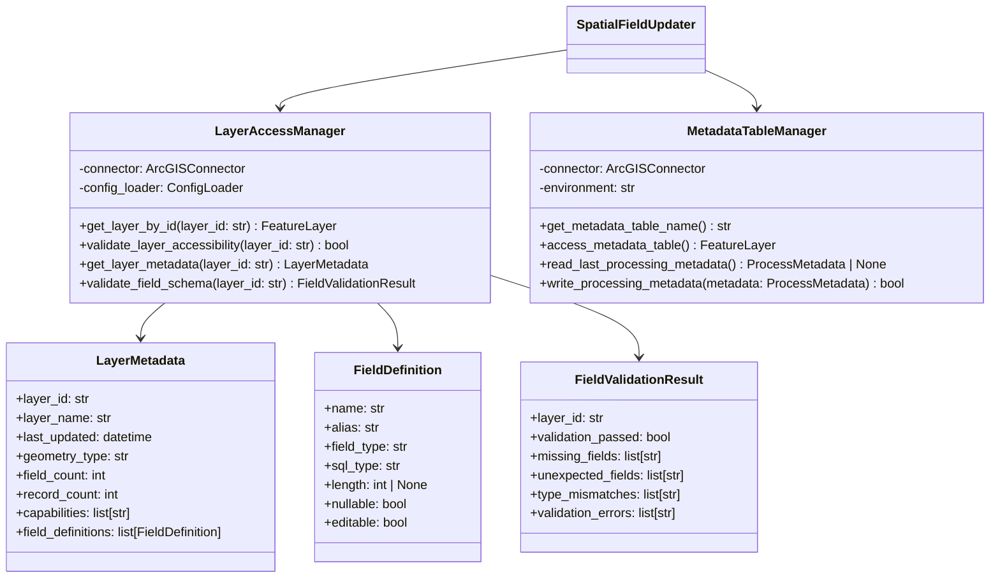

# Layer Access and Metadata Management – PRP (Product Requirement Plan)

## References
- [ArcGIS API for Python Documentation](https://github.com/esri/arcgis-python-api) - Layer access, metadata retrieval, and field schema validation
- [CAMS Project Roadmap](docs/project/ROADMAP.md) - Item 4 specifications
- [CAMS Architecture](docs/project/ARCHITECTURE.md) - Layer access patterns and metadata management
- [Spatial Field Updater Structure PRP](docs/prp/3-spatial-field-updater-structure/PRP.md) - Module foundation dependency

## Requirements

**Feature Description:** Implement reliable access to spatial layers with comprehensive metadata retrieval, field schema validation, and layer version tracking for the spatial field updater module.

**Type:** New Feature Implementation

**Required Tools:**
- Python 3.12+
- ArcGIS API for Python ≥2.4.1 (existing dependency)
- Existing SpatialFieldUpdater module structure
- Existing ArcGISConnector infrastructure
- Pydantic ≥2.0 for data validation

## Major Changes

### 1. Layer Access Management Architecture


### 2. Layer Configuration Enhancement
- Extend field_updater_config.json with layer access validation rules
- Add field mapping validation schemas
- Implement environment-specific layer ID verification

### 3. Metadata Management Integration
- Layer metadata caching for performance optimization
- Field schema validation against expected mappings
- Processing metadata table access with environment awareness

### 4. Error Handling and Validation
- Comprehensive layer accessibility validation
- Field schema mismatch detection and reporting
- Graceful handling of layer access failures

## Dependencies

1. **Spatial Field Updater Structure PRP (3-spatial-field-updater-structure)** - COMPLETED ✅
   - SpatialFieldUpdater class implementation
   - ProcessMetadata model (already implemented)
   - Module configuration structure

2. **ArcGIS Connectivity PRP (2-arcgis-connectivity)** - COMPLETED ✅
   - ArcGISConnector implementation with retry logic
   - Authentication handling
   - Connection validation

## Development Plan

### Task 1: Layer Access Manager Implementation

**Goal:** Create a centralized layer access manager that provides reliable access to ArcGIS layers with metadata retrieval.

**Implementation Steps:**
1. Create `modules/spatial_field_updater/layer_access/` directory structure
2. Implement `layer_access_manager.py`:
   ```python
   from typing import Optional, List, Dict, Any
   from datetime import datetime
   import logging
   from arcgis.features import FeatureLayer, FeatureLayerCollection
   from pydantic import BaseModel, Field
   
   from src.connection.arcgis_connector import ArcGISConnector
   from src.config.config_loader import ConfigLoader
   
   logger = logging.getLogger(__name__)
   
   class FieldDefinition(BaseModel):
       """Definition of a field in an ArcGIS layer."""
       name: str = Field(..., description="Field name")
       alias: str = Field(..., description="Field alias")
       field_type: str = Field(..., description="ArcGIS field type")
       sql_type: str = Field(..., description="SQL field type")
       length: Optional[int] = Field(None, description="Field length for string types")
       nullable: bool = Field(True, description="Whether field allows null values")
       editable: bool = Field(True, description="Whether field is editable")
   
   class LayerMetadata(BaseModel):
       """Metadata information for an ArcGIS layer."""
       layer_id: str = Field(..., description="Unique layer identifier")
       layer_name: str = Field(..., description="Layer display name")
       last_updated: datetime = Field(..., description="Layer last update timestamp")
       geometry_type: str = Field(..., description="Geometry type (Point, Polygon, etc.)")
       field_count: int = Field(ge=0, description="Number of fields in layer")
       record_count: int = Field(ge=0, description="Number of records in layer")
       capabilities: List[str] = Field(default_factory=list, description="Layer capabilities")
       field_definitions: List[FieldDefinition] = Field(default_factory=list, description="Field definitions")
   
   class LayerAccessManager:
       """Manages access to ArcGIS layers with metadata retrieval and validation."""
       
       def __init__(self, connector: ArcGISConnector, config_loader: ConfigLoader):
           self.connector = connector
           self.config_loader = config_loader
           self._layer_cache: Dict[str, FeatureLayer] = {}
           self._metadata_cache: Dict[str, LayerMetadata] = {}
       
       def get_layer_by_id(self, layer_id: str, use_cache: bool = True) -> Optional[FeatureLayer]:
           """Get FeatureLayer instance by layer ID."""
           if use_cache and layer_id in self._layer_cache:
               return self._layer_cache[layer_id]
           
           try:
               # Use connector to get authenticated GIS instance
               gis = self.connector.get_gis()
               layer = FeatureLayer(layer_id, gis)
               
               # Validate layer accessibility
               if self.validate_layer_accessibility(layer_id):
                   self._layer_cache[layer_id] = layer
                   return layer
               else:
                   logger.error(f"Layer {layer_id} is not accessible")
                   return None
                   
           except Exception as e:
               logger.error(f"Failed to access layer {layer_id}: {e}")
               return None
       
       def validate_layer_accessibility(self, layer_id: str) -> bool:
           """Validate that a layer is accessible with current credentials."""
           try:
               gis = self.connector.get_gis()
               layer = FeatureLayer(layer_id, gis)
               
               # Test basic access by querying properties
               _ = layer.properties.name
               return True
               
           except Exception as e:
               logger.debug(f"Layer accessibility validation failed for {layer_id}: {e}")
               return False
       
       def get_layer_metadata(self, layer_id: str, force_refresh: bool = False) -> Optional[LayerMetadata]:
           """Retrieve comprehensive metadata for a layer."""
           if not force_refresh and layer_id in self._metadata_cache:
               return self._metadata_cache[layer_id]
           
           layer = self.get_layer_by_id(layer_id)
           if not layer:
               return None
           
           try:
               properties = layer.properties
               
               # Extract field definitions
               field_definitions = []
               for field in properties.fields:
                   field_def = FieldDefinition(
                       name=field.name,
                       alias=field.alias or field.name,
                       field_type=field.type,
                       sql_type=getattr(field, 'sqlType', 'unknown'),
                       length=getattr(field, 'length', None),
                       nullable=getattr(field, 'nullable', True),
                       editable=getattr(field, 'editable', True)
                   )
                   field_definitions.append(field_def)
               
               # Get record count (may be expensive for large layers)
               try:
                   record_count = layer.query(return_count_only=True)
               except:
                   record_count = -1  # Unknown count
               
               metadata = LayerMetadata(
                   layer_id=layer_id,
                   layer_name=properties.name,
                   last_updated=datetime.fromtimestamp(properties.editingInfo.lastEditDate / 1000) 
                                if hasattr(properties, 'editingInfo') and properties.editingInfo.lastEditDate 
                                else datetime.now(),
                   geometry_type=properties.geometryType,
                   field_count=len(properties.fields),
                   record_count=record_count,
                   capabilities=properties.capabilities.split(',') if properties.capabilities else [],
                   field_definitions=field_definitions
               )
               
               self._metadata_cache[layer_id] = metadata
               return metadata
               
           except Exception as e:
               logger.error(f"Failed to retrieve metadata for layer {layer_id}: {e}")
               return None
   ```

3. Create `layer_access/__init__.py`:
   ```python
   """Layer Access Management for Spatial Field Updater"""
   
   from .layer_access_manager import LayerAccessManager, LayerMetadata, FieldDefinition
   from .field_validator import FieldValidator, FieldValidationResult
   from .metadata_table_manager import MetadataTableManager
   
   __all__ = [
       'LayerAccessManager', 'LayerMetadata', 'FieldDefinition',
       'FieldValidator', 'FieldValidationResult',
       'MetadataTableManager'
   ]
   ```

**Automated Tests:**
- Create `modules/spatial_field_updater/tests/test_layer_access_manager.py`
- Test layer access with valid and invalid layer IDs
- Test metadata retrieval and caching
- Test layer accessibility validation
- Mock ArcGIS layer responses for isolated testing

**Documentation:**
- Add comprehensive docstrings to all classes and methods
- Document layer access patterns and caching behavior
- Add usage examples for layer metadata retrieval

### Task 2: Field Schema Validation System

**Goal:** Implement comprehensive field schema validation against expected mappings from configuration.

**Implementation Steps:**
1. Create `modules/spatial_field_updater/layer_access/field_validator.py`:
   ```python
   from typing import Dict, List, Set
   from pydantic import BaseModel, Field
   import logging
   
   from .layer_access_manager import LayerAccessManager, FieldDefinition
   from src.config.config_loader import ConfigLoader
   
   logger = logging.getLogger(__name__)
   
   class FieldValidationResult(BaseModel):
       """Result of field schema validation."""
       layer_id: str = Field(..., description="Layer ID that was validated")
       validation_passed: bool = Field(..., description="Overall validation result")
       missing_fields: List[str] = Field(default_factory=list, description="Required fields not found")
       unexpected_fields: List[str] = Field(default_factory=list, description="Unexpected fields found")
       type_mismatches: List[str] = Field(default_factory=list, description="Fields with incorrect types")
       validation_errors: List[str] = Field(default_factory=list, description="Detailed validation errors")
   
   class FieldValidator:
       """Validates layer field schemas against expected configuration."""
       
       def __init__(self, layer_manager: LayerAccessManager, config_loader: ConfigLoader):
           self.layer_manager = layer_manager
           self.config_loader = config_loader
       
       def validate_layer_schema(self, layer_id: str, expected_fields: Dict[str, str]) -> FieldValidationResult:
           """Validate layer schema against expected field definitions."""
           result = FieldValidationResult(layer_id=layer_id, validation_passed=False)
           
           try:
               metadata = self.layer_manager.get_layer_metadata(layer_id)
               if not metadata:
                   result.validation_errors.append(f"Could not retrieve metadata for layer {layer_id}")
                   return result
               
               # Get actual field names and types
               actual_fields = {field.name.lower(): field.field_type for field in metadata.field_definitions}
               expected_fields_lower = {k.lower(): v for k, v in expected_fields.items()}
               
               # Check for missing required fields
               missing = set(expected_fields_lower.keys()) - set(actual_fields.keys())
               result.missing_fields = list(missing)
               
               # Check for type mismatches
               for field_name, expected_type in expected_fields_lower.items():
                   if field_name in actual_fields:
                       actual_type = actual_fields[field_name]
                       if not self._types_compatible(expected_type, actual_type):
                           result.type_mismatches.append(
                               f"{field_name}: expected {expected_type}, got {actual_type}"
                           )
               
               # Determine overall validation result
               result.validation_passed = len(result.missing_fields) == 0 and len(result.type_mismatches) == 0
               
               if not result.validation_passed:
                   error_msg = f"Schema validation failed for layer {layer_id}"
                   if result.missing_fields:
                       error_msg += f" - Missing fields: {', '.join(result.missing_fields)}"
                   if result.type_mismatches:
                       error_msg += f" - Type mismatches: {'; '.join(result.type_mismatches)}"
                   result.validation_errors.append(error_msg)
               
               return result
               
           except Exception as e:
               result.validation_errors.append(f"Schema validation error: {e}")
               return result
       
       def _types_compatible(self, expected: str, actual: str) -> bool:
           """Check if field types are compatible."""
           # Define type compatibility mappings
           type_mappings = {
               'string': ['esriFieldTypeString', 'esriFieldTypeGUID'],
               'integer': ['esriFieldTypeInteger', 'esriFieldTypeSmallInteger', 'esriFieldTypeOID'],
               'double': ['esriFieldTypeDouble', 'esriFieldTypeSingle'],
               'date': ['esriFieldTypeDate'],
               'geometry': ['esriFieldTypeGeometry']
           }
           
           expected_lower = expected.lower()
           for type_group, arcgis_types in type_mappings.items():
               if expected_lower == type_group and actual in arcgis_types:
                   return True
           
           # Direct match
           return expected.lower() == actual.lower()
       
       def validate_all_configured_layers(self) -> Dict[str, FieldValidationResult]:
           """Validate all layers defined in module configuration."""
           results = {}
           
           try:
               # Load field mappings from configuration
               field_mapping = self.config_loader.load_field_mapping()
               module_config = self._load_module_config()
               
               # Validate weed locations layer
               env_config = self.config_loader.load_environment_config()
               environment = env_config.get('current_environment', 'development')
               weed_layer_id = env_config.get(environment, {}).get('weed_locations_layer_id')
               
               if weed_layer_id:
                   expected_fields = module_config.get('validation', {}).get('field_mappings', {})
                   results['weed_locations'] = self.validate_layer_schema(weed_layer_id, expected_fields)
               
               # Validate area layers (region, district)
               area_layers = module_config.get('area_layers', {})
               for area_type, area_config in area_layers.items():
                   layer_id = area_config.get('layer_id')
                   if layer_id:
                       # Define expected fields for area layers
                       expected_fields = {
                           area_config.get('source_code_field', 'CODE'): 'string',
                           'OBJECTID': 'integer',
                           'GlobalID': 'string'
                       }
                       results[area_type] = self.validate_layer_schema(layer_id, expected_fields)
               
               return results
               
           except Exception as e:
               logger.error(f"Failed to validate configured layers: {e}")
               return {}
       
       def _load_module_config(self) -> Dict:
           """Load module configuration."""
           import json
           from pathlib import Path
           
           config_path = Path("modules/spatial_field_updater/config/field_updater_config.json")
           with open(config_path) as f:
               return json.load(f)
   ```

**Automated Tests:**
- Create `modules/spatial_field_updater/tests/test_field_validator.py`
- Test field validation with correct and incorrect schemas
- Test type compatibility checking
- Test validation of all configured layers
- Mock layer metadata for testing scenarios

**Documentation:**
- Document field validation rules and type mappings
- Add examples of validation results and error handling

### Task 3: Metadata Table Management

**Goal:** Implement access to the Weeds Area Metadata table with environment-aware naming and processing metadata tracking.

**Implementation Steps:**
1. Create `modules/spatial_field_updater/layer_access/metadata_table_manager.py`:
   ```python
   from typing import Optional
   import logging
   from datetime import datetime
   
   from src.connection.arcgis_connector import ArcGISConnector
   from src.config.config_loader import ConfigLoader
   from ..models import ProcessMetadata
   from .layer_access_manager import LayerAccessManager
   
   logger = logging.getLogger(__name__)
   
   class MetadataTableManager:
       """Manages access to the Weeds Area Metadata table for processing tracking."""
       
       def __init__(self, connector: ArcGISConnector, config_loader: ConfigLoader, 
                    layer_manager: LayerAccessManager):
           self.connector = connector
           self.config_loader = config_loader
           self.layer_manager = layer_manager
           self._metadata_table = None
       
       def get_metadata_table_name(self) -> str:
           """Get the appropriate metadata table name for current environment."""
           try:
               # Load module configuration
               import json
               from pathlib import Path
               
               config_path = Path("modules/spatial_field_updater/config/field_updater_config.json")
               with open(config_path) as f:
                   module_config = json.load(f)
               
               # Determine environment
               env_config = self.config_loader.load_environment_config()
               environment = env_config.get('current_environment', 'development')
               
               metadata_config = module_config.get('metadata_table', {})
               if environment == 'production':
                   return metadata_config.get('production_name', 'Weeds Area Metadata')
               else:
                   return metadata_config.get('development_name', 'XXX Weeds Area Metadata DEV')
                   
           except Exception as e:
               logger.error(f"Failed to determine metadata table name: {e}")
               return 'Weeds Area Metadata'  # Default fallback
       
       def access_metadata_table(self) -> Optional[object]:
           """Access the metadata table layer."""
           if self._metadata_table:
               return self._metadata_table
           
           try:
               # Search for metadata table by name
               gis = self.connector.get_gis()
               table_name = self.get_metadata_table_name()
               
               # Search for the metadata table
               search_results = gis.content.search(f'title:"{table_name}"', item_type='Feature Service')
               
               if not search_results:
                   logger.warning(f"Metadata table '{table_name}' not found")
                   return None
               
               # Get the first matching service
               metadata_service = search_results[0]
               
               # Access the table (tables are usually index 0 for non-spatial data)
               if hasattr(metadata_service, 'tables') and metadata_service.tables:
                   self._metadata_table = metadata_service.tables[0]
               elif hasattr(metadata_service, 'layers') and metadata_service.layers:
                   # Sometimes stored as a layer instead of table
                   self._metadata_table = metadata_service.layers[0]
               else:
                   logger.error(f"No accessible tables or layers found in metadata service")
                   return None
               
               return self._metadata_table
               
           except Exception as e:
               logger.error(f"Failed to access metadata table: {e}")
               return None
       
       def read_last_processing_metadata(self) -> Optional[ProcessMetadata]:
           """Read the most recent processing metadata from the table."""
           metadata_table = self.access_metadata_table()
           if not metadata_table:
               return None
           
           try:
               # Query for the most recent record
               query_result = metadata_table.query(
                   where="1=1",
                   order_by_fields="ProcessTimestamp DESC",
                   result_record_count=1
               )
               
               if not query_result.features:
                   logger.info("No previous processing metadata found")
                   return None
               
               # Extract metadata from the most recent record
               feature = query_result.features[0]
               attributes = feature.attributes
               
               # Map table fields to ProcessMetadata model
               metadata = ProcessMetadata(
                   process_timestamp=datetime.fromtimestamp(attributes.get('ProcessTimestamp', 0) / 1000),
                   region_layer_id=attributes.get('RegionLayerID', ''),
                   region_layer_updated=datetime.fromtimestamp(attributes.get('RegionLayerUpdated', 0) / 1000),
                   district_layer_id=attributes.get('DistrictLayerID', ''),
                   district_layer_updated=datetime.fromtimestamp(attributes.get('DistrictLayerUpdated', 0) / 1000),
                   process_status=attributes.get('ProcessStatus', 'Error'),
                   records_processed=attributes.get('RecordsProcessed', 0),
                   processing_duration=attributes.get('ProcessingDuration'),
                   error_message=attributes.get('ErrorMessage'),
                   metadata_details={}  # Can be extended with additional fields
               )
               
               return metadata
               
           except Exception as e:
               logger.error(f"Failed to read processing metadata: {e}")
               return None
       
       def write_processing_metadata(self, metadata: ProcessMetadata) -> bool:
           """Write processing metadata to the table."""
           metadata_table = self.access_metadata_table()
           if not metadata_table:
               logger.error("Cannot write metadata: metadata table not accessible")
               return False
           
           try:
               # Convert ProcessMetadata to table record format
               attributes = {
                   'ProcessTimestamp': int(metadata.process_timestamp.timestamp() * 1000),
                   'RegionLayerID': metadata.region_layer_id,
                   'RegionLayerUpdated': int(metadata.region_layer_updated.timestamp() * 1000),
                   'DistrictLayerID': metadata.district_layer_id,
                   'DistrictLayerUpdated': int(metadata.district_layer_updated.timestamp() * 1000),
                   'ProcessStatus': metadata.process_status,
                   'RecordsProcessed': metadata.records_processed,
                   'ProcessingDuration': metadata.processing_duration,
                   'ErrorMessage': metadata.error_message
               }
               
               # Create feature for insertion
               feature = {
                   'attributes': attributes
               }
               
               # Add the record to the table
               result = metadata_table.edit_features(adds=[feature])
               
               if result.get('addResults') and result['addResults'][0].get('success'):
                   logger.info("Processing metadata written successfully")
                   return True
               else:
                   logger.error(f"Failed to write metadata: {result}")
                   return False
                   
           except Exception as e:
               logger.error(f"Error writing processing metadata: {e}")
               return False
       
       def verify_metadata_table_schema(self) -> bool:
           """Verify that the metadata table has the expected schema."""
           metadata_table = self.access_metadata_table()
           if not metadata_table:
               return False
           
           try:
               # Expected fields in metadata table
               expected_fields = {
                   'ProcessTimestamp': 'date',
                   'RegionLayerID': 'string',
                   'RegionLayerUpdated': 'date',
                   'DistrictLayerID': 'string',
                   'DistrictLayerUpdated': 'date',
                   'ProcessStatus': 'string',
                   'RecordsProcessed': 'integer',
                   'ProcessingDuration': 'double',
                   'ErrorMessage': 'string'
               }
               
               # Get actual fields
               properties = metadata_table.properties
               actual_fields = {field.name: field.type for field in properties.fields}
               
               # Check for missing required fields
               missing_fields = []
               for field_name, expected_type in expected_fields.items():
                   if field_name not in actual_fields:
                       missing_fields.append(field_name)
               
               if missing_fields:
                   logger.error(f"Metadata table missing required fields: {missing_fields}")
                   return False
               
               logger.info("Metadata table schema validation passed")
               return True
               
           except Exception as e:
               logger.error(f"Failed to verify metadata table schema: {e}")
               return False
   ```

**Automated Tests:**
- Create `modules/spatial_field_updater/tests/test_metadata_table_manager.py`
- Test metadata table name resolution for different environments
- Test reading and writing processing metadata
- Test metadata table schema verification
- Mock metadata table access for testing

**Documentation:**
- Document metadata table structure and field mappings
- Add examples of reading and writing processing metadata

### Task 4: Integration with SpatialFieldUpdater

**Goal:** Integrate the layer access and metadata management components with the existing SpatialFieldUpdater class.

**Implementation Steps:**
1. Update `modules/spatial_field_updater/processor/spatial_field_updater.py`:
   ```python
   # Add imports at the top
   from ..layer_access import LayerAccessManager, FieldValidator, MetadataTableManager
   
   # Add to __init__ method
   def __init__(self, config_loader: ConfigLoader):
       # ... existing initialization ...
       
       # Initialize layer access components
       self.layer_manager = None
       self.field_validator = None
       self.metadata_manager = None
   
   # Add new method
   def _initialize_layer_access(self):
       """Initialize layer access components."""
       if self.connector and not self.layer_manager:
           self.layer_manager = LayerAccessManager(self.connector, self.config_loader)
           self.field_validator = FieldValidator(self.layer_manager, self.config_loader)
           self.metadata_manager = MetadataTableManager(
               self.connector, self.config_loader, self.layer_manager
           )
   
   # Update validate_configuration method
   def validate_configuration(self) -> bool:
       # ... existing validation ...
       
       # Add layer access validation
       if self._configuration_valid:
           try:
               self._initialize_layer_access()
               
               # Validate all configured layers
               validation_results = self.field_validator.validate_all_configured_layers()
               
               for layer_name, result in validation_results.items():
                   if not result.validation_passed:
                       logger.error(f"Layer validation failed for {layer_name}: {result.validation_errors}")
                       self._configuration_valid = False
                       return False
               
               # Validate metadata table access
               if not self.metadata_manager.verify_metadata_table_schema():
                   logger.error("Metadata table schema validation failed")
                   self._configuration_valid = False
                   return False
               
           except Exception as e:
               logger.error(f"Layer access validation failed: {e}")
               self._configuration_valid = False
               return False
       
       return self._configuration_valid
   
   # Add new method for layer metadata retrieval
   def get_all_layer_metadata(self) -> Dict[str, Any]:
       """Get metadata for all configured layers."""
       if not self.layer_manager:
           return {}
       
       try:
           metadata = {}
           module_config = self._get_module_config()
           
           # Get weed locations layer metadata
           env_config = self.config_loader.load_environment_config()
           environment = env_config.get('current_environment', 'development')
           weed_layer_id = env_config.get(environment, {}).get('weed_locations_layer_id')
           
           if weed_layer_id:
               weed_metadata = self.layer_manager.get_layer_metadata(weed_layer_id)
               if weed_metadata:
                   metadata['weed_locations'] = weed_metadata.model_dump()
           
           # Get area layers metadata
           area_layers = module_config.get('area_layers', {})
           for area_type, area_config in area_layers.items():
               layer_id = area_config.get('layer_id')
               if layer_id:
                   layer_metadata = self.layer_manager.get_layer_metadata(layer_id)
                   if layer_metadata:
                       metadata[area_type] = layer_metadata.model_dump()
           
           return metadata
           
       except Exception as e:
           logger.error(f"Failed to retrieve layer metadata: {e}")
           return {}
   ```

2. Update `get_processing_summary` method to include layer metadata:
   ```python
   def get_processing_summary(self) -> Dict[str, Any]:
       try:
           module_config = self._get_module_config()
           
           # Get layer metadata
           layer_metadata = self.get_all_layer_metadata()
           
           return {
               "module_name": "spatial_field_updater",
               "description": "Automated spatial field updates for weed location data",
               "supported_operations": [
                   "Region assignment via spatial intersection",
                   "District assignment via spatial intersection",
                   "Incremental processing based on change detection",
                   "Batch processing with configurable batch sizes"
               ],
               "configuration": {
                   "batch_size": module_config.get("processing", {}).get("batch_size", "unknown"),
                   "area_layers": list(module_config.get("area_layers", {}).keys()),
                   "configured": self.validate_configuration()
               },
               "layer_metadata": layer_metadata,
               "metadata_table": {
                   "name": self.metadata_manager.get_metadata_table_name() if self.metadata_manager else "unknown",
                   "accessible": self.metadata_manager.access_metadata_table() is not None if self.metadata_manager else False
               },
               "status": self.get_status().model_dump(),
               "last_run": self._last_run.isoformat() if self._last_run else None
           }
       except Exception as e:
           logger.error(f"Failed to generate processing summary: {e}")
           return {
               "module_name": "spatial_field_updater",
               "error": f"Failed to generate summary: {e}"
           }
   ```

**Automated Tests:**
- Update `modules/spatial_field_updater/tests/test_spatial_field_updater.py`
- Test layer access integration
- Test configuration validation with layer access
- Test processing summary with layer metadata
- Mock layer access components for testing

**Documentation:**
- Update SpatialFieldUpdater documentation with layer access capabilities
- Add examples of layer metadata retrieval and validation

### Task 5: Configuration Enhancement and Validation

**Goal:** Extend the module configuration with layer access validation rules and comprehensive field mappings.

**Implementation Steps:**
1. Update `modules/spatial_field_updater/config/field_updater_config.json`:
   ```json
   {
     "area_layers": {
       "region": {
         "layer_id": "7759fbaecd4649dea39c4ac2b07fc4ab",
         "source_code_field": "REGC_code",
         "target_field": "RegionCode",
         "description": "Region boundary polygons for spatial intersection",
         "expected_fields": {
           "REGC_code": "string",
           "OBJECTID": "integer",
           "GlobalID": "string",
           "Shape": "geometry"
         }
       },
       "district": {
         "layer_id": "c8f6ba6b968c4d31beddfb69abfe3df0",
         "source_code_field": "TALB_code",
         "target_field": "DistrictCode",
         "description": "District boundary polygons for spatial intersection",
         "expected_fields": {
           "TALB_code": "string",
           "OBJECTID": "integer",
           "GlobalID": "string",
           "Shape": "geometry"
         }
       }
     },
     "processing": {
       "batch_size": 100,
       "max_retries": 3,
       "timeout_seconds": 1800,
       "spatial_relationship": "intersects",
       "metadata_refresh_interval": 3600
     },
     "metadata_table": {
       "production_name": "Weeds Area Metadata",
       "development_name": "XXX Weeds Area Metadata DEV",
       "required_fields": {
         "ProcessTimestamp": "date",
         "RegionLayerID": "string",
         "RegionLayerUpdated": "date",
         "DistrictLayerID": "string",
         "DistrictLayerUpdated": "date",
         "ProcessStatus": "string",
         "RecordsProcessed": "integer",
         "ProcessingDuration": "double",
         "ErrorMessage": "string"
       }
     },
     "validation": {
       "required_fields": ["object_id", "global_id", "geometry", "edit_date"],
       "field_mappings": {
         "object_id": "OBJECTID",
         "global_id": "GlobalID",
         "edit_date": "EditDate_1",
         "region_code": "RegionCode",
         "district_code": "DistrictCode"
       },
       "field_types": {
         "OBJECTID": "integer",
         "GlobalID": "string",
         "EditDate_1": "date",
         "RegionCode": "string",
         "DistrictCode": "string",
         "Shape": "geometry"
       }
     },
     "layer_access": {
       "cache_duration": 300,
       "retry_attempts": 3,
       "timeout_seconds": 30,
       "validate_on_startup": true
     }
   }
   ```

2. Update configuration validator to include layer access validation:
   ```python
   class LayerAccessConfig(BaseModel):
       cache_duration: int = Field(ge=0, le=3600, description="Cache duration in seconds")
       retry_attempts: int = Field(ge=0, le=10, description="Number of retry attempts")
       timeout_seconds: int = Field(gt=0, description="Timeout for layer access")
       validate_on_startup: bool = Field(True, description="Validate layers on startup")
   
   class EnhancedFieldUpdaterConfig(BaseModel):
       area_layers: Dict[str, AreaLayerConfig]
       processing: ProcessingConfig
       metadata_table: MetadataConfig
       validation: ValidationConfig
       layer_access: LayerAccessConfig
   ```

**Automated Tests:**
- Create `modules/spatial_field_updater/tests/test_enhanced_config.py`
- Test enhanced configuration validation
- Test layer access configuration parsing
- Test field type validation

**Documentation:**
- Document enhanced configuration schema
- Add examples of layer access configuration

### Task 6: Comprehensive Integration Testing

**Goal:** Create integration tests that verify layer access and metadata management work correctly with real or mocked ArcGIS services.

**Implementation Steps:**
1. Create `modules/spatial_field_updater/tests/test_layer_access_integration.py`:
   ```python
   """Integration tests for layer access and metadata management."""
   
   import pytest
   from unittest.mock import Mock, patch
   from datetime import datetime
   
   from modules.spatial_field_updater.layer_access import (
       LayerAccessManager, FieldValidator, MetadataTableManager
   )
   from modules.spatial_field_updater.models import ProcessMetadata
   
   class TestLayerAccessIntegration:
       """Integration tests for layer access components."""
       
       @pytest.fixture
       def mock_arcgis_layer(self):
           """Mock ArcGIS layer with realistic properties."""
           mock_layer = Mock()
           mock_layer.properties.name = "Test Layer"
           mock_layer.properties.geometryType = "esriGeometryPoint"
           mock_layer.properties.capabilities = "Query,Create,Update"
           
           # Mock fields
           mock_field = Mock()
           mock_field.name = "OBJECTID"
           mock_field.alias = "Object ID"
           mock_field.type = "esriFieldTypeOID"
           mock_field.sqlType = "sqlTypeInteger"
           mock_field.nullable = False
           mock_field.editable = False
           
           mock_layer.properties.fields = [mock_field]
           mock_layer.query.return_value = 100  # Mock record count
           
           return mock_layer
       
       def test_end_to_end_layer_validation(self, mock_config_loader, mock_arcgis_layer):
           """Test complete layer validation workflow."""
           # Setup mocks
           mock_connector = Mock()
           mock_gis = Mock()
           mock_connector.get_gis.return_value = mock_gis
           
           with patch('modules.spatial_field_updater.layer_access.layer_access_manager.FeatureLayer',
                     return_value=mock_arcgis_layer):
               
               # Test layer access manager
               layer_manager = LayerAccessManager(mock_connector, mock_config_loader)
               layer = layer_manager.get_layer_by_id("test-layer-id")
               
               assert layer is not None
               
               # Test metadata retrieval
               metadata = layer_manager.get_layer_metadata("test-layer-id")
               assert metadata is not None
               assert metadata.layer_name == "Test Layer"
               
               # Test field validation
               field_validator = FieldValidator(layer_manager, mock_config_loader)
               result = field_validator.validate_layer_schema(
                   "test-layer-id", 
                   {"objectid": "integer"}
               )
               
               assert result.validation_passed is True
       
       def test_metadata_table_integration(self, mock_config_loader):
           """Test metadata table manager integration."""
           # Setup mocks
           mock_connector = Mock()
           mock_layer_manager = Mock()
           
           # Mock metadata table
           mock_table = Mock()
           mock_feature = Mock()
           mock_feature.attributes = {
               'ProcessTimestamp': int(datetime.now().timestamp() * 1000),
               'RegionLayerID': 'test-region',
               'RegionLayerUpdated': int(datetime.now().timestamp() * 1000),
               'DistrictLayerID': 'test-district',
               'DistrictLayerUpdated': int(datetime.now().timestamp() * 1000),
               'ProcessStatus': 'Success',
               'RecordsProcessed': 100
           }
           
           mock_query_result = Mock()
           mock_query_result.features = [mock_feature]
           mock_table.query.return_value = mock_query_result
           
           metadata_manager = MetadataTableManager(mock_connector, mock_config_loader, mock_layer_manager)
           
           with patch.object(metadata_manager, 'access_metadata_table', return_value=mock_table):
               # Test reading metadata
               metadata = metadata_manager.read_last_processing_metadata()
               assert metadata is not None
               assert metadata.process_status == 'Success'
               assert metadata.records_processed == 100
               
               # Test writing metadata
               new_metadata = ProcessMetadata(
                   process_timestamp=datetime.now(),
                   region_layer_id='new-region',
                   region_layer_updated=datetime.now(),
                   district_layer_id='new-district',
                   district_layer_updated=datetime.now(),
                   process_status='Success',
                   records_processed=150
               )
               
               mock_table.edit_features.return_value = {'addResults': [{'success': True}]}
               
               result = metadata_manager.write_processing_metadata(new_metadata)
               assert result is True
   ```

**Automated Tests:**
- Test complete layer access workflow
- Test metadata table read/write operations
- Test error handling and recovery scenarios
- Test performance with cached vs non-cached access

**Documentation:**
- Document integration testing approach
- Add troubleshooting guide for layer access issues

### Task 7: Documentation and Examples

**Goal:** Create comprehensive documentation and usage examples for layer access and metadata management.

**Implementation Steps:**
1. Create `modules/spatial_field_updater/layer_access/README.md`:
   ```markdown
   # Layer Access and Metadata Management
   
   This package provides comprehensive layer access and metadata management capabilities for the Spatial Field Updater module.
   
   ## Components
   
   ### LayerAccessManager
   
   Provides centralized access to ArcGIS layers with caching and metadata retrieval.
   
   ```python
   from modules.spatial_field_updater.layer_access import LayerAccessManager
   
   # Initialize with connector and config
   layer_manager = LayerAccessManager(connector, config_loader)
   
   # Access a layer
   layer = layer_manager.get_layer_by_id("layer-id-123")
   
   # Get comprehensive metadata
   metadata = layer_manager.get_layer_metadata("layer-id-123")
   print(f"Layer: {metadata.layer_name}")
   print(f"Records: {metadata.record_count}")
   print(f"Last Updated: {metadata.last_updated}")
   ```
   
   ### FieldValidator
   
   Validates layer schemas against expected field definitions.
   
   ```python
   from modules.spatial_field_updater.layer_access import FieldValidator
   
   # Initialize validator
   validator = FieldValidator(layer_manager, config_loader)
   
   # Validate specific layer
   result = validator.validate_layer_schema("layer-id", {
       "OBJECTID": "integer",
       "Name": "string",
       "Shape": "geometry"
   })
   
   if result.validation_passed:
       print("Schema validation passed")
   else:
       print(f"Validation failed: {result.validation_errors}")
   ```
   
   ### MetadataTableManager
   
   Manages processing metadata storage and retrieval.
   
   ```python
   from modules.spatial_field_updater.layer_access import MetadataTableManager
   
   # Initialize manager
   metadata_manager = MetadataTableManager(connector, config_loader, layer_manager)
   
   # Read last processing metadata
   last_metadata = metadata_manager.read_last_processing_metadata()
   if last_metadata:
       print(f"Last processing: {last_metadata.process_timestamp}")
   
   # Write new processing metadata
   new_metadata = ProcessMetadata(
       process_timestamp=datetime.now(),
       region_layer_id="region-123",
       region_layer_updated=datetime.now(),
       district_layer_id="district-456", 
       district_layer_updated=datetime.now(),
       process_status="Success",
       records_processed=1000
   )
   
   metadata_manager.write_processing_metadata(new_metadata)
   ```
   
   ## Configuration
   
   Layer access is configured through the enhanced `field_updater_config.json`:
   
   ```json
   {
     "layer_access": {
       "cache_duration": 300,
       "retry_attempts": 3,
       "timeout_seconds": 30,
       "validate_on_startup": true
     }
   }
   ```
   
   ## Error Handling
   
   All components include comprehensive error handling:
   
   - Layer accessibility validation
   - Graceful degradation for missing layers
   - Detailed error reporting and logging
   - Retry logic for transient failures
   
   ## Performance Optimization
   
   - Layer and metadata caching
   - Configurable cache durations
   - Batch operations where possible
   - Lazy loading of layer metadata
   ```

2. Update main module documentation to include layer access capabilities

**Documentation Updates:**
- Comprehensive API documentation
- Usage examples and best practices
- Configuration reference
- Troubleshooting guides
- Performance optimization tips

## Quality Assurance

### Testing Requirements
- **Unit Tests:** 95%+ code coverage for all layer access components
- **Integration Tests:** End-to-end testing with mocked ArcGIS services
- **Performance Tests:** Layer access and metadata retrieval under load
- **Error Handling Tests:** Network failures, authentication issues, invalid layers

### Code Review Checklist
- [ ] Layer access patterns follow ArcGIS best practices
- [ ] Field validation is comprehensive and accurate
- [ ] Metadata table integration handles all edge cases
- [ ] Error handling provides clear diagnostic information
- [ ] Performance optimization through caching is implemented
- [ ] Documentation is complete and accurate

### Success Criteria
- [ ] All configured layers can be accessed reliably
- [ ] Field schema validation catches mismatches accurately
- [ ] Metadata table read/write operations work correctly
- [ ] Layer metadata caching improves performance
- [ ] Environment-specific layer access works correctly
- [ ] Integration with SpatialFieldUpdater is seamless
- [ ] Comprehensive error handling and logging

## Feedback Collection

**Layer Access Validation:**
- Verify layer accessibility across different environments
- Test field schema validation with real layer schemas
- Validate metadata table integration with actual data

**Performance Assessment:**
- Measure layer access performance with and without caching
- Evaluate metadata retrieval times for large layers
- Test concurrent layer access scenarios

**Documentation Review:**
- Validate API documentation completeness
- Test usage examples with real scenarios
- Review troubleshooting guides for accuracy 