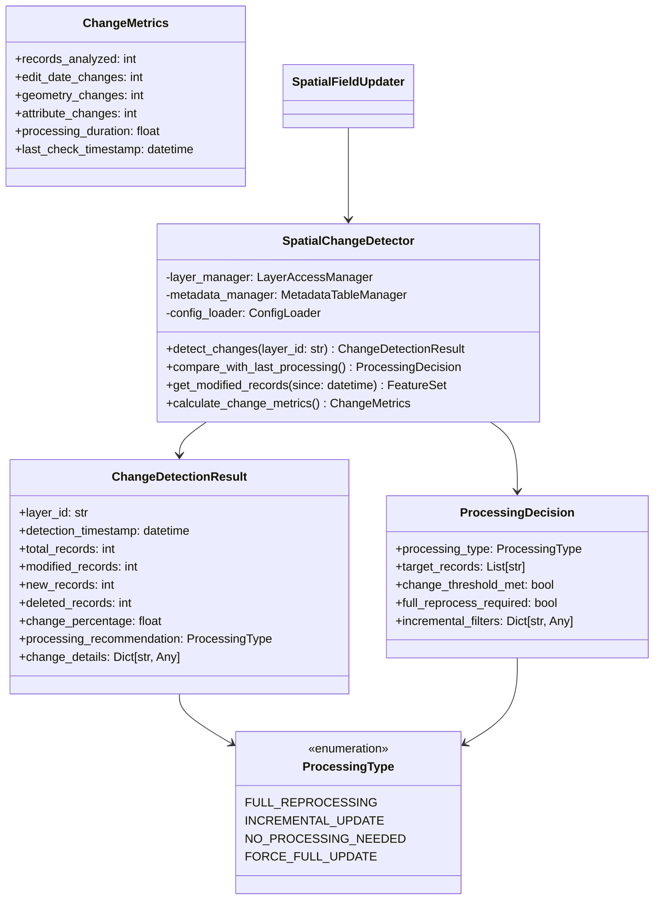

# Change Detection System – PRP (Product Requirement Plan)

## References
- [ArcGIS API for Python Documentation](https://github.com/esri/arcgis-python-api) - Change detection, query filtering, and date-based processing
- [CAMS Project Roadmap](docs/project/ROADMAP.md) - Item 5 specifications
- [CAMS Architecture](docs/project/ARCHITECTURE.md) - Change detection patterns and metadata management
- [Layer Access and Metadata Management PRP](docs/prp/4-layer-access-metadata/PRP.md) - Foundation dependency

## Requirements

**Feature Description:** Implement intelligent detection of changes requiring spatial reprocessing within the spatial field updater module, enabling incremental processing and optimization based on EditDate_1 field monitoring.

**Type:** New Feature Implementation

**Required Tools:**
- Python 3.12+
- ArcGIS API for Python ≥2.4.1 (existing dependency)
- Existing Layer Access and Metadata Management components
- Existing ProcessMetadata and SpatialFieldUpdater infrastructure
- Pydantic ≥2.0 for data validation

## Major Changes

### 1. Change Detection Architecture


### 2. EditDate_1 Field Monitoring System
- Context7 best practices for date-based WHERE clause queries
- Efficient change detection using `layer.query(where="EditDate_1 > ?")`
- Timestamp comparison with previous processing metadata
- Incremental record identification and batch processing

### 3. Processing Decision Logic
- Intelligent full vs incremental processing decisions
- Change threshold configuration and validation
- Processing recommendation engine based on change metrics
- Integration with existing metadata table patterns

### 4. Change Detection Result Models
- Comprehensive change metrics and reporting
- Processing recommendation with detailed reasoning
- Change detection history and trend analysis
- Integration with shared logging infrastructure

## Dependencies

1. **Layer Access and Metadata Management PRP (4-layer-access-metadata)** - COMPLETED ✅
   - LayerAccessManager for efficient layer access and querying
   - MetadataTableManager for processing state tracking
   - FieldValidator for schema validation

2. **Spatial Field Updater Structure PRP (3-spatial-field-updater-structure)** - COMPLETED ✅
   - SpatialFieldUpdater class implementation
   - ProcessMetadata model for processing tracking
   - Module configuration structure

## Development Plan

### Task 1: Core Change Detection Models

**Goal:** Create Pydantic models for change detection results and processing decisions following Context7 best practices.

**Implementation Steps:**
1. Create `modules/spatial_field_updater/change_detection/` directory structure
2. Implement `change_detection_models.py`:
   ```python
   from typing import Dict, List, Any, Optional
   from datetime import datetime
   from enum import Enum
   from pydantic import BaseModel, Field, field_validator
   
   class ProcessingType(str, Enum):
       """Processing type recommendations based on change detection."""
       FULL_REPROCESSING = "full_reprocessing"
       INCREMENTAL_UPDATE = "incremental_update" 
       NO_PROCESSING_NEEDED = "no_processing_needed"
       FORCE_FULL_UPDATE = "force_full_update"
   
   class ChangeMetrics(BaseModel):
       """Detailed metrics from change detection analysis."""
       records_analyzed: int = Field(ge=0, description="Total records analyzed")
       edit_date_changes: int = Field(ge=0, description="Records with EditDate_1 changes")
       geometry_changes: int = Field(ge=0, description="Records with geometry changes")
       attribute_changes: int = Field(ge=0, description="Records with attribute changes")
       processing_duration: float = Field(ge=0, description="Duration of change detection in seconds")
       last_check_timestamp: datetime = Field(..., description="Timestamp of change detection")
   
   class ChangeDetectionResult(BaseModel):
       """Comprehensive result of change detection analysis."""
       layer_id: str = Field(..., description="Layer identifier analyzed")
       detection_timestamp: datetime = Field(default_factory=datetime.now, description="When detection was performed")
       total_records: int = Field(ge=0, description="Total records in layer")
       modified_records: int = Field(ge=0, description="Number of modified records")
       new_records: int = Field(ge=0, description="Number of new records")
       deleted_records: int = Field(ge=0, description="Number of deleted records")
       change_percentage: float = Field(ge=0, le=100, description="Percentage of records changed")
       processing_recommendation: ProcessingType = Field(..., description="Recommended processing type")
       change_details: Dict[str, Any] = Field(default_factory=dict, description="Additional change details")
       change_metrics: ChangeMetrics = Field(..., description="Detailed change metrics")
       
       @field_validator('change_percentage')
       @classmethod
       def validate_change_percentage(cls, v: float) -> float:
           """Ensure change percentage is within valid range."""
           return round(min(max(v, 0.0), 100.0), 2)
   
   class ProcessingDecision(BaseModel):
       """Decision result for processing type and target records."""
       processing_type: ProcessingType = Field(..., description="Type of processing recommended")
       target_records: List[str] = Field(default_factory=list, description="Specific record IDs to process")
       change_threshold_met: bool = Field(..., description="Whether change threshold was exceeded")
       full_reprocess_required: bool = Field(..., description="Whether full reprocessing is required")
       incremental_filters: Dict[str, Any] = Field(default_factory=dict, description="Filters for incremental processing")
       reasoning: str = Field(default="", description="Explanation for processing decision")
       estimated_processing_time: Optional[float] = Field(None, description="Estimated processing time in seconds")
   ```

3. Create `change_detection/__init__.py`:
   ```python
   """Change Detection System for Spatial Field Updater"""
   
   from .change_detection_models import (
       ProcessingType, ChangeMetrics, ChangeDetectionResult, ProcessingDecision
   )
   from .spatial_change_detector import SpatialChangeDetector
   
   __all__ = [
       'ProcessingType', 'ChangeMetrics', 'ChangeDetectionResult', 'ProcessingDecision',
       'SpatialChangeDetector'
   ]
   ```

**Automated Tests:**
- Create `modules/spatial_field_updater/tests/test_change_detection_models.py`
- Test Pydantic model validation and serialization
- Test enum values and field constraints
- Test change percentage calculation and validation

**Documentation:**
- Comprehensive docstrings for all models
- Usage examples for change detection results

### Task 2: SpatialChangeDetector Implementation

**Goal:** Implement the core change detection logic using Context7 best practices for date-based queries and metadata comparison.

**Implementation Steps:**
1. Create `modules/spatial_field_updater/change_detection/spatial_change_detector.py`:
   ```python
   from typing import Optional, Dict, List, Any
   from datetime import datetime, timedelta
   import logging
   
   from ..layer_access import LayerAccessManager, MetadataTableManager
   from ..models import ProcessMetadata
   from .change_detection_models import (
       ChangeDetectionResult, ProcessingDecision, ProcessingType, ChangeMetrics
   )
   from src.config.config_loader import ConfigLoader
   
   logger = logging.getLogger(__name__)
   
   class SpatialChangeDetector:
       """Detects changes in spatial layers requiring reprocessing.
       
       Implements Context7 best practices for:
       - Date-based WHERE clause queries for EditDate_1 monitoring
       - Efficient change detection using query(return_count_only=True)
       - Metadata comparison for processing decisions
       - Batch processing patterns for large datasets
       """
       
       def __init__(self, layer_manager: LayerAccessManager, 
                    metadata_manager: MetadataTableManager, 
                    config_loader: ConfigLoader):
           """Initialize change detector with layer access and metadata management."""
           self.layer_manager = layer_manager
           self.metadata_manager = metadata_manager
           self.config_loader = config_loader
           self._change_config = self._load_change_detection_config()
           logger.info("SpatialChangeDetector initialized")
       
       def detect_changes(self, layer_id: str, since_timestamp: Optional[datetime] = None) -> ChangeDetectionResult:
           """Detect changes in a layer since the specified timestamp.
           
           Following Context7 best practices for efficient change detection using
           date-based WHERE clauses and optimized queries.
           
           Args:
               layer_id: ArcGIS layer identifier
               since_timestamp: Timestamp to check changes since (defaults to last processing)
               
           Returns:
               ChangeDetectionResult with comprehensive change analysis
           """
           start_time = datetime.now()
           logger.info(f"Starting change detection for layer {layer_id}")
           
           try:
               # Get layer metadata and validate accessibility
               layer_metadata = self.layer_manager.get_layer_metadata(layer_id)
               if not layer_metadata:
                   raise ValueError(f"Could not access layer metadata for {layer_id}")
               
               # Determine since timestamp from last processing if not provided
               if since_timestamp is None:
                   since_timestamp = self._get_last_processing_timestamp()
               
               # Get total record count using Context7 best practice
               layer = self.layer_manager.get_layer_by_id(layer_id)
               total_records = layer.query(return_count_only=True)
               
               # Detect modified records using EditDate_1 field
               modified_count, modified_records = self._get_modified_records(
                   layer, since_timestamp
               )
               
               # Detect new records (records with EditDate_1 after last processing)
               new_count = self._get_new_records_count(layer, since_timestamp)
               
               # Calculate change metrics
               change_percentage = (modified_count / total_records * 100) if total_records > 0 else 0
               processing_duration = (datetime.now() - start_time).total_seconds()
               
               # Create change metrics
               change_metrics = ChangeMetrics(
                   records_analyzed=total_records,
                   edit_date_changes=modified_count,
                   geometry_changes=0,  # Could be enhanced to detect geometry changes
                   attribute_changes=modified_count,  # Simplified - assume all changes are attribute changes
                   processing_duration=processing_duration,
                   last_check_timestamp=datetime.now()
               )
               
               # Determine processing recommendation
               processing_recommendation = self._determine_processing_type(
                   total_records, modified_count, change_percentage
               )
               
               result = ChangeDetectionResult(
                   layer_id=layer_id,
                   detection_timestamp=datetime.now(),
                   total_records=total_records,
                   modified_records=modified_count,
                   new_records=new_count,
                   deleted_records=0,  # Could be enhanced to detect deletions
                   change_percentage=change_percentage,
                   processing_recommendation=processing_recommendation,
                   change_details={
                       "since_timestamp": since_timestamp.isoformat(),
                       "edit_date_field": "EditDate_1",
                       "detection_method": "edit_date_monitoring"
                   },
                   change_metrics=change_metrics
               )
               
               logger.info(f"Change detection completed: {modified_count}/{total_records} records changed ({change_percentage:.2f}%)")
               return result
               
           except Exception as e:
               logger.error(f"Change detection failed for layer {layer_id}: {e}")
               # Return minimal result indicating error
               return ChangeDetectionResult(
                   layer_id=layer_id,
                   detection_timestamp=datetime.now(),
                   total_records=0,
                   modified_records=0,
                   new_records=0,
                   deleted_records=0,
                   change_percentage=0.0,
                   processing_recommendation=ProcessingType.NO_PROCESSING_NEEDED,
                   change_details={"error": str(e)},
                   change_metrics=ChangeMetrics(
                       records_analyzed=0,
                       edit_date_changes=0,
                       geometry_changes=0,
                       attribute_changes=0,
                       processing_duration=0.0,
                       last_check_timestamp=datetime.now()
                   )
               )
       
       def _get_modified_records(self, layer, since_timestamp: datetime) -> tuple[int, List[str]]:
           """Get modified records using Context7 date-based WHERE clause query."""
           try:
               # Convert datetime to ArcGIS compatible format (milliseconds since epoch)
               timestamp_ms = int(since_timestamp.timestamp() * 1000)
               
               # Context7 best practice: Use date-based WHERE clause for efficient filtering
               where_clause = f"EditDate_1 > {timestamp_ms}"
               
               # Get count efficiently
               modified_count = layer.query(where=where_clause, return_count_only=True)
               
               # Get record IDs for incremental processing
               modified_records = []
               if modified_count > 0 and modified_count <= 1000:  # Avoid large result sets
                   result = layer.query(where=where_clause, out_fields=["OBJECTID"])
                   modified_records = [str(f.attributes["OBJECTID"]) for f in result.features]
               
               logger.debug(f"Found {modified_count} modified records since {since_timestamp}")
               return modified_count, modified_records
               
           except Exception as e:
               logger.warning(f"Failed to get modified records: {e}")
               return 0, []
       
       def _get_new_records_count(self, layer, since_timestamp: datetime) -> int:
           """Get count of new records since timestamp."""
           try:
               timestamp_ms = int(since_timestamp.timestamp() * 1000)
               # Assume new records have EditDate_1 close to creation time
               where_clause = f"EditDate_1 >= {timestamp_ms}"
               return layer.query(where=where_clause, return_count_only=True)
           except Exception as e:
               logger.warning(f"Failed to get new records count: {e}")
               return 0
       
       def _determine_processing_type(self, total_records: int, modified_count: int, 
                                    change_percentage: float) -> ProcessingType:
           """Determine processing type based on change metrics and configuration."""
           # Load thresholds from configuration
           thresholds = self._change_config.get("thresholds", {})
           
           full_reprocess_threshold = thresholds.get("full_reprocess_percentage", 25.0)
           incremental_threshold = thresholds.get("incremental_threshold_percentage", 1.0)
           max_incremental_records = thresholds.get("max_incremental_records", 1000)
           
           # Decision logic
           if modified_count == 0:
               return ProcessingType.NO_PROCESSING_NEEDED
           elif change_percentage >= full_reprocess_threshold:
               return ProcessingType.FULL_REPROCESSING
           elif modified_count > max_incremental_records:
               return ProcessingType.FULL_REPROCESSING
           elif change_percentage >= incremental_threshold:
               return ProcessingType.INCREMENTAL_UPDATE
           else:
               return ProcessingType.NO_PROCESSING_NEEDED
       
       def compare_with_last_processing(self, layer_id: str) -> ProcessingDecision:
           """Compare current state with last processing metadata to make processing decision."""
           try:
               # Get last processing metadata
               last_metadata = self.metadata_manager.read_last_processing_metadata()
               
               if not last_metadata:
                   logger.info("No previous processing metadata found - recommending full processing")
                   return ProcessingDecision(
                       processing_type=ProcessingType.FULL_REPROCESSING,
                       target_records=[],
                       change_threshold_met=True,
                       full_reprocess_required=True,
                       incremental_filters={},
                       reasoning="No previous processing metadata found"
                   )
               
               # Detect changes since last processing
               change_result = self.detect_changes(layer_id, last_metadata.process_timestamp)
               
               # Create processing decision based on change detection
               decision = ProcessingDecision(
                   processing_type=change_result.processing_recommendation,
                   target_records=change_result.change_details.get("modified_record_ids", []),
                   change_threshold_met=change_result.change_percentage > self._change_config.get("thresholds", {}).get("incremental_threshold_percentage", 1.0),
                   full_reprocess_required=change_result.processing_recommendation == ProcessingType.FULL_REPROCESSING,
                   incremental_filters={
                       "where_clause": f"EditDate_1 > {int(last_metadata.process_timestamp.timestamp() * 1000)}",
                       "modified_count": change_result.modified_records
                   },
                   reasoning=f"Change detection found {change_result.modified_records} modified records ({change_result.change_percentage:.2f}% change)",
                   estimated_processing_time=self._estimate_processing_time(change_result)
               )
               
               logger.info(f"Processing decision: {decision.processing_type} - {decision.reasoning}")
               return decision
               
           except Exception as e:
               logger.error(f"Failed to compare with last processing: {e}")
               return ProcessingDecision(
                   processing_type=ProcessingType.FORCE_FULL_UPDATE,
                   target_records=[],
                   change_threshold_met=True,
                   full_reprocess_required=True,
                   incremental_filters={},
                   reasoning=f"Error in change detection: {e}"
               )
       
       def _get_last_processing_timestamp(self) -> datetime:
           """Get timestamp of last processing or default fallback."""
           try:
               last_metadata = self.metadata_manager.read_last_processing_metadata()
               if last_metadata:
                   return last_metadata.process_timestamp
               else:
                   # Default to 30 days ago if no previous processing
                   return datetime.now() - timedelta(days=30)
           except Exception as e:
               logger.warning(f"Could not get last processing timestamp: {e}")
               return datetime.now() - timedelta(days=30)
       
       def _estimate_processing_time(self, change_result: ChangeDetectionResult) -> float:
           """Estimate processing time based on change metrics."""
           # Simple estimation based on record count and processing type
           base_time_per_record = 0.1  # seconds per record
           
           if change_result.processing_recommendation == ProcessingType.FULL_REPROCESSING:
               return change_result.total_records * base_time_per_record
           elif change_result.processing_recommendation == ProcessingType.INCREMENTAL_UPDATE:
               return change_result.modified_records * base_time_per_record * 2  # Incremental is slightly slower per record
           else:
               return 0.0
       
       def _load_change_detection_config(self) -> Dict[str, Any]:
           """Load change detection configuration."""
           try:
               # Load from module configuration
               import json
               from pathlib import Path
               
               config_path = Path("modules/spatial_field_updater/config/field_updater_config.json")
               with open(config_path) as f:
                   config = json.load(f)
               
               return config.get("change_detection", {
                   "thresholds": {
                       "full_reprocess_percentage": 25.0,
                       "incremental_threshold_percentage": 1.0,
                       "max_incremental_records": 1000
                   },
                   "edit_date_field": "EditDate_1",
                   "batch_size": 100
               })
               
           except Exception as e:
               logger.warning(f"Could not load change detection config: {e}")
               return {
                   "thresholds": {
                       "full_reprocess_percentage": 25.0,
                       "incremental_threshold_percentage": 1.0,
                       "max_incremental_records": 1000
                   },
                   "edit_date_field": "EditDate_1",
                   "batch_size": 100
               }
   ```

**Automated Tests:**
- Create `modules/spatial_field_updater/tests/test_spatial_change_detector.py`
- Test change detection with various scenarios
- Test date-based WHERE clause queries
- Test processing type determination logic
- Mock layer access and metadata operations

**Documentation:**
- Document change detection algorithms and thresholds
- Add examples of change detection usage

### Task 3: Integration with SpatialFieldUpdater

**Goal:** Integrate change detection into the SpatialFieldUpdater processing workflow.

**Implementation Steps:**
1. Update `modules/spatial_field_updater/processor/spatial_field_updater.py`:
   ```python
   # Add imports
   from ..change_detection import SpatialChangeDetector, ProcessingType
   
   # Update __init__ method
   def __init__(self, config_loader: ConfigLoader):
       # ... existing initialization ...
       
       # Initialize change detection component
       self.change_detector: Optional[SpatialChangeDetector] = None
   
   # Update _initialize_layer_access method
   def _initialize_layer_access(self):
       """Initialize layer access components including change detection."""
       if self.connector and not self.layer_manager:
           # ... existing layer access initialization ...
           
           # Initialize change detector
           self.change_detector = SpatialChangeDetector(
               self.layer_manager, self.metadata_manager, self.config_loader
           )
           
           logger.info("Change detection component initialized")
   
   # Update process method
   def process(self, dry_run: bool = False) -> ProcessingResult:
       """Execute spatial field update processing with intelligent change detection."""
       start_time = datetime.now()
       
       try:
           # Validate configuration
           if not self.validate_configuration():
               return ProcessingResult(
                   success=False,
                   records_processed=0,
                   errors=["Configuration validation failed"],
                   metadata={"dry_run": dry_run},
                   execution_time=0
               )
           
           # Initialize ArcGIS connectivity
           self.connector = ArcGISConnector(self.config_loader)
           self._initialize_layer_access()
           
           # Get environment configuration
           env_config = self.config_loader.load_environment_config()
           environment = env_config.get('current_environment', 'development')
           weed_layer_id = env_config.get(environment, {}).get('weed_locations_layer_id')
           
           if not weed_layer_id:
               return ProcessingResult(
                   success=False,
                   records_processed=0,
                   errors=["Weed locations layer ID not configured"],
                   metadata={"dry_run": dry_run},
                   execution_time=0
               )
           
           # Perform change detection
           processing_decision = self.change_detector.compare_with_last_processing(weed_layer_id)
           
           # Process based on change detection decision
           if processing_decision.processing_type == ProcessingType.NO_PROCESSING_NEEDED:
               logger.info("No processing needed - no significant changes detected")
               execution_time = (datetime.now() - start_time).total_seconds()
               
               return ProcessingResult(
                   success=True,
                   records_processed=0,
                   errors=[],
                   metadata={
                       "dry_run": dry_run,
                       "processing_decision": processing_decision.model_dump(),
                       "change_detection_used": True
                   },
                   execution_time=execution_time
               )
           
           # Determine processing approach
           if processing_decision.processing_type == ProcessingType.FULL_REPROCESSING:
               records_processed = self._perform_full_reprocessing(weed_layer_id, dry_run)
           else:  # INCREMENTAL_UPDATE
               records_processed = self._perform_incremental_processing(
                   weed_layer_id, processing_decision, dry_run
               )
           
           # Update last run timestamp
           self._last_run = datetime.now()
           execution_time = (self._last_run - start_time).total_seconds()
           
           # Write processing metadata
           if not dry_run and self.metadata_manager:
               processing_metadata = self._create_processing_metadata(
                   processing_decision, records_processed, execution_time
               )
               self.metadata_manager.write_processing_metadata(processing_metadata)
           
           logger.info(f"Processing completed: {records_processed} records processed in {execution_time:.2f} seconds")
           
           return ProcessingResult(
               success=True,
               records_processed=records_processed,
               errors=[],
               metadata={
                   "dry_run": dry_run,
                   "processing_decision": processing_decision.model_dump(),
                   "change_detection_used": True,
                   "processing_type": processing_decision.processing_type
               },
               execution_time=execution_time
           )
           
       except Exception as e:
           execution_time = (datetime.now() - start_time).total_seconds()
           error_message = f"Processing failed: {e}"
           logger.error(error_message)
           
           return ProcessingResult(
               success=False,
               records_processed=0,
               errors=[str(e)],
               metadata={"dry_run": dry_run, "error_occurred_at": datetime.now().isoformat()},
               execution_time=execution_time
           )
   
   def _perform_full_reprocessing(self, layer_id: str, dry_run: bool) -> int:
       """Perform full reprocessing of all records."""
       logger.info("Performing full reprocessing")
       
       if dry_run:
           # Simulate processing by counting records
           layer = self.layer_manager.get_layer_by_id(layer_id)
           return layer.query(return_count_only=True)
       
       # TODO: Implement actual full reprocessing logic
       return 1000  # Placeholder
   
   def _perform_incremental_processing(self, layer_id: str, 
                                     processing_decision: ProcessingDecision, 
                                     dry_run: bool) -> int:
       """Perform incremental processing of modified records."""
       logger.info(f"Performing incremental processing of {len(processing_decision.target_records)} records")
       
       if dry_run:
           return len(processing_decision.target_records)
       
       # TODO: Implement actual incremental processing logic
       return len(processing_decision.target_records)
   
   def _create_processing_metadata(self, processing_decision: ProcessingDecision, 
                                 records_processed: int, execution_time: float) -> ProcessMetadata:
       """Create processing metadata with change detection information."""
       module_config = self._get_module_config()
       area_layers = module_config.get('area_layers', {})
       
       return ProcessMetadata(
           process_timestamp=datetime.now(),
           region_layer_id=area_layers.get('region', {}).get('layer_id', ''),
           region_layer_updated=datetime.now(),
           district_layer_id=area_layers.get('district', {}).get('layer_id', ''),
           district_layer_updated=datetime.now(),
           process_status='Success',
           records_processed=records_processed,
           processing_duration=execution_time,
           error_message=None,
           metadata_details={
               "processing_type": processing_decision.processing_type,
               "change_detection_used": True,
               "incremental_filters": processing_decision.incremental_filters
           }
       )
   ```

**Automated Tests:**
- Update `modules/spatial_field_updater/tests/test_spatial_field_updater.py`
- Test change detection integration
- Test processing decision logic
- Test incremental vs full processing workflows

**Documentation:**
- Update SpatialFieldUpdater documentation with change detection capabilities
- Add examples of change detection in processing workflows

### Task 4: Configuration Enhancement

**Goal:** Extend module configuration with change detection settings and thresholds.

**Implementation Steps:**
1. Update `modules/spatial_field_updater/config/field_updater_config.json`:
   ```json
   {
     "area_layers": {
       "region": {
         "layer_id": "7759fbaecd4649dea39c4ac2b07fc4ab",
         "source_code_field": "REGC_code",
         "target_field": "RegionCode",
         "description": "Region boundary polygons for spatial intersection",
         "expected_fields": {
           "REGC_code": "string",
           "OBJECTID": "integer",
           "GlobalID": "string",
           "Shape": "geometry"
         }
       },
       "district": {
         "layer_id": "c8f6ba6b968c4d31beddfb69abfe3df0",
         "source_code_field": "TALB_code",
         "target_field": "DistrictCode",
         "description": "District boundary polygons for spatial intersection",
         "expected_fields": {
           "TALB_code": "string",
           "OBJECTID": "integer",
           "GlobalID": "string",
           "Shape": "geometry"
         }
       }
     },
     "processing": {
       "batch_size": 100,
       "max_retries": 3,
       "timeout_seconds": 1800,
       "spatial_relationship": "intersects",
       "metadata_refresh_interval": 3600
     },
     "metadata_table": {
       "production_name": "Weeds Area Metadata",
       "development_name": "XXX Weeds Area Metadata DEV",
       "required_fields": {
         "ProcessTimestamp": "date",
         "RegionLayerID": "string",
         "RegionLayerUpdated": "date",
         "DistrictLayerID": "string",
         "DistrictLayerUpdated": "date",
         "ProcessStatus": "string",
         "RecordsProcessed": "integer",
         "ProcessingDuration": "double",
         "ErrorMessage": "string"
       }
     },
     "validation": {
       "required_fields": ["object_id", "global_id", "geometry", "edit_date"],
       "field_mappings": {
         "object_id": "OBJECTID",
         "global_id": "GlobalID",
         "edit_date": "EditDate_1",
         "region_code": "RegionCode",
         "district_code": "DistrictCode"
       },
       "field_types": {
         "OBJECTID": "integer",
         "GlobalID": "string",
         "EditDate_1": "date",
         "RegionCode": "string",
         "DistrictCode": "string",
         "Shape": "geometry"
       }
     },
     "layer_access": {
       "cache_duration": 300,
       "retry_attempts": 3,
       "timeout_seconds": 30,
       "validate_on_startup": true
     },
     "change_detection": {
       "enabled": true,
       "edit_date_field": "EditDate_1",
       "thresholds": {
         "full_reprocess_percentage": 25.0,
         "incremental_threshold_percentage": 1.0,
         "max_incremental_records": 1000,
         "no_change_threshold_percentage": 0.1
       },
       "processing_decisions": {
         "default_processing_type": "incremental_update",
         "force_full_reprocess_days": 7,
         "max_incremental_age_hours": 24
       },
       "performance": {
         "batch_size": 100,
         "query_timeout_seconds": 60,
         "max_records_per_query": 5000
       }
     }
   }
   ```

**Automated Tests:**
- Test configuration validation with change detection settings
- Test threshold parsing and validation
- Test configuration loading and defaults

**Documentation:**
- Document change detection configuration options
- Add examples of threshold tuning

### Task 5: Comprehensive Testing

**Goal:** Create comprehensive tests for change detection functionality.

**Implementation Steps:**
1. Create `modules/spatial_field_updater/tests/test_change_detection_integration.py`:
   ```python
   """Integration tests for change detection system."""
   
   import pytest
   from unittest.mock import Mock, patch
   from datetime import datetime, timedelta
   
   from modules.spatial_field_updater.change_detection import (
       SpatialChangeDetector, ProcessingType, ChangeDetectionResult
   )
   
   class TestChangeDetectionIntegration:
       """Integration tests for change detection components."""
       
       @pytest.fixture
       def mock_dependencies(self):
           """Create mock dependencies for change detector."""
           layer_manager = Mock()
           metadata_manager = Mock()
           config_loader = Mock()
           return layer_manager, metadata_manager, config_loader
       
       @pytest.fixture
       def change_detector(self, mock_dependencies):
           """Create SpatialChangeDetector instance."""
           layer_manager, metadata_manager, config_loader = mock_dependencies
           return SpatialChangeDetector(layer_manager, metadata_manager, config_loader)
       
       def test_no_changes_detected(self, change_detector, mock_dependencies):
           """Test behavior when no changes are detected."""
           layer_manager, metadata_manager, config_loader = mock_dependencies
           
           # Mock layer with no changes
           mock_layer = Mock()
           mock_layer.query.return_value = 0  # No modified records
           layer_manager.get_layer_by_id.return_value = mock_layer
           layer_manager.get_layer_metadata.return_value = Mock(layer_name="Test Layer")
           
           # Simulate query calls
           def mock_query(**kwargs):
               if kwargs.get('return_count_only'):
                   if 'EditDate_1' in kwargs.get('where', ''):
                       return 0  # No modified records
                   return 1000  # Total records
               return Mock(features=[])
           
           mock_layer.query.side_effect = mock_query
           
           result = change_detector.detect_changes("test-layer")
           
           assert result.processing_recommendation == ProcessingType.NO_PROCESSING_NEEDED
           assert result.modified_records == 0
           assert result.change_percentage == 0.0
       
       def test_incremental_changes_detected(self, change_detector, mock_dependencies):
           """Test behavior when incremental changes are detected."""
           layer_manager, metadata_manager, config_loader = mock_dependencies
           
           mock_layer = Mock()
           layer_manager.get_layer_by_id.return_value = mock_layer
           layer_manager.get_layer_metadata.return_value = Mock(layer_name="Test Layer")
           
           # Simulate 2% change (20 out of 1000 records)
           def mock_query(**kwargs):
               if kwargs.get('return_count_only'):
                   if 'EditDate_1' in kwargs.get('where', ''):
                       return 20  # Modified records
                   return 1000  # Total records
               return Mock(features=[Mock(attributes={"OBJECTID": i}) for i in range(20)])
           
           mock_layer.query.side_effect = mock_query
           
           result = change_detector.detect_changes("test-layer")
           
           assert result.processing_recommendation == ProcessingType.INCREMENTAL_UPDATE
           assert result.modified_records == 20
           assert result.change_percentage == 2.0
       
       def test_full_reprocess_threshold_exceeded(self, change_detector, mock_dependencies):
           """Test behavior when full reprocess threshold is exceeded."""
           layer_manager, metadata_manager, config_loader = mock_dependencies
           
           mock_layer = Mock()
           layer_manager.get_layer_by_id.return_value = mock_layer
           layer_manager.get_layer_metadata.return_value = Mock(layer_name="Test Layer")
           
           # Simulate 30% change (300 out of 1000 records)
           def mock_query(**kwargs):
               if kwargs.get('return_count_only'):
                   if 'EditDate_1' in kwargs.get('where', ''):
                       return 300  # Modified records
                   return 1000  # Total records
               return Mock(features=[])
           
           mock_layer.query.side_effect = mock_query
           
           result = change_detector.detect_changes("test-layer")
           
           assert result.processing_recommendation == ProcessingType.FULL_REPROCESSING
           assert result.modified_records == 300
           assert result.change_percentage == 30.0
   ```

**Automated Tests:**
- Test change detection algorithms with various scenarios
- Test processing decision logic
- Test configuration-driven thresholds
- Test error handling and edge cases

**Documentation:**
- Document integration testing approach
- Add examples of change detection scenarios

### Task 6: Performance Optimization

**Goal:** Optimize change detection performance for large datasets.

**Implementation Steps:**
1. Implement batch processing for change detection
2. Add caching for frequently accessed metadata
3. Optimize WHERE clause construction and query performance
4. Add performance monitoring and metrics

**Automated Tests:**
- Performance tests with large datasets
- Memory usage optimization tests
- Query performance benchmarks

**Documentation:**
- Performance optimization guidelines
- Benchmark results and recommendations

### Task 7: Documentation and Examples

**Goal:** Create comprehensive documentation and usage examples.

**Implementation Steps:**
1. Create `modules/spatial_field_updater/change_detection/README.md`:
   ```markdown
   # Change Detection System
   
   Intelligent detection of changes requiring spatial reprocessing following Context7 best practices.
   
   ## Overview
   
   The Change Detection System monitors EditDate_1 field changes in ArcGIS layers to determine:
   - Whether processing is needed
   - Full reprocessing vs incremental updates
   - Specific records requiring processing
   
   ## Components
   
   ### SpatialChangeDetector
   
   Core change detection engine with Context7 optimizations:
   
   ```python
   from modules.spatial_field_updater.change_detection import SpatialChangeDetector
   
   # Initialize detector
   detector = SpatialChangeDetector(layer_manager, metadata_manager, config_loader)
   
   # Detect changes since last processing
   result = detector.detect_changes("layer-id-123")
   
   print(f"Changes detected: {result.modified_records} records ({result.change_percentage:.2f}%)")
   print(f"Recommendation: {result.processing_recommendation}")
   ```
   
   ### Processing Decision Logic
   
   Intelligent decision making based on change thresholds:
   
   ```python
   # Get processing decision
   decision = detector.compare_with_last_processing("layer-id-123")
   
   if decision.processing_type == ProcessingType.INCREMENTAL_UPDATE:
       print(f"Process {len(decision.target_records)} specific records")
   elif decision.processing_type == ProcessingType.FULL_REPROCESSING:
       print("Full reprocessing required")
   ```
   
   ## Configuration
   
   Change detection is configured in field_updater_config.json:
   
   ```json
   {
     "change_detection": {
       "thresholds": {
         "full_reprocess_percentage": 25.0,
         "incremental_threshold_percentage": 1.0,
         "max_incremental_records": 1000
       }
     }
   }
   ```
   
   ## Context7 Best Practices
   
   - **Date-based queries**: `layer.query(where="EditDate_1 > timestamp")`
   - **Efficient counting**: `layer.query(return_count_only=True)`
   - **Batch processing**: Configurable batch sizes for large datasets
   - **Metadata comparison**: Integration with ProcessMetadata for state tracking
   
   ## Performance Optimization
   
   - Layer caching from LayerAccessManager
   - Optimized WHERE clause construction
   - Configurable query timeouts and batch sizes
   - Memory-efficient record processing
   ```

2. Add usage examples and troubleshooting guides

**Documentation Updates:**
- API documentation for all change detection classes
- Integration examples with SpatialFieldUpdater
- Configuration reference and tuning guide
- Performance optimization recommendations

## Quality Assurance

### Testing Requirements
- **Unit Tests:** 95%+ code coverage for change detection components
- **Integration Tests:** End-to-end testing with mocked ArcGIS layers
- **Performance Tests:** Change detection with large datasets (>10k records)
- **Edge Case Tests:** Network failures, invalid timestamps, missing metadata

### Code Review Checklist
- [ ] Context7 best practices for date-based queries implemented
- [ ] Efficient change detection using return_count_only queries
- [ ] Proper metadata comparison and processing decisions
- [ ] Comprehensive error handling and logging
- [ ] Performance optimization for large datasets
- [ ] Configuration-driven thresholds and settings

### Success Criteria
- [ ] Change detection accurately identifies modified records
- [ ] Processing decisions optimize between full and incremental updates
- [ ] EditDate_1 field monitoring works efficiently
- [ ] Metadata table integration tracks processing state
- [ ] Performance scales to large datasets (>100k records)
- [ ] Configuration allows tuning of detection thresholds
- [ ] Integration with SpatialFieldUpdater is seamless

## Feedback Collection

**Change Detection Accuracy:**
- Validate change detection with known data modifications
- Test threshold tuning for different data patterns
- Verify processing decision logic with real scenarios

**Performance Assessment:**
- Measure change detection performance with large datasets
- Evaluate query optimization and caching effectiveness
- Test memory usage with concurrent change detection

**Integration Validation:**
- Verify seamless integration with existing SpatialFieldUpdater
- Test metadata table operations and state tracking
- Validate processing workflows with incremental updates 