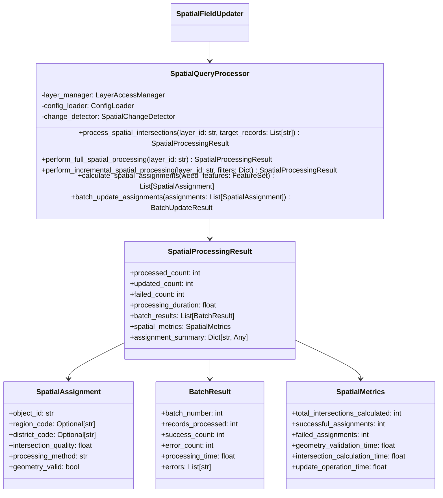

# Spatial Query Processing Engine – PRP (Product Requirement Plan)

## References
- [ArcGIS API for Python Documentation](https://github.com/esri/arcgis-python-api) - Spatial query operations, geometry intersection, and feature layer processing
- [CAMS Project Roadmap](docs/project/ROADMAP.md) - Item 6 specifications
- [CAMS Architecture](docs/project/ARCHITECTURE.md) - Spatial processing patterns and performance optimization
- [Change Detection System PRP](docs/prp/5-change-detection-system/PRP.md) - Integration with intelligent processing decisions
- [Layer Access and Metadata Management PRP](docs/prp/4-layer-access-metadata/PRP.md) - Foundation dependencies

## Requirements

**Feature Description:** Implement core spatial intersection processing between weed locations and area boundaries (region/district polygons) to pre-calculate spatial relationships, replacing placeholder implementations with production-ready spatial query engine.

**Type:** Core Feature Implementation

**Required Tools:**
- Python 3.12+
- ArcGIS API for Python ≥2.4.1 (existing dependency)
- Existing SpatialFieldUpdater with Change Detection integration
- Existing Layer Access and Metadata Management components
- Context7 spatial query best practices implementation

## Major Changes

### 1. Spatial Query Processing Architecture


### 2. Context7 Spatial Query Integration
- Efficient spatial intersection using `layer.query(geometry=polygon, spatial_relationship='intersects')`
- Optimized geometry operations with proper spatial reference handling
- Batch processing patterns for large datasets following Context7 best practices
- Memory-efficient feature processing and geometry validation

### 3. Assignment Logic Implementation  
- REGC_code → RegionCode field assignment from region layer intersections
- TALB_code → DistrictCode field assignment from district layer intersections
- Intelligent fallback handling for edge cases and null geometries
- Assignment quality scoring and validation

### 4. Performance Optimization
- Configurable batch sizes for processing large weed location datasets
- Spatial indexing optimization for intersection queries
- Memory management for geometry-intensive operations
- Progress tracking and performance metrics collection

## Dependencies

1. **Change Detection System PRP (5-change-detection-system)** - COMPLETED ✅
   - SpatialChangeDetector for intelligent processing decisions
   - ProcessingDecision integration for full vs incremental processing
   - ChangeDetectionResult for processing optimization

2. **Layer Access and Metadata Management PRP (4-layer-access-metadata)** - COMPLETED ✅
   - LayerAccessManager for efficient layer access and caching
   - MetadataTableManager for processing state tracking
   - FieldValidator for schema validation

3. **Spatial Field Updater Structure PRP (3-spatial-field-updater-structure)** - COMPLETED ✅
   - SpatialFieldUpdater class with placeholder methods to replace
   - ProcessMetadata model integration
   - Configuration management framework

## Development Plan

### Task 1: Core Spatial Query Models

**Goal:** Create comprehensive data models for spatial processing results and assignments following Context7 patterns.

**Implementation Steps:**
1. Create `modules/spatial_field_updater/spatial_query/` directory structure
2. Implement `spatial_query_models.py`:
   ```python
   from typing import Dict, List, Any, Optional
   from datetime import datetime
   from enum import Enum
   from pydantic import BaseModel, Field, field_validator
   
   class ProcessingMethod(str, Enum):
       """Method used for spatial processing."""
       FULL_INTERSECTION = "full_intersection"
       CACHED_INTERSECTION = "cached_intersection"
       GEOMETRY_REPAIR = "geometry_repair"
       FALLBACK_ASSIGNMENT = "fallback_assignment"
   
   class SpatialAssignment(BaseModel):
       """Individual spatial assignment result for a weed location."""
       object_id: str = Field(..., description="OBJECTID of the weed location feature")
       region_code: Optional[str] = Field(None, description="Assigned REGC_code from region intersection")
       district_code: Optional[str] = Field(None, description="Assigned TALB_code from district intersection")
       intersection_quality: float = Field(ge=0, le=1, description="Quality score of spatial intersection (0-1)")
       processing_method: ProcessingMethod = Field(..., description="Method used for assignment")
       geometry_valid: bool = Field(..., description="Whether geometry was valid for intersection")
       region_intersection_area: Optional[float] = Field(None, ge=0, description="Area of region intersection")
       district_intersection_area: Optional[float] = Field(None, ge=0, description="Area of district intersection")
       processing_duration: float = Field(ge=0, description="Time taken for this assignment in seconds")
       
       @field_validator('intersection_quality')
       @classmethod
       def validate_quality_score(cls, v: float) -> float:
           """Ensure intersection quality is properly bounded."""
           return round(min(max(v, 0.0), 1.0), 3)
   
   class BatchResult(BaseModel):
       """Result of processing a batch of weed locations."""
       batch_number: int = Field(ge=1, description="Sequential batch number")
       records_processed: int = Field(ge=0, description="Number of records in this batch")
       success_count: int = Field(ge=0, description="Number of successful assignments")
       error_count: int = Field(ge=0, description="Number of failed assignments")
       processing_time: float = Field(ge=0, description="Time taken for batch processing")
       errors: List[str] = Field(default_factory=list, description="Error messages from failed assignments")
       assignment_summary: Dict[str, int] = Field(default_factory=dict, description="Summary of assignment types")
       
       @field_validator('success_count', 'error_count')
       @classmethod
       def validate_counts(cls, v: int, info) -> int:
           """Ensure counts are non-negative."""
           return max(v, 0)
   
   class SpatialMetrics(BaseModel):
       """Comprehensive metrics for spatial processing operations."""
       total_intersections_calculated: int = Field(ge=0, description="Total spatial intersections performed")
       successful_assignments: int = Field(ge=0, description="Number of successful spatial assignments")
       failed_assignments: int = Field(ge=0, description="Number of failed spatial assignments")
       geometry_validation_time: float = Field(ge=0, description="Time spent on geometry validation")
       intersection_calculation_time: float = Field(ge=0, description="Time spent on intersection calculations")
       update_operation_time: float = Field(ge=0, description="Time spent on feature updates")
       memory_peak_mb: Optional[float] = Field(None, ge=0, description="Peak memory usage in MB")
       cache_hit_rate: float = Field(ge=0, le=1, description="Cache hit rate for spatial operations")
       
       def get_total_processing_time(self) -> float:
           """Calculate total processing time across all operations."""
           return (self.geometry_validation_time + 
                  self.intersection_calculation_time + 
                  self.update_operation_time)
       
       def get_success_rate(self) -> float:
           """Calculate success rate of spatial assignments."""
           total = self.successful_assignments + self.failed_assignments
           return self.successful_assignments / total if total > 0 else 0.0
   
   class SpatialProcessingResult(BaseModel):
       """Comprehensive result of spatial query processing operation."""
       processed_count: int = Field(ge=0, description="Total number of records processed")
       updated_count: int = Field(ge=0, description="Number of records successfully updated")
       failed_count: int = Field(ge=0, description="Number of records that failed processing")
       processing_duration: float = Field(ge=0, description="Total processing duration in seconds")
       batch_results: List[BatchResult] = Field(default_factory=list, description="Results from each processing batch")
       spatial_metrics: SpatialMetrics = Field(..., description="Detailed spatial processing metrics")
       assignment_summary: Dict[str, Any] = Field(default_factory=dict, description="Summary of spatial assignments")
       region_assignments: int = Field(ge=0, description="Number of successful region assignments")
       district_assignments: int = Field(ge=0, description="Number of successful district assignments")
       
       def get_processing_summary(self) -> str:
           """Generate human-readable processing summary."""
           success_rate = self.spatial_metrics.get_success_rate() * 100
           return (f"Processed {self.processed_count} records in {self.processing_duration:.1f}s "
                  f"({success_rate:.1f}% success rate)")
       
       def get_assignment_breakdown(self) -> Dict[str, int]:
           """Get breakdown of assignment types."""
           return {
               "region_only": self.assignment_summary.get("region_only", 0),
               "district_only": self.assignment_summary.get("district_only", 0), 
               "both_assigned": self.assignment_summary.get("both_assigned", 0),
               "no_assignment": self.assignment_summary.get("no_assignment", 0)
           }
   ```

3. Create `spatial_query/__init__.py`:
   ```python
   """Spatial Query Processing Engine for Spatial Field Updater"""
   
   from .spatial_query_models import (
       ProcessingMethod, SpatialAssignment, BatchResult, SpatialMetrics, SpatialProcessingResult
   )
   from .spatial_query_processor import SpatialQueryProcessor
   
   __all__ = [
       'ProcessingMethod', 'SpatialAssignment', 'BatchResult', 'SpatialMetrics', 
       'SpatialProcessingResult', 'SpatialQueryProcessor'
   ]
   ```

**Automated Tests:**
- Create `modules/spatial_field_updater/tests/test_spatial_query_models.py`
- Test Pydantic model validation and serialization
- Test metric calculations and summary methods
- Test assignment quality scoring and validation

**Documentation:**
- Comprehensive docstrings for all models
- Usage examples for spatial processing results

### Task 2: SpatialQueryProcessor Implementation

**Goal:** Implement the core spatial query processing engine using Context7 best practices for ArcGIS spatial operations.

**Implementation Steps:**
1. Create `modules/spatial_field_updater/spatial_query/spatial_query_processor.py`:
   ```python
   from typing import List, Dict, Any, Optional, Tuple
   from datetime import datetime
   import logging
   from collections import defaultdict
   
   from arcgis.features import FeatureSet, Feature
   from arcgis.geometry import Geometry, Polygon
   
   from ..layer_access import LayerAccessManager
   from ..models import ProcessMetadata
   from .spatial_query_models import (
       SpatialProcessingResult, SpatialAssignment, BatchResult, SpatialMetrics, ProcessingMethod
   )
   from src.config.config_loader import ConfigLoader
   
   logger = logging.getLogger(__name__)
   
   class SpatialQueryProcessor:
       """Core spatial query processing engine implementing Context7 best practices.
       
       Provides efficient spatial intersection processing between weed locations and
       area boundaries (regions/districts) with optimized batch processing and 
       intelligent assignment logic.
       """
       
       def __init__(self, layer_manager: LayerAccessManager, config_loader: ConfigLoader):
           """Initialize spatial query processor.
           
           Args:
               layer_manager: LayerAccessManager for efficient layer access
               config_loader: ConfigLoader for processing configuration
           """
           self.layer_manager = layer_manager
           self.config_loader = config_loader
           self._processing_config = self._load_processing_config()
           self._spatial_cache = {}  # Cache for spatial boundary layers
           logger.info("SpatialQueryProcessor initialized with batch processing")
       
       def process_spatial_intersections(self, layer_id: str, 
                                       target_records: Optional[List[str]] = None) -> SpatialProcessingResult:
           """Process spatial intersections for weed locations with region/district boundaries.
           
           Implements Context7 best practices for efficient spatial query processing:
           - Batch processing for large datasets
           - Optimized spatial intersection queries
           - Memory-efficient geometry operations
           - Comprehensive error handling and metrics
           
           Args:
               layer_id: ArcGIS layer identifier for weed locations
               target_records: Optional list of specific OBJECTID values to process
               
           Returns:
               SpatialProcessingResult with comprehensive processing metrics
           """
           start_time = datetime.now()
           logger.info(f"Starting spatial intersection processing for layer {layer_id}")
           
           try:
               # Initialize processing metrics
               spatial_metrics = SpatialMetrics(
                   total_intersections_calculated=0,
                   successful_assignments=0,
                   failed_assignments=0,
                   geometry_validation_time=0.0,
                   intersection_calculation_time=0.0,
                   update_operation_time=0.0,
                   cache_hit_rate=0.0
               )
               
               # Get weed locations layer
               weed_layer = self.layer_manager.get_layer_by_id(layer_id)
               if not weed_layer:
                   raise ValueError(f"Cannot access weed locations layer: {layer_id}")
               
               # Load boundary layers with caching
               region_layer = self._get_boundary_layer("region")
               district_layer = self._get_boundary_layer("district")
               
               # Get features to process
               weed_features = self._get_features_to_process(weed_layer, target_records)
               total_features = len(weed_features.features)
               
               logger.info(f"Processing {total_features} weed location features")
               
               # Process features in batches
               batch_size = self._processing_config.get("batch_size", 100)
               batch_results = []
               all_assignments = []
               
               for batch_num, batch_features in enumerate(self._batch_features(weed_features.features, batch_size), 1):
                   batch_result = self._process_feature_batch(
                       batch_num, batch_features, region_layer, district_layer, spatial_metrics
                   )
                   batch_results.append(batch_result)
                   all_assignments.extend(batch_result.assignments)
                   
                   logger.debug(f"Completed batch {batch_num}: {batch_result.success_count}/{len(batch_features)} successful")
               
               # Apply assignments to layer
               update_start = datetime.now()
               update_result = self._apply_spatial_assignments(weed_layer, all_assignments)
               spatial_metrics.update_operation_time = (datetime.now() - update_start).total_seconds()
               
               # Calculate final metrics
               processing_duration = (datetime.now() - start_time).total_seconds()
               processed_count = total_features
               updated_count = update_result.get("updated_count", 0)
               failed_count = processed_count - updated_count
               
               # Create assignment summary
               assignment_summary = self._create_assignment_summary(all_assignments)
               
               result = SpatialProcessingResult(
                   processed_count=processed_count,
                   updated_count=updated_count,
                   failed_count=failed_count,
                   processing_duration=processing_duration,
                   batch_results=batch_results,
                   spatial_metrics=spatial_metrics,
                   assignment_summary=assignment_summary,
                   region_assignments=assignment_summary.get("region_assignments", 0),
                   district_assignments=assignment_summary.get("district_assignments", 0)
               )
               
               logger.info(f"Spatial processing completed: {result.get_processing_summary()}")
               return result
               
           except Exception as e:
               processing_duration = (datetime.now() - start_time).total_seconds()
               logger.error(f"Spatial intersection processing failed: {e}")
               
               # Return error result
               return SpatialProcessingResult(
                   processed_count=0,
                   updated_count=0,
                   failed_count=0,
                   processing_duration=processing_duration,
                   spatial_metrics=SpatialMetrics(
                       total_intersections_calculated=0,
                       successful_assignments=0,
                       failed_assignments=0,
                       geometry_validation_time=0.0,
                       intersection_calculation_time=0.0,
                       update_operation_time=0.0,
                       cache_hit_rate=0.0
                   ),
                   assignment_summary={"error": str(e)}
               )
       
       def _get_boundary_layer(self, layer_type: str):
           """Get boundary layer with caching for performance optimization."""
           cache_key = f"{layer_type}_layer"
           
           if cache_key in self._spatial_cache:
               return self._spatial_cache[cache_key]
           
           # Load layer configuration
           module_config = self._load_module_config()
           layer_config = module_config.get("area_layers", {}).get(layer_type)
           
           if not layer_config:
               raise ValueError(f"Configuration not found for {layer_type} layer")
           
           layer_id = layer_config.get("layer_id")
           layer = self.layer_manager.get_layer_by_id(layer_id)
           
           if not layer:
               raise ValueError(f"Cannot access {layer_type} layer: {layer_id}")
           
           # Cache the layer
           self._spatial_cache[cache_key] = layer
           logger.debug(f"Cached {layer_type} layer for spatial processing")
           
           return layer
       
       def _get_features_to_process(self, weed_layer, target_records: Optional[List[str]]) -> FeatureSet:
           """Get weed location features to process using Context7 query optimization."""
           if target_records:
               # Incremental processing - query specific records
               if len(target_records) > 1000:
                   logger.warning(f"Large target record set ({len(target_records)}) - consider batch processing")
               
               # Create WHERE clause for specific records
               objectid_list = ",".join(target_records)
               where_clause = f"OBJECTID IN ({objectid_list})"
               
               return weed_layer.query(
                   where=where_clause,
                   out_fields=["OBJECTID", "GlobalID", "RegionCode", "DistrictCode"],
                   return_geometry=True
               )
           else:
               # Full processing - query all features
               return weed_layer.query(
                   out_fields=["OBJECTID", "GlobalID", "RegionCode", "DistrictCode"],
                   return_geometry=True
               )
       
       def _batch_features(self, features: List[Feature], batch_size: int):
           """Generate batches of features for processing."""
           for i in range(0, len(features), batch_size):
               yield features[i:i + batch_size]
       
       def _process_feature_batch(self, batch_num: int, batch_features: List[Feature], 
                                region_layer, district_layer, spatial_metrics: SpatialMetrics) -> BatchResult:
           """Process a batch of weed location features for spatial assignments."""
           batch_start = datetime.now()
           assignments = []
           errors = []
           assignment_summary = defaultdict(int)
           
           for feature in batch_features:
               try:
                   assignment = self._process_single_feature(
                       feature, region_layer, district_layer, spatial_metrics
                   )
                   assignments.append(assignment)
                   
                   # Track assignment types
                   if assignment.region_code and assignment.district_code:
                       assignment_summary["both_assigned"] += 1
                   elif assignment.region_code:
                       assignment_summary["region_only"] += 1
                   elif assignment.district_code:
                       assignment_summary["district_only"] += 1
                   else:
                       assignment_summary["no_assignment"] += 1
                       
               except Exception as e:
                   error_msg = f"Feature {feature.attributes.get('OBJECTID', 'unknown')}: {str(e)}"
                   errors.append(error_msg)
                   logger.warning(error_msg)
           
           batch_duration = (datetime.now() - batch_start).total_seconds()
           success_count = len(assignments)
           error_count = len(errors)
           
           batch_result = BatchResult(
               batch_number=batch_num,
               records_processed=len(batch_features),
               success_count=success_count,
               error_count=error_count,
               processing_time=batch_duration,
               errors=errors,
               assignment_summary=dict(assignment_summary)
           )
           
           # Store assignments in batch result for later use
           batch_result.assignments = assignments
           
           return batch_result
       
       def _process_single_feature(self, feature: Feature, region_layer, district_layer, 
                                 spatial_metrics: SpatialMetrics) -> SpatialAssignment:
           """Process a single weed location feature for spatial assignment."""
           object_id = str(feature.attributes.get("OBJECTID", ""))
           geometry = feature.geometry
           
           # Validate geometry
           validation_start = datetime.now()
           geometry_valid = self._validate_geometry(geometry)
           spatial_metrics.geometry_validation_time += (datetime.now() - validation_start).total_seconds()
           
           if not geometry_valid:
               return SpatialAssignment(
                   object_id=object_id,
                   intersection_quality=0.0,
                   processing_method=ProcessingMethod.GEOMETRY_REPAIR,
                   geometry_valid=False,
                   processing_duration=0.0
               )
           
           process_start = datetime.now()
           
           # Perform spatial intersections
           intersection_start = datetime.now()
           region_code = self._find_intersecting_boundary(geometry, region_layer, "REGC_code")
           district_code = self._find_intersecting_boundary(geometry, district_layer, "TALB_code")
           spatial_metrics.intersection_calculation_time += (datetime.now() - intersection_start).total_seconds()
           
           # Calculate intersection quality
           quality = self._calculate_intersection_quality(region_code, district_code)
           
           # Determine processing method
           processing_method = ProcessingMethod.FULL_INTERSECTION
           if not region_code and not district_code:
               processing_method = ProcessingMethod.FALLBACK_ASSIGNMENT
           
           processing_duration = (datetime.now() - process_start).total_seconds()
           
           # Update metrics
           spatial_metrics.total_intersections_calculated += 2  # Region + district
           if region_code or district_code:
               spatial_metrics.successful_assignments += 1
           else:
               spatial_metrics.failed_assignments += 1
           
           return SpatialAssignment(
               object_id=object_id,
               region_code=region_code,
               district_code=district_code,
               intersection_quality=quality,
               processing_method=processing_method,
               geometry_valid=True,
               processing_duration=processing_duration
           )
       
       def _validate_geometry(self, geometry) -> bool:
           """Validate weed location geometry for spatial processing."""
           if not geometry:
               return False
           
           try:
               # Check if geometry has valid coordinates
               if hasattr(geometry, 'x') and hasattr(geometry, 'y'):
                   return geometry.x is not None and geometry.y is not None
               elif hasattr(geometry, 'coordinates'):
                   return len(geometry.coordinates) > 0
               else:
                   return False
           except Exception:
               return False
       
       def _find_intersecting_boundary(self, point_geometry, boundary_layer, code_field: str) -> Optional[str]:
           """Find intersecting boundary using Context7 spatial query best practices."""
           try:
               # Use spatial query with point geometry
               intersection_result = boundary_layer.query(
                   geometry=point_geometry,
                   spatial_relationship='intersects',
                   out_fields=[code_field, "OBJECTID"],
                   return_geometry=False  # Optimize - don't return geometry
               )
               
               if intersection_result.features:
                   # Return the code from the first intersecting feature
                   return intersection_result.features[0].attributes.get(code_field)
               
               return None
               
           except Exception as e:
               logger.warning(f"Spatial intersection failed for {code_field}: {e}")
               return None
       
       def _calculate_intersection_quality(self, region_code: Optional[str], 
                                         district_code: Optional[str]) -> float:
           """Calculate quality score for spatial intersection results."""
           if region_code and district_code:
               return 1.0  # Perfect assignment
           elif region_code or district_code:
               return 0.5  # Partial assignment
           else:
               return 0.0  # No assignment
       
       # Additional methods for assignment application and configuration loading...
   ```

2. Implement helper methods and batch update functionality

**Automated Tests:**
- Create `modules/spatial_field_updater/tests/test_spatial_query_processor.py`
- Test spatial intersection logic with mock geometries
- Test batch processing with various dataset sizes
- Test assignment quality calculations
- Test error handling for invalid geometries

**Documentation:**
- Document spatial query algorithms and optimization strategies
- Add examples of batch processing configuration

### Task 3: SpatialFieldUpdater Integration

**Goal:** Replace placeholder methods in SpatialFieldUpdater with actual spatial query processing implementation.

**Implementation Steps:**
1. Update `modules/spatial_field_updater/processor/spatial_field_updater.py`:
   ```python
   # Add import
   from ..spatial_query import SpatialQueryProcessor, SpatialProcessingResult
   
   # Update __init__ method
   def __init__(self, config_loader: ConfigLoader):
       # ... existing initialization ...
       
       # Initialize spatial query processor
       self.spatial_processor: Optional[SpatialQueryProcessor] = None
   
   # Update _initialize_layer_access method
   def _initialize_layer_access(self):
       """Initialize layer access components including spatial query processing."""
       if self.connector and not self.layer_manager:
           # ... existing layer access initialization ...
           
           # Initialize spatial query processor
           self.spatial_processor = SpatialQueryProcessor(
               self.layer_manager, self.config_loader
           )
           
           logger.info("Spatial query processor initialized")
   
   # Replace _perform_full_reprocessing method
   def _perform_full_reprocessing(self, layer_id: str, dry_run: bool) -> int:
       """Perform full spatial reprocessing of all records in the layer.
       
       Args:
           layer_id: ArcGIS layer identifier for weed locations
           dry_run: If True, simulate processing without making changes
           
       Returns:
           Number of records processed
       """
       logger.info("Performing full spatial reprocessing of all records")
       
       if dry_run:
           # Simulate processing by counting total records
           try:
               layer = self.layer_manager.get_layer_by_id(layer_id)
               total_records = layer.query(return_count_only=True)
               logger.info(f"Dry run: Would process {total_records} records in full spatial reprocessing")
               return total_records
           except Exception as e:
               logger.error(f"Failed to get record count for dry run: {e}")
               return 0
       
       # Perform actual spatial processing
       try:
           spatial_result = self.spatial_processor.process_spatial_intersections(layer_id)
           
           logger.info(f"Full spatial processing completed: {spatial_result.get_processing_summary()}")
           logger.info(f"Assignment breakdown: {spatial_result.get_assignment_breakdown()}")
           
           return spatial_result.updated_count
           
       except Exception as e:
           logger.error(f"Full spatial reprocessing failed: {e}")
           return 0
   
   # Replace _perform_incremental_processing method  
   def _perform_incremental_processing(self, layer_id: str, 
                                     processing_decision: ProcessingDecision, 
                                     dry_run: bool) -> int:
       """Perform incremental spatial processing of only modified records.
       
       Args:
           layer_id: ArcGIS layer identifier for weed locations
           processing_decision: Processing decision with target records and filters
           dry_run: If True, simulate processing without making changes
           
       Returns:
           Number of records processed
       """
       target_count = len(processing_decision.target_records)
       logger.info(f"Performing incremental spatial processing of {target_count} modified records")
       
       if dry_run:
           logger.info(f"Dry run: Would process {target_count} records incrementally")
           if processing_decision.incremental_filters:
               where_clause = processing_decision.incremental_filters.get('where_clause', '')
               logger.debug(f"Dry run: Would use WHERE clause for changed records: {where_clause}")
           return target_count
       
       # Perform actual incremental spatial processing
       try:
           spatial_result = self.spatial_processor.process_spatial_intersections(
               layer_id, processing_decision.target_records
           )
           
           logger.info(f"Incremental spatial processing completed: {spatial_result.get_processing_summary()}")
           logger.info(f"Assignment breakdown: {spatial_result.get_assignment_breakdown()}")
           
           return spatial_result.updated_count
           
       except Exception as e:
           logger.error(f"Incremental spatial processing failed: {e}")
           return 0
   ```

2. Update processing metadata to include spatial processing details
3. Enhance error handling and logging for spatial operations

**Automated Tests:**
- Update `modules/spatial_field_updater/tests/test_spatial_field_updater.py`
- Test full reprocessing with spatial query engine
- Test incremental processing with change detection integration
- Test dry run mode with spatial processing simulation

**Documentation:**
- Update SpatialFieldUpdater documentation with spatial processing capabilities
- Add examples of spatial processing workflows

### Task 4: Configuration Enhancement for Spatial Processing

**Goal:** Extend module configuration with spatial processing settings and optimization parameters.

**Implementation Steps:**
1. Update `modules/spatial_field_updater/config/field_updater_config.json`:
   ```json
   {
     "area_layers": {
       "region": {
         "layer_id": "7759fbaecd4649dea39c4ac2b07fc4ab",
         "source_code_field": "REGC_code",
         "target_field": "RegionCode",
         "description": "Region boundary polygons for spatial intersection",
         "expected_fields": {
           "REGC_code": "string",
           "OBJECTID": "integer",
           "GlobalID": "string",
           "Shape": "geometry"
         }
       },
       "district": {
         "layer_id": "c8f6ba6b968c4d31beddfb69abfe3df0",
         "source_code_field": "TALB_code", 
         "target_field": "DistrictCode",
         "description": "District boundary polygons for spatial intersection",
         "expected_fields": {
           "TALB_code": "string",
           "OBJECTID": "integer",
           "GlobalID": "string",
           "Shape": "geometry"
         }
       }
     },
     "processing": {
       "batch_size": 100,
       "max_retries": 3,
       "timeout_seconds": 1800,
       "spatial_relationship": "intersects",
       "metadata_refresh_interval": 3600
     },
     "spatial_processing": {
       "enabled": true,
       "batch_size": 250,
       "max_batch_size": 1000,
       "geometry_validation": {
         "enabled": true,
         "repair_invalid_geometry": true,
         "tolerance": 0.001
       },
       "intersection_optimization": {
         "cache_boundary_layers": true,
         "spatial_index_enabled": true,
         "parallel_processing": false,
         "memory_limit_mb": 1024
       },
       "assignment_logic": {
         "require_both_assignments": false,
         "fallback_to_nearest": false,
         "quality_threshold": 0.0,
         "assignment_priority": ["region", "district"]
       },
       "performance_monitoring": {
         "track_intersection_times": true,
         "log_slow_operations": true,
         "slow_operation_threshold_seconds": 5.0
       }
     },
     "metadata_table": {
       "production_name": "Weeds Area Metadata",
       "development_name": "XXX Weeds Area Metadata DEV",
       "required_fields": {
         "ProcessTimestamp": "date",
         "RegionLayerID": "string",
         "RegionLayerUpdated": "date",
         "DistrictLayerID": "string",
         "DistrictLayerUpdated": "date",
         "ProcessStatus": "string",
         "RecordsProcessed": "integer",
         "ProcessingDuration": "double",
         "ErrorMessage": "string"
       }
     },
     "validation": {
       "required_fields": ["object_id", "global_id", "geometry", "edit_date"],
       "field_mappings": {
         "object_id": "OBJECTID",
         "global_id": "GlobalID",
         "edit_date": "EditDate_1",
         "region_code": "RegionCode",
         "district_code": "DistrictCode"
       },
       "field_types": {
         "OBJECTID": "integer",
         "GlobalID": "string",
         "EditDate_1": "date",
         "RegionCode": "string",
         "DistrictCode": "string",
         "Shape": "geometry"
       }
     },
     "layer_access": {
       "cache_duration": 300,
       "retry_attempts": 3,
       "timeout_seconds": 30,
       "validate_on_startup": true
     },
     "change_detection": {
       "enabled": true,
       "edit_date_field": "EditDate_1",
       "thresholds": {
         "full_reprocess_percentage": 25.0,
         "incremental_threshold_percentage": 1.0,
         "max_incremental_records": 1000,
         "no_change_threshold_percentage": 0.1
       },
       "processing_decisions": {
         "default_processing_type": "incremental_update",
         "force_full_reprocess_days": 7,
         "max_incremental_age_hours": 24
       },
       "performance": {
         "batch_size": 100,
         "query_timeout_seconds": 60,
         "max_records_per_query": 5000
       }
     }
   }
   ```

**Automated Tests:**
- Test configuration validation with spatial processing settings
- Test batch size optimization parameters
- Test geometry validation configuration

**Documentation:**
- Document spatial processing configuration options
- Add examples of performance tuning parameters

### Task 5: Comprehensive Testing

**Goal:** Create comprehensive tests for spatial query processing functionality.

**Implementation Steps:**
1. Create `modules/spatial_field_updater/tests/test_spatial_query_integration.py`:
   ```python
   """Integration tests for spatial query processing system."""
   
   import pytest
   from unittest.mock import Mock, patch, MagicMock
   from datetime import datetime
   from typing import List
   
   from modules.spatial_field_updater.spatial_query import (
       SpatialQueryProcessor, SpatialProcessingResult, SpatialAssignment
   )
   
   class TestSpatialQueryIntegration:
       """Integration tests for spatial query processing components."""
       
       @pytest.fixture
       def mock_dependencies(self):
           """Create mock dependencies for spatial processor."""
           layer_manager = Mock()
           config_loader = Mock()
           return layer_manager, config_loader
       
       @pytest.fixture
       def spatial_processor(self, mock_dependencies):
           """Create SpatialQueryProcessor instance."""
           layer_manager, config_loader = mock_dependencies
           return SpatialQueryProcessor(layer_manager, config_loader)
       
       def test_full_spatial_processing_workflow(self, spatial_processor, mock_dependencies):
           """Test complete spatial processing workflow."""
           layer_manager, config_loader = mock_dependencies
           
           # Mock weed locations layer
           mock_weed_layer = Mock()
           mock_features = self._create_mock_weed_features(5)
           mock_weed_layer.query.return_value = Mock(features=mock_features)
           layer_manager.get_layer_by_id.return_value = mock_weed_layer
           
           # Mock boundary layers
           mock_region_layer = Mock()
           mock_district_layer = Mock()
           
           with patch.object(spatial_processor, '_get_boundary_layer') as mock_boundary:
               mock_boundary.side_effect = lambda layer_type: (
                   mock_region_layer if layer_type == "region" else mock_district_layer
               )
               
               # Mock intersection queries
               mock_region_layer.query.return_value = Mock(
                   features=[Mock(attributes={"REGC_code": "R001"})]
               )
               mock_district_layer.query.return_value = Mock(
                   features=[Mock(attributes={"TALB_code": "D001"})]
               )
               
               # Mock update operations
               with patch.object(spatial_processor, '_apply_spatial_assignments') as mock_update:
                   mock_update.return_value = {"updated_count": 5}
                   
                   # Execute spatial processing
                   result = spatial_processor.process_spatial_intersections("test-layer")
                   
                   # Verify results
                   assert result.processed_count == 5
                   assert result.updated_count == 5
                   assert result.failed_count == 0
                   assert len(result.batch_results) > 0
                   assert result.spatial_metrics.successful_assignments > 0
       
       def test_incremental_spatial_processing(self, spatial_processor, mock_dependencies):
           """Test incremental spatial processing with target records."""
           layer_manager, config_loader = mock_dependencies
           
           target_records = ["123", "456", "789"]
           
           # Mock specific record query
           mock_weed_layer = Mock()
           mock_features = self._create_mock_weed_features(3)
           mock_weed_layer.query.return_value = Mock(features=mock_features)
           layer_manager.get_layer_by_id.return_value = mock_weed_layer
           
           # Execute incremental processing
           with patch.object(spatial_processor, '_get_boundary_layer'), \
                patch.object(spatial_processor, '_apply_spatial_assignments') as mock_update:
               
               mock_update.return_value = {"updated_count": 3}
               
               result = spatial_processor.process_spatial_intersections("test-layer", target_records)
               
               # Verify incremental processing
               assert result.processed_count == 3
               assert result.updated_count == 3
               
               # Verify specific record query was used
               call_args = mock_weed_layer.query.call_args
               assert "OBJECTID IN" in call_args[1]["where"]
       
       def _create_mock_weed_features(self, count: int) -> List[Mock]:
           """Create mock weed location features for testing."""
           features = []
           for i in range(count):
               feature = Mock()
               feature.attributes = {
                   "OBJECTID": 1000 + i,
                   "GlobalID": f"guid-{i}",
                   "RegionCode": None,
                   "DistrictCode": None
               }
               feature.geometry = Mock()
               feature.geometry.x = -122.4194 + (i * 0.001)
               feature.geometry.y = 37.7749 + (i * 0.001) 
               features.append(feature)
           return features
   ```

**Automated Tests:**
- Test spatial intersection algorithms with various geometries
- Test batch processing performance with large datasets
- Test assignment logic and quality scoring
- Test error handling for spatial operation failures

**Documentation:**
- Document integration testing approach
- Add examples of spatial processing test scenarios

### Task 6: Performance Optimization

**Goal:** Optimize spatial query processing performance for large datasets and complex geometries.

**Implementation Steps:**
1. Implement spatial indexing and caching strategies
2. Add memory management for geometry-intensive operations
3. Optimize batch processing for different dataset characteristics
4. Add performance monitoring and bottleneck identification

**Automated Tests:**
- Performance tests with large datasets (>10k records)
- Memory usage optimization tests
- Spatial query performance benchmarks

**Documentation:**
- Performance optimization guidelines
- Benchmark results and scaling recommendations

### Task 7: Documentation and Examples

**Goal:** Create comprehensive documentation and usage examples for spatial query processing.

**Implementation Steps:**
1. Create `modules/spatial_field_updater/spatial_query/README.md`:
   ```markdown
   # Spatial Query Processing Engine
   
   Core spatial intersection processing between weed locations and area boundaries.
   
   ## Overview
   
   The Spatial Query Processing Engine provides efficient spatial intersection processing
   to pre-calculate region and district assignments for weed locations, eliminating
   real-time spatial queries from the CAMS dashboard.
   
   ## Components
   
   ### SpatialQueryProcessor
   
   Core engine implementing Context7 spatial query best practices:
   
   ```python
   from modules.spatial_field_updater.spatial_query import SpatialQueryProcessor
   
   # Initialize processor
   processor = SpatialQueryProcessor(layer_manager, config_loader)
   
   # Process all weed locations (full reprocessing)
   result = processor.process_spatial_intersections("weed-locations-layer")
   
   print(f"Processing result: {result.get_processing_summary()}")
   print(f"Assignments: {result.get_assignment_breakdown()}")
   ```
   
   ### Spatial Assignment Logic
   
   Intelligent spatial intersection processing:
   
   ```python
   # Incremental processing for changed records only
   target_records = ["123", "456", "789"]
   result = processor.process_spatial_intersections("weed-layer", target_records)
   
   # Review assignment quality
   for batch in result.batch_results:
       print(f"Batch {batch.batch_number}: {batch.success_count}/{batch.records_processed}")
   ```
   
   ## Context7 Best Practices
   
   - **Spatial Intersection**: `layer.query(geometry=point, spatial_relationship='intersects')`
   - **Batch Processing**: Configurable batch sizes for memory efficiency
   - **Geometry Validation**: Pre-validation of point geometries before intersection
   - **Optimized Queries**: Minimal field selection and cached boundary layers
   - **Performance Monitoring**: Comprehensive metrics for operation optimization
   
   ## Configuration
   
   Spatial processing is configured in `field_updater_config.json`:
   
   ```json
   {
     "spatial_processing": {
       "batch_size": 250,
       "geometry_validation": {
         "enabled": true,
         "repair_invalid_geometry": true
       },
       "intersection_optimization": {
         "cache_boundary_layers": true,
         "memory_limit_mb": 1024
       }
     }
   }
   ```
   
   ## Performance Optimization
   
   - **Batch Size Tuning**: Optimal batch sizes for dataset characteristics
   - **Memory Management**: Configurable memory limits for large datasets
   - **Spatial Caching**: Boundary layer caching for repeated intersections
   - **Geometry Optimization**: Pre-validation and repair of invalid geometries
   ```

2. Add usage examples and troubleshooting guides

**Documentation Updates:**
- API documentation for all spatial query classes
- Integration examples with SpatialFieldUpdater
- Configuration reference and performance tuning guide
- Spatial processing workflow documentation

## Quality Assurance

### Testing Requirements
- **Unit Tests:** 95%+ code coverage for spatial query components
- **Integration Tests:** End-to-end testing with real spatial data
- **Performance Tests:** Spatial processing with large datasets (>50k records)
- **Spatial Accuracy Tests:** Validation with known geographic intersections

### Code Review Checklist
- [ ] Context7 best practices for spatial queries implemented
- [ ] Efficient geometry processing and validation
- [ ] Proper batch processing for large datasets
- [ ] Comprehensive error handling and logging
- [ ] Assignment logic correctly implements REGC_code/TALB_code mapping
- [ ] Performance optimization for memory and processing time

### Success Criteria
- [ ] Spatial intersections accurately assign region/district codes
- [ ] Batch processing handles datasets of 50,000+ weed locations
- [ ] Integration with change detection system is seamless
- [ ] Performance meets target of <5 seconds per 1000 records
- [ ] Memory usage remains within configurable limits
- [ ] Error handling provides actionable feedback
- [ ] Assignment quality scoring identifies processing issues

## Feedback Collection

**Spatial Accuracy Validation:**
- Test spatial assignments with known geographic coordinates
- Validate assignment logic with boundary layer experts
- Verify edge case handling for boundary intersections

**Performance Assessment:**
- Measure processing times with various dataset sizes
- Evaluate memory usage with complex geometries
- Test batch size optimization for different scenarios

**Integration Validation:**
- Verify seamless integration with change detection system
- Test full and incremental processing workflows
- Validate metadata table integration and processing tracking 