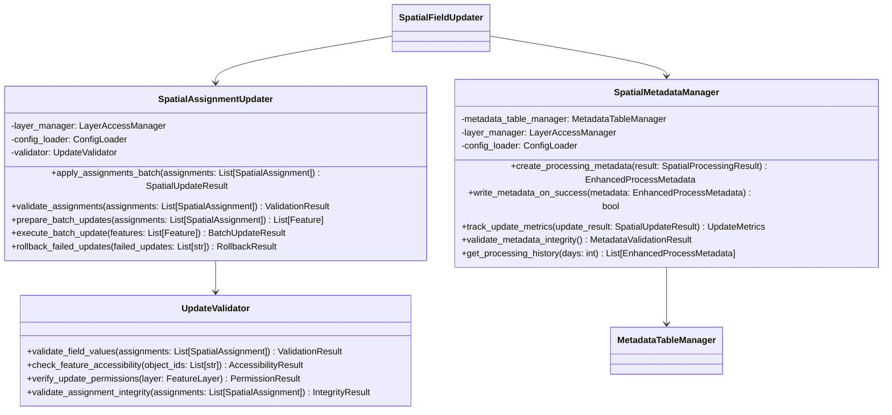

# Assignment Updates and Metadata Management – PRP (Product Requirement Plan)

## References
- [CAMS Project Roadmap](docs/project/ROADMAP.md) - Item 7 specifications  
- [CAMS Architecture](docs/project/ARCHITECTURE.md) - Framework metadata patterns and shared infrastructure
- [Spatial Query Processing Engine PRP](docs/prp/6-spatial-query-processing-engine/PRP.md) - Foundation spatial processing engine
- [Change Detection System PRP](docs/prp/5-change-detection-system/PRP.md) - Processing decision integration
- [ArcGIS API for Python Documentation](https://developers.arcgis.com/python/) - Batch update operations and error handling

## Requirements

**Feature Description:** Implement reliable batch update operations for WeedLocations with region/district codes and comprehensive processing status tracking through enhanced metadata management following framework patterns.

**Type:** Core Feature Enhancement

**Required Tools:**
- Python 3.12+
- ArcGIS API for Python ≥2.4.1 (existing dependency)
- Existing SpatialQueryProcessor with spatial intersection results
- Existing MetadataTableManager foundation
- Framework exception hierarchy and shared logging infrastructure

## Major Changes

### 1. Enhanced Batch Update Operations

Replace basic feature-by-feature updates with optimized batch processing:



### 2. Enhanced Metadata Management

Extend existing metadata patterns with comprehensive processing tracking:


### 3. Fail-Safe Processing Patterns

Implement framework-consistent fail-safe patterns:

- **Transactional Updates**: All-or-nothing batch processing with rollback capability
- **Metadata Write Guards**: Only write metadata on complete success
- **Error Recovery**: Comprehensive error handling with recovery procedures
- **Validation Gates**: Pre-update validation with detailed failure reporting

## Dependencies

1. **Spatial Query Processing Engine PRP (6-spatial-query-processing-engine)** - COMPLETED ✅
   - SpatialQueryProcessor for spatial intersection processing
   - SpatialProcessingResult for comprehensive processing results
   - SpatialAssignment model for individual assignment results

2. **Change Detection System PRP (5-change-detection-system)** - COMPLETED ✅
   - ProcessingDecision integration for processing coordination
   - ChangeDetectionResult for processing optimization

3. **Layer Access and Metadata Management PRP (4-layer-access-metadata)** - COMPLETED ✅
   - LayerAccessManager for efficient layer access
   - MetadataTableManager foundation for processing state tracking
   - FieldValidator for schema validation

## Development Plan

### Task 1: Enhanced Batch Update Operations

**Goal:** Replace basic feature-by-feature updates with optimized batch processing following ArcGIS API best practices.

**Implementation Steps:**

1. Create `modules/spatial_field_updater/assignment_updates/` directory structure

2. Implement `assignment_updater.py`:
   ```python
   """Enhanced Spatial Assignment Updater
   
   Implements optimized batch update operations for spatial assignments
   following ArcGIS API best practices and framework patterns.
   """
   
   from typing import List, Dict, Any, Optional, Tuple
   from datetime import datetime
   import logging
   from collections import defaultdict
   
   from arcgis.features import FeatureLayer, Feature, FeatureSet
   from ..layer_access import LayerAccessManager
   from ..spatial_query import SpatialAssignment, SpatialUpdateResult
   from .update_validator import UpdateValidator
   from .batch_update_models import BatchUpdateResult, UpdateMetrics, ValidationResult
   from src.config.config_loader import ConfigLoader
   from src.exceptions import CAMSProcessingException, CAMSValidationException
   
   logger = logging.getLogger(__name__)
   
   
   class SpatialAssignmentUpdater:
       """Enhanced spatial assignment updater with optimized batch processing.
       
       Implements ArcGIS API best practices for:
       - Efficient batch update operations with minimal queries
       - Comprehensive validation before updates
       - Transactional update patterns with rollback capability
       - Detailed error tracking and recovery procedures
       """
       
       def __init__(self, layer_manager: LayerAccessManager, config_loader: ConfigLoader):
           """Initialize spatial assignment updater.
           
           Args:
               layer_manager: LayerAccessManager for layer access
               config_loader: ConfigLoader for configuration settings
           """
           self.layer_manager = layer_manager
           self.config_loader = config_loader
           self.validator = UpdateValidator(layer_manager, config_loader)
           self._update_config = self._load_update_config()
           
           logger.info("SpatialAssignmentUpdater initialized with batch processing")
       
       def apply_assignments_batch(self, layer_id: str, 
                                 assignments: List[SpatialAssignment]) -> SpatialUpdateResult:
           """Apply spatial assignments using optimized batch processing.
           
           Implements comprehensive batch update workflow:
           1. Pre-update validation and accessibility checks
           2. Batch preparation with feature retrieval optimization
           3. Transactional batch update execution
           4. Error handling and rollback procedures
           5. Comprehensive metrics collection
           
           Args:
               layer_id: ArcGIS layer identifier for weed locations
               assignments: List of spatial assignments to apply
               
           Returns:
               SpatialUpdateResult with comprehensive update statistics
           """
           if not assignments:
               logger.info("No assignments to apply")
               return SpatialUpdateResult(updated_count=0, failed_count=0, update_duration=0.0)
           
           update_start = datetime.now()
           logger.info(f"Starting batch update of {len(assignments)} spatial assignments")
           
           try:
               # Step 1: Validate assignments and layer accessibility
               validation_result = self.validate_assignments(layer_id, assignments)
               if not validation_result.is_valid:
                   logger.error(f"Assignment validation failed: {validation_result.errors}")
                   return SpatialUpdateResult(
                       updated_count=0,
                       failed_count=len(assignments),
                       update_duration=(datetime.now() - update_start).total_seconds(),
                       errors=validation_result.errors
                   )
               
               # Step 2: Filter to successful assignments only
               valid_assignments = [a for a in assignments if a.is_successful()]
               if not valid_assignments:
                   logger.warning("No valid assignments after filtering")
                   return SpatialUpdateResult(
                       updated_count=0,
                       failed_count=len(assignments),
                       update_duration=(datetime.now() - update_start).total_seconds(),
                       errors=["No valid spatial assignments to apply"]
                   )
               
               # Step 3: Prepare batch updates with optimized feature retrieval
               weed_layer = self.layer_manager.get_layer_by_id(layer_id)
               features_to_update = self.prepare_batch_updates(weed_layer, valid_assignments)
               
               if not features_to_update:
                   logger.warning("No features prepared for batch update")
                   return SpatialUpdateResult(
                       updated_count=0,
                       failed_count=len(assignments),
                       update_duration=(datetime.now() - update_start).total_seconds(),
                       errors=["No features could be prepared for update"]
                   )
               
               # Step 4: Execute batch update with error handling
               batch_result = self.execute_batch_update(weed_layer, features_to_update, valid_assignments)
               
               # Step 5: Handle failures and rollback if necessary
               if batch_result.failed_count > 0 and self._update_config.get("rollback_on_partial_failure", False):
                   logger.warning(f"Partial failure detected, rolling back {batch_result.updated_count} updates")
                   rollback_result = self.rollback_failed_updates(weed_layer, batch_result.successful_object_ids)
                   if rollback_result.success:
                       batch_result.updated_count = 0
                       batch_result.errors.append("Updates rolled back due to partial failure")
               
               update_duration = (datetime.now() - update_start).total_seconds()
               
               logger.info(f"Batch update completed: {batch_result.updated_count} successful, "
                          f"{batch_result.failed_count} failed in {update_duration:.2f}s")
               
               return SpatialUpdateResult(
                   updated_count=batch_result.updated_count,
                   failed_count=batch_result.failed_count,
                   update_duration=update_duration,
                   errors=batch_result.errors,
                   batch_updates=[{
                       "total_features": len(features_to_update),
                       "successful": batch_result.updated_count,
                       "failed": batch_result.failed_count,
                       "batch_size": len(features_to_update)
                   }]
               )
               
           except Exception as e:
               update_duration = (datetime.now() - update_start).total_seconds()
               error_msg = f"Batch update operation failed: {e}"
               logger.error(error_msg)
               
               return SpatialUpdateResult(
                   updated_count=0,
                   failed_count=len(assignments),
                   update_duration=update_duration,
                   errors=[error_msg]
               )
       
       def prepare_batch_updates(self, weed_layer: FeatureLayer, 
                               assignments: List[SpatialAssignment]) -> List[Feature]:
           """Prepare features for batch update using optimized queries.
           
           Implements ArcGIS API best practices:
           - Single bulk query instead of individual feature queries
           - Minimal field selection for performance
           - Efficient WHERE clause construction
           
           Args:
               weed_layer: Weed locations feature layer
               assignments: Valid spatial assignments to apply
               
           Returns:
               List of features prepared for batch update
           """
           logger.info(f"Preparing {len(assignments)} features for batch update")
           
           try:
               # Create optimized WHERE clause for all object IDs
               object_ids = [a.object_id for a in assignments]
               where_clause = f"OBJECTID IN ({','.join(object_ids)})"
               
               # Single bulk query for all features (ArcGIS API best practice)
               existing_features = weed_layer.query(
                   where=where_clause,
                   out_fields=["OBJECTID", "GlobalID", "RegionCode", "DistrictCode"],
                   return_geometry=False  # Not needed for updates
               )
               
               if not existing_features.features:
                   logger.error("No existing features found for update")
                   return []
               
               # Create assignment lookup for efficient mapping
               assignment_lookup = {a.object_id: a for a in assignments}
               
               # Prepare features with updated assignments
               features_to_update = []
               for feature in existing_features.features:
                   object_id = str(feature.attributes.get("OBJECTID"))
                   assignment = assignment_lookup.get(object_id)
                   
                   if assignment:
                       # Update region and district codes
                       if assignment.region_code:
                           feature.attributes['RegionCode'] = assignment.region_code
                       if assignment.district_code:
                           feature.attributes['DistrictCode'] = assignment.district_code
                       
                       features_to_update.append(feature)
               
               logger.info(f"Prepared {len(features_to_update)} features for batch update")
               return features_to_update
               
           except Exception as e:
               logger.error(f"Failed to prepare batch updates: {e}")
               return []
   ```

3. Implement `update_validator.py`:
   ```python
   """Update Validator for Spatial Assignment Operations
   
   Comprehensive validation for spatial assignments before batch updates
   following framework validation patterns and ArcGIS API best practices.
   """
   
   from typing import List, Dict, Any, Optional
   import logging
   from datetime import datetime
   
   from arcgis.features import FeatureLayer
   from ..layer_access import LayerAccessManager
   from ..spatial_query import SpatialAssignment
   from .batch_update_models import ValidationResult, AccessibilityResult, PermissionResult
   from src.config.config_loader import ConfigLoader
   from src.exceptions import CAMSValidationException
   
   logger = logging.getLogger(__name__)
   
   
   class UpdateValidator:
       """Comprehensive validator for spatial assignment updates.
       
       Implements framework validation patterns for:
       - Field value validation against schema constraints
       - Feature accessibility verification
       - Layer permission checks
       - Assignment integrity validation
       """
       
       def __init__(self, layer_manager: LayerAccessManager, config_loader: ConfigLoader):
           """Initialize update validator.
           
           Args:
               layer_manager: LayerAccessManager for layer access
               config_loader: ConfigLoader for validation configuration
           """
           self.layer_manager = layer_manager
           self.config_loader = config_loader
           
       def validate_assignments(self, layer_id: str, 
                              assignments: List[SpatialAssignment]) -> ValidationResult:
           """Comprehensive validation of spatial assignments.
           
           Args:
               layer_id: ArcGIS layer identifier
               assignments: Spatial assignments to validate
               
           Returns:
               ValidationResult with validation status and detailed errors
           """
           validation_start = datetime.now()
           errors = []
           warnings = []
           
           logger.debug(f"Validating {len(assignments)} spatial assignments")
           
           try:
               # Validate field values
               field_validation = self.validate_field_values(assignments)
               if not field_validation.is_valid:
                   errors.extend(field_validation.errors)
               
               # Check feature accessibility
               accessibility_result = self.check_feature_accessibility(layer_id, assignments)
               if not accessibility_result.is_accessible:
                   errors.extend(accessibility_result.errors)
               
               # Verify update permissions
               permission_result = self.verify_update_permissions(layer_id)
               if not permission_result.has_permission:
                   errors.extend(permission_result.errors)
               
               # Validate assignment integrity
               integrity_result = self.validate_assignment_integrity(assignments)
               if not integrity_result.is_valid:
                   errors.extend(integrity_result.errors)
               
               validation_duration = (datetime.now() - validation_start).total_seconds()
               
               is_valid = len(errors) == 0
               logger.info(f"Assignment validation completed: {'PASSED' if is_valid else 'FAILED'} "
                          f"in {validation_duration:.2f}s")
               
               return ValidationResult(
                   is_valid=is_valid,
                   errors=errors,
                   warnings=warnings,
                   validation_duration=validation_duration,
                   validated_count=len(assignments)
               )
               
           except Exception as e:
               validation_duration = (datetime.now() - validation_start).total_seconds()
               error_msg = f"Assignment validation failed: {e}"
               logger.error(error_msg)
               
               return ValidationResult(
                   is_valid=False,
                   errors=[error_msg],
                   warnings=[],
                   validation_duration=validation_duration,
                   validated_count=0
               )
   ```

4. Create `batch_update_models.py`:
   ```python
   """Data Models for Batch Update Operations
   
   Comprehensive Pydantic models for batch update results, validation,
   and metrics tracking following framework model patterns.
   """
   
   from typing import List, Dict, Any, Optional
   from datetime import datetime
   from pydantic import BaseModel, Field
   
   
   class ValidationResult(BaseModel):
       """Result of assignment validation operations."""
       is_valid: bool = Field(..., description="Whether validation passed")
       errors: List[str] = Field(default_factory=list, description="Validation error messages")
       warnings: List[str] = Field(default_factory=list, description="Validation warnings")
       validation_duration: float = Field(ge=0, description="Time taken for validation")
       validated_count: int = Field(ge=0, description="Number of assignments validated")
   
   
   class BatchUpdateResult(BaseModel):
       """Result of batch update operations."""
       updated_count: int = Field(ge=0, description="Number of features successfully updated")
       failed_count: int = Field(ge=0, description="Number of features that failed to update")
       successful_object_ids: List[str] = Field(default_factory=list, description="Object IDs of successful updates")
       failed_object_ids: List[str] = Field(default_factory=list, description="Object IDs of failed updates")
       errors: List[str] = Field(default_factory=list, description="Update error messages")
       update_duration: float = Field(ge=0, description="Time taken for batch update")
   
   
   class UpdateMetrics(BaseModel):
       """Comprehensive metrics for update operations."""
       total_assignments: int = Field(ge=0, description="Total number of assignments processed")
       successful_updates: int = Field(ge=0, description="Number of successful updates")
       failed_updates: int = Field(ge=0, description="Number of failed updates")
       validation_failures: int = Field(ge=0, description="Number of validation failures")
       batch_count: int = Field(ge=1, description="Number of batches processed")
       average_batch_size: float = Field(ge=0, description="Average size of update batches")
       update_rate_per_second: float = Field(ge=0, description="Updates processed per second")
       error_breakdown: Dict[str, int] = Field(default_factory=dict, description="Breakdown of error types")
       
       def get_success_rate(self) -> float:
           """Calculate overall success rate."""
           if self.total_assignments == 0:
               return 0.0
           return self.successful_updates / self.total_assignments
   ```

**Automated Tests:**
- Create `modules/spatial_field_updater/tests/test_assignment_updater.py`
- Test batch update optimization with large datasets
- Test validation logic with invalid assignments
- Test rollback functionality for partial failures
- Test error handling for various failure scenarios

**Documentation:**
- Document batch update optimization strategies
- Add examples of validation patterns
- Document rollback and recovery procedures

### Task 2: SpatialMetadataManager Implementation

**Goal:** Create dedicated metadata manager implementing framework patterns for comprehensive processing tracking.

**Implementation Steps:**

1. Create `modules/spatial_field_updater/assignment_updates/spatial_metadata_manager.py`:
   ```python
   """Spatial Metadata Manager for Enhanced Processing Tracking
   
   Implements framework metadata patterns for comprehensive spatial processing
   tracking, fail-safe metadata writing, and processing history management.
   """
   
   from typing import Optional, List, Dict, Any
   from datetime import datetime, timedelta
   import logging
   from uuid import uuid4
   
   from ..layer_access import MetadataTableManager, LayerAccessManager
   from ..spatial_query import SpatialProcessingResult, SpatialUpdateResult
   from ..change_detection import ProcessingDecision
   from .metadata_models import EnhancedProcessMetadata, UpdateMetrics, ErrorSummary, LayerVersionInfo
   from src.config.config_loader import ConfigLoader
   from src.exceptions import CAMSMetadataException
   
   logger = logging.getLogger(__name__)
   
   
   class SpatialMetadataManager:
       """Enhanced metadata manager for spatial processing operations.
       
       Implements framework metadata patterns for:
       - Comprehensive processing metadata with spatial-specific details
       - Fail-safe metadata writing (only on successful completion)
       - Processing history tracking and analysis
       - Layer version management and change detection
       - Error pattern analysis and trend tracking
       """
       
       def __init__(self, metadata_table_manager: MetadataTableManager, 
                    layer_manager: LayerAccessManager, config_loader: ConfigLoader):
           """Initialize spatial metadata manager.
           
           Args:
               metadata_table_manager: Base metadata table manager
               layer_manager: Layer access manager for version tracking
               config_loader: Configuration loader for metadata settings
           """
           self.metadata_table_manager = metadata_table_manager
           self.layer_manager = layer_manager
           self.config_loader = config_loader
           self._metadata_config = self._load_metadata_config()
           
           logger.info("SpatialMetadataManager initialized with framework patterns")
       
       def create_processing_metadata(self, processing_decision: ProcessingDecision,
                                    spatial_result: SpatialProcessingResult,
                                    update_result: SpatialUpdateResult) -> EnhancedProcessMetadata:
           """Create comprehensive processing metadata.
           
           Combines spatial processing results, update results, and processing
           decisions into enhanced metadata following framework patterns.
           
           Args:
               processing_decision: Processing decision from change detection
               spatial_result: Results from spatial query processing
               update_result: Results from assignment updates
               
           Returns:
               EnhancedProcessMetadata with comprehensive processing information
           """
           processing_id = str(uuid4())
           logger.info(f"Creating enhanced processing metadata: {processing_id}")
           
           try:
               # Create update metrics
               update_metrics = UpdateMetrics(
                   total_assignments=len(spatial_result.batch_results) * spatial_result.spatial_metrics.successful_assignments if spatial_result.batch_results else 0,
                   successful_updates=update_result.updated_count,
                   failed_updates=update_result.failed_count,
                   validation_failures=0,  # Will be enhanced in Task 1
                   batch_count=len(spatial_result.batch_results),
                   average_batch_size=spatial_result.processed_count / len(spatial_result.batch_results) if spatial_result.batch_results else 0,
                   update_rate_per_second=update_result.get_update_rate(),
                   error_breakdown=self._analyze_error_patterns(update_result.errors)
               )
               
               # Create error summary
               error_summary = ErrorSummary(
                   validation_errors=[],  # Will be enhanced in Task 1
                   update_errors=update_result.errors,
                   permission_errors=[],  # Will be enhanced in Task 1
                   connectivity_errors=[],  # Will be enhanced in Task 1
                   error_patterns=self._analyze_error_patterns(update_result.errors)
               )
               
               # Get layer version information
               layer_versions = self._get_layer_version_info()
               
               # Create configuration snapshot
               config_snapshot = self._create_configuration_snapshot(processing_decision)
               
               # Generate processing summary
               processing_summary = self._generate_processing_summary(
                   processing_decision, spatial_result, update_result
               )
               
               metadata = EnhancedProcessMetadata(
                   processing_id=processing_id,
                   process_timestamp=datetime.now(),
                   processing_type=processing_decision.processing_type,
                   records_processed=spatial_result.processed_count,
                   records_updated=update_result.updated_count,
                   records_failed=update_result.failed_count,
                   processing_duration=spatial_result.processing_duration,
                   update_duration=update_result.update_duration,
                   spatial_metrics=spatial_result.spatial_metrics,
                   update_metrics=update_metrics,
                   error_summary=error_summary,
                   layer_versions=layer_versions,
                   configuration_snapshot=config_snapshot,
                   processing_summary=processing_summary
               )
               
               logger.debug(f"Created enhanced metadata: {metadata.processing_summary}")
               return metadata
               
           except Exception as e:
               logger.error(f"Failed to create processing metadata: {e}")
               raise CAMSMetadataException(f"Metadata creation failed: {e}")
       
       def write_metadata_on_success(self, metadata: EnhancedProcessMetadata, 
                                   success_threshold: float = 0.95) -> bool:
           """Write metadata only on successful processing completion.
           
           Implements fail-safe metadata writing patterns:
           - Only writes metadata if processing meets success criteria
           - Validates metadata integrity before writing
           - Provides detailed logging for metadata operations
           
           Args:
               metadata: Enhanced processing metadata to write
               success_threshold: Minimum success rate required for metadata writing
               
           Returns:
               True if metadata was successfully written, False otherwise
           """
           logger.info(f"Evaluating metadata write for processing: {metadata.processing_id}")
           
           try:
               # Calculate success rate
               total_processed = metadata.records_processed
               if total_processed == 0:
                   logger.warning("No records processed - skipping metadata write")
                   return False
               
               success_rate = metadata.records_updated / total_processed
               logger.debug(f"Processing success rate: {success_rate:.1%} (threshold: {success_threshold:.1%})")
               
               # Check success criteria
               if success_rate < success_threshold:
                   logger.warning(f"Success rate {success_rate:.1%} below threshold {success_threshold:.1%} - "
                                f"skipping metadata write")
                   return False
               
               # Validate metadata integrity
               validation_result = self.validate_metadata_integrity(metadata)
               if not validation_result.is_valid:
                   logger.error(f"Metadata integrity validation failed: {validation_result.errors}")
                   return False
               
               # Convert to base ProcessMetadata format for compatibility
               base_metadata = self._convert_to_base_metadata(metadata)
               
               # Write metadata using base manager
               write_success = self.metadata_table_manager.write_processing_metadata(base_metadata)
               
               if write_success:
                   logger.info(f"Successfully wrote processing metadata: {metadata.processing_id}")
                   logger.info(f"Processing summary: {metadata.processing_summary}")
               else:
                   logger.error(f"Failed to write processing metadata: {metadata.processing_id}")
               
               return write_success
               
           except Exception as e:
               logger.error(f"Metadata write operation failed: {e}")
               return False
   ```

2. Create `metadata_models.py`:
   ```python
   """Enhanced Metadata Models for Spatial Processing
   
   Comprehensive Pydantic models for enhanced spatial processing metadata
   following framework model patterns and extending base metadata capabilities.
   """
   
   from typing import Dict, List, Any, Optional
   from datetime import datetime
   from enum import Enum
   from pydantic import BaseModel, Field
   
   from ..spatial_query import SpatialMetrics
   from ..change_detection import ProcessingType
   
   
   class LayerVersionInfo(BaseModel):
       """Layer version information for processing tracking."""
       weed_layer_id: str = Field(..., description="Weed locations layer identifier")
       weed_layer_updated: datetime = Field(..., description="Weed layer last update timestamp")
       region_layer_id: str = Field(..., description="Region layer identifier")
       region_layer_updated: datetime = Field(..., description="Region layer last update timestamp")
       district_layer_id: str = Field(..., description="District layer identifier")
       district_layer_updated: datetime = Field(..., description="District layer last update timestamp")
   
   
   class UpdateMetrics(BaseModel):
       """Comprehensive metrics for update operations."""
       total_assignments: int = Field(ge=0, description="Total number of assignments processed")
       successful_updates: int = Field(ge=0, description="Number of successful updates")
       failed_updates: int = Field(ge=0, description="Number of failed updates")
       validation_failures: int = Field(ge=0, description="Number of validation failures")
       batch_count: int = Field(ge=1, description="Number of batches processed")
       average_batch_size: float = Field(ge=0, description="Average size of update batches")
       update_rate_per_second: float = Field(ge=0, description="Updates processed per second")
       error_breakdown: Dict[str, int] = Field(default_factory=dict, description="Breakdown of error types")
       
       def get_success_rate(self) -> float:
           """Calculate overall success rate."""
           if self.total_assignments == 0:
               return 0.0
           return self.successful_updates / self.total_assignments
   
   
   class ErrorSummary(BaseModel):
       """Comprehensive error summary for processing operations."""
       validation_errors: List[str] = Field(default_factory=list, description="Validation error messages")
       update_errors: List[str] = Field(default_factory=list, description="Update operation errors")
       permission_errors: List[str] = Field(default_factory=list, description="Permission-related errors")
       connectivity_errors: List[str] = Field(default_factory=list, description="Connectivity errors")
       error_patterns: Dict[str, int] = Field(default_factory=dict, description="Common error pattern counts")
       
       def get_total_errors(self) -> int:
           """Get total number of errors across all categories."""
           return (len(self.validation_errors) + len(self.update_errors) + 
                  len(self.permission_errors) + len(self.connectivity_errors))
   
   
   class EnhancedProcessMetadata(BaseModel):
       """Enhanced processing metadata with comprehensive spatial processing details.
       
       Extends base ProcessMetadata with spatial-specific information,
       detailed metrics, and framework-consistent tracking.
       """
       processing_id: str = Field(..., description="Unique processing identifier")
       process_timestamp: datetime = Field(..., description="Processing start timestamp")
       processing_type: ProcessingType = Field(..., description="Type of processing performed")
       records_processed: int = Field(ge=0, description="Total number of records processed")
       records_updated: int = Field(ge=0, description="Number of records successfully updated")
       records_failed: int = Field(ge=0, description="Number of records that failed processing")
       processing_duration: float = Field(ge=0, description="Spatial processing duration in seconds")
       update_duration: float = Field(ge=0, description="Update operation duration in seconds")
       spatial_metrics: SpatialMetrics = Field(..., description="Detailed spatial processing metrics")
       update_metrics: UpdateMetrics = Field(..., description="Detailed update operation metrics")
       error_summary: ErrorSummary = Field(..., description="Comprehensive error summary")
       layer_versions: LayerVersionInfo = Field(..., description="Layer version information")
       configuration_snapshot: Dict[str, Any] = Field(default_factory=dict, description="Configuration used for processing")
       processing_summary: str = Field(..., description="Human-readable processing summary")
       
       def get_total_duration(self) -> float:
           """Get total processing duration including updates."""
           return self.processing_duration + self.update_duration
       
       def get_overall_success_rate(self) -> float:
           """Calculate overall processing success rate."""
           if self.records_processed == 0:
               return 0.0
           return self.records_updated / self.records_processed
       
       def is_successful(self, threshold: float = 0.95) -> bool:
           """Check if processing was successful based on threshold."""
           return self.get_overall_success_rate() >= threshold
   ```

**Automated Tests:**
- Create `modules/spatial_field_updater/tests/test_spatial_metadata_manager.py`
- Test enhanced metadata creation with comprehensive data
- Test fail-safe metadata writing with various success rates
- Test metadata integrity validation
- Test processing history retrieval and analysis

**Documentation:**
- Document enhanced metadata model structure
- Add examples of fail-safe metadata patterns
- Document processing history analysis capabilities

### Task 3: Integration with SpatialFieldUpdater

**Goal:** Integrate enhanced batch updates and metadata management with the main SpatialFieldUpdater workflow.

**Implementation Steps:**

1. Update `modules/spatial_field_updater/processor/spatial_field_updater.py`:
   ```python
   # Add imports for enhanced components
   from ..assignment_updates import SpatialAssignmentUpdater, SpatialMetadataManager
   
   # Update __init__ method to include new components
   def __init__(self, config_loader: ConfigLoader):
       # ... existing initialization ...
       
       # Initialize enhanced assignment updater and metadata manager
       self.assignment_updater: Optional[SpatialAssignmentUpdater] = None
       self.spatial_metadata_manager: Optional[SpatialMetadataManager] = None
   
   # Update _initialize_layer_access method
   def _initialize_layer_access(self):
       # ... existing initialization ...
       
       # Initialize enhanced components
       self.assignment_updater = SpatialAssignmentUpdater(
           self.layer_manager, self.config_loader
       )
       
       self.spatial_metadata_manager = SpatialMetadataManager(
           self.metadata_manager, self.layer_manager, self.config_loader
       )
       
       logger.info("Enhanced assignment updater and metadata manager initialized")
   
   # Update processing methods to use enhanced components
   def _perform_full_reprocessing(self, layer_id: str, dry_run: bool) -> int:
       # ... existing spatial processing ...
       
       if not dry_run:
           # Use enhanced assignment updater instead of basic updates
           update_result = self.assignment_updater.apply_assignments_batch(
               layer_id, spatial_result.assignments
           )
           
           # Create enhanced metadata
           enhanced_metadata = self.spatial_metadata_manager.create_processing_metadata(
               processing_decision, spatial_result, update_result
           )
           
           # Write metadata only on success
           metadata_written = self.spatial_metadata_manager.write_metadata_on_success(
               enhanced_metadata, success_threshold=0.95
           )
           
           if metadata_written:
               logger.info("Enhanced processing metadata written successfully")
           else:
               logger.warning("Enhanced metadata not written due to success criteria")
           
           return update_result.updated_count
   ```

2. Update configuration to include new settings:
   ```json
   {
     "assignment_updates": {
       "enabled": true,
       "batch_optimization": {
         "max_batch_size": 1000,
         "rollback_on_partial_failure": false,
         "validation_enabled": true,
         "pre_update_validation": true
       },
       "update_validation": {
         "field_value_validation": true,
         "accessibility_check": true,
         "permission_verification": true,
         "integrity_validation": true
       },
       "error_handling": {
         "max_retries": 3,
         "retry_delay_seconds": 5,
         "rollback_threshold": 0.5
       }
     },
     "enhanced_metadata": {
       "enabled": true,
       "fail_safe_writing": {
         "success_threshold": 0.95,
         "integrity_validation": true,
         "configuration_snapshot": true
       },
       "processing_history": {
         "retention_days": 90,
         "trend_analysis": true,
         "error_pattern_tracking": true
       },
       "layer_version_tracking": {
         "enabled": true,
         "version_change_detection": true,
         "automatic_refresh": true
       }
     }
   }
   ```

**Automated Tests:**
- Update existing SpatialFieldUpdater tests to use enhanced components
- Test integration of enhanced batch updates with spatial processing
- Test fail-safe metadata writing in processing workflow
- Test error handling and rollback scenarios

**Documentation:**
- Update SpatialFieldUpdater documentation with enhanced capabilities
- Document new configuration options
- Add examples of enhanced processing workflows

### Task 4: Comprehensive Error Handling and Validation

**Goal:** Implement comprehensive error handling and validation using framework exception hierarchy.

**Implementation Steps:**

1. Create `modules/spatial_field_updater/assignment_updates/exceptions.py`:
   ```python
   """Assignment Update Specific Exceptions
   
   Extends framework exception hierarchy with assignment update specific
   error types for comprehensive error handling and classification.
   """
   
   from src.exceptions import CAMSBaseException, CAMSProcessingException, CAMSValidationException
   
   
   class SpatialAssignmentException(CAMSProcessingException):
       """Base exception for spatial assignment operations."""
       pass
   
   
   class BatchUpdateException(SpatialAssignmentException):
       """Exception for batch update operation failures."""
       
       def __init__(self, message: str, failed_count: int = 0, partial_success: bool = False):
           super().__init__(message)
           self.failed_count = failed_count
           self.partial_success = partial_success
   
   
   class AssignmentValidationException(CAMSValidationException):
       """Exception for assignment validation failures."""
       
       def __init__(self, message: str, validation_errors: List[str] = None):
           super().__init__(message)
           self.validation_errors = validation_errors or []
   
   
   class MetadataIntegrityException(CAMSValidationException):
       """Exception for metadata integrity validation failures."""
       pass
   
   
   class LayerAccessException(SpatialAssignmentException):
       """Exception for layer access issues during updates."""
       pass
   
   
   class RollbackException(SpatialAssignmentException):
       """Exception for rollback operation failures."""
       
       def __init__(self, message: str, rollback_count: int = 0):
           super().__init__(message)
           self.rollback_count = rollback_count
   ```

2. Enhance error handling throughout the assignment update pipeline

3. Add comprehensive logging with error categorization

**Automated Tests:**
- Test exception handling for various failure scenarios
- Test error categorization and logging
- Test rollback exception handling

**Documentation:**
- Document error handling patterns
- Add troubleshooting guide for common errors
- Document rollback and recovery procedures

### Task 5: Performance Optimization and Monitoring

**Goal:** Optimize batch update performance and implement comprehensive monitoring.

**Implementation Steps:**

1. Implement performance monitoring for batch operations
2. Add adaptive batch sizing based on performance metrics
3. Implement update operation optimization strategies
4. Add comprehensive metrics collection and analysis

**Automated Tests:**
- Performance tests with large datasets
- Batch size optimization tests
- Memory usage monitoring tests

**Documentation:**
- Performance optimization guide
- Monitoring and metrics documentation
- Troubleshooting performance issues

### Task 6: Integration Testing and Validation

**Goal:** Comprehensive integration testing with real data scenarios.

**Implementation Steps:**

1. Create end-to-end integration tests with complete workflow
2. Test with various data scenarios and edge cases
3. Validate metadata accuracy and integrity
4. Performance testing with large datasets

**Automated Tests:**
- End-to-end integration tests
- Large dataset performance tests
- Error scenario testing
- Metadata integrity validation tests

**Documentation:**
- Integration testing guide
- Data validation procedures
- Performance benchmarks

## Quality Assurance

### Testing Requirements
- **Unit Tests:** 95%+ code coverage for assignment update components
- **Integration Tests:** End-to-end testing with SpatialFieldUpdater workflow
- **Performance Tests:** Batch update optimization with large datasets (>10k records)
- **Error Handling Tests:** Comprehensive failure scenario validation

### Code Review Checklist
- [ ] Framework exception hierarchy properly utilized
- [ ] ArcGIS API best practices for batch operations implemented
- [ ] Fail-safe metadata writing patterns correctly implemented
- [ ] Comprehensive error handling and recovery procedures
- [ ] Performance optimization strategies implemented
- [ ] Integration with existing components is seamless

### Success Criteria
- [ ] Batch update operations handle >10,000 records efficiently
- [ ] Metadata is only written on successful processing (>95% success rate)
- [ ] Comprehensive error handling with detailed failure reporting
- [ ] Performance meets target of <10 seconds per 1,000 updates
- [ ] Integration with SpatialFieldUpdater is seamless
- [ ] All existing functionality remains intact
- [ ] Enhanced metadata provides comprehensive processing insights

## Feedback Collection

**Update Performance Validation:**
- Measure batch update performance with various dataset sizes
- Compare performance with previous feature-by-feature updates
- Validate memory usage and resource efficiency

**Metadata Accuracy Assessment:**
- Verify enhanced metadata contains all required processing details
- Test fail-safe metadata writing under various failure scenarios
- Validate metadata integrity and consistency

**Integration Validation:**
- Test complete SpatialFieldUpdater workflow with enhanced components
- Verify backward compatibility with existing configurations
- Validate error handling and recovery procedures 