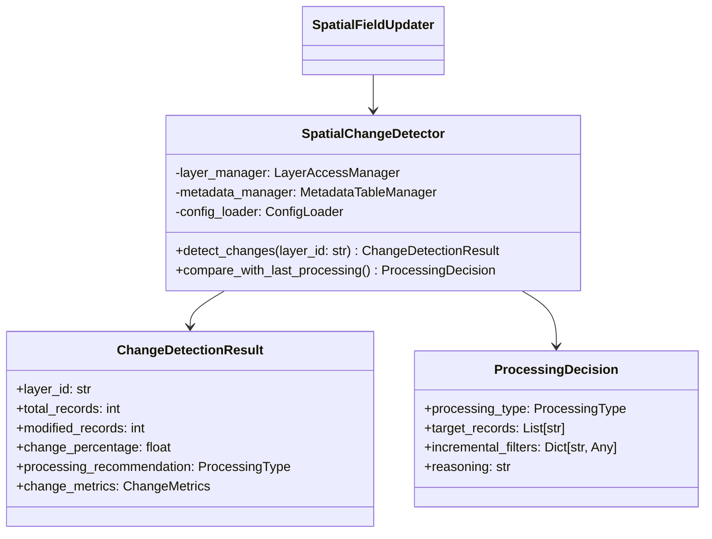

# Change Detection System

Intelligent detection of changes requiring spatial reprocessing following Context7 best practices.

## Overview

The Change Detection System monitors EditDate_1 field changes in ArcGIS layers to determine:
- Whether processing is needed
- Full reprocessing vs incremental updates  
- Specific records requiring processing

This system optimizes spatial field processing by avoiding unnecessary work when no changes are detected, and intelligently choosing between full and incremental processing based on the scope of changes.

## Architecture



## Components

### SpatialChangeDetector

Core change detection engine with Context7 optimizations:

```python
from modules.spatial_field_updater.change_detection import SpatialChangeDetector

# Initialize detector
detector = SpatialChangeDetector(layer_manager, metadata_manager, config_loader)

# Detect changes since last processing
result = detector.detect_changes("layer-id-123")

print(f"Changes detected: {result.modified_records} records ({result.change_percentage:.2f}%)")
print(f"Recommendation: {result.processing_recommendation}")
```

### Processing Decision Logic

Intelligent decision making based on change thresholds:

```python
# Get processing decision
decision = detector.compare_with_last_processing("layer-id-123")

if decision.processing_type == ProcessingType.INCREMENTAL_UPDATE:
    print(f"Process {len(decision.target_records)} specific records")
    print(f"Using WHERE clause: {decision.incremental_filters['where_clause']}")
elif decision.processing_type == ProcessingType.FULL_REPROCESSING:
    print("Full reprocessing required")
    print(f"Reason: {decision.reasoning}")
elif decision.processing_type == ProcessingType.NO_PROCESSING_NEEDED:
    print("No processing needed - no significant changes detected")
```

### Data Models

The system uses comprehensive Pydantic models for type safety and validation:

```python
from modules.spatial_field_updater.change_detection import (
    ProcessingType, ChangeDetectionResult, ProcessingDecision, ChangeMetrics
)

# ProcessingType enum values
ProcessingType.NO_PROCESSING_NEEDED     # No changes detected
ProcessingType.INCREMENTAL_UPDATE       # Process only changed records  
ProcessingType.FULL_REPROCESSING       # Process all records
ProcessingType.FORCE_FULL_UPDATE       # Force full processing due to errors

# Example result usage
result = detector.detect_changes("layer-123")
print(result.get_change_summary())  # Human-readable summary
print(result.model_dump())          # JSON-serializable dictionary
```

## Configuration

Change detection is configured in `field_updater_config.json`:

```json
{
  "change_detection": {
    "enabled": true,
    "edit_date_field": "EditDate_1",
    "thresholds": {
      "full_reprocess_percentage": 25.0,
      "incremental_threshold_percentage": 1.0,
      "max_incremental_records": 1000,
      "no_change_threshold_percentage": 0.1
    },
    "processing_decisions": {
      "default_processing_type": "incremental_update",
      "force_full_reprocess_days": 7,
      "max_incremental_age_hours": 24
    },
    "performance": {
      "batch_size": 100,
      "query_timeout_seconds": 60,
      "max_records_per_query": 5000
    }
  }
}
```

### Configuration Parameters

#### Thresholds
- `full_reprocess_percentage`: Percentage of changes that triggers full reprocessing (default: 25%)
- `incremental_threshold_percentage`: Minimum percentage change to trigger processing (default: 1%) 
- `max_incremental_records`: Maximum records for incremental processing (default: 1000)
- `no_change_threshold_percentage`: Changes below this are ignored (default: 0.1%)

#### Processing Decisions  
- `default_processing_type`: Default recommendation when thresholds are unclear
- `force_full_reprocess_days`: Days after which to force full reprocessing
- `max_incremental_age_hours`: Maximum age for incremental processing eligibility

#### Performance
- `batch_size`: Records per batch for large operations (default: 100)
- `query_timeout_seconds`: Timeout for individual queries (default: 60)
- `max_records_per_query`: Maximum records in single query (default: 5000)

## Context7 Best Practices

The change detection system implements several Context7 best practices for optimal ArcGIS API performance:

### Date-based Queries
```python
# Efficient date filtering using millisecond timestamps
timestamp_ms = int(since_timestamp.timestamp() * 1000)
where_clause = f"EditDate_1 > {timestamp_ms}"
```

### Optimized Counting
```python
# Use return_count_only for efficient record counting
modified_count = layer.query(where=where_clause, return_count_only=True)
```

### Minimal Field Selection
```python
# Query only required fields to minimize data transfer
result = layer.query(
    where=where_clause,
    out_fields=["OBJECTID"],
    result_record_count=max_records
)
```

### Batch Processing
```python
# Process large datasets in configurable batches
if record_count > max_incremental_records:
    # Switch to full reprocessing for efficiency
    processing_type = ProcessingType.FULL_REPROCESSING
```

### Metadata Integration
```python
# Compare with previous processing state
last_metadata = metadata_manager.read_last_processing_metadata()
change_result = detector.detect_changes(layer_id, last_metadata.process_timestamp)
```

## Integration with SpatialFieldUpdater

The change detection system integrates seamlessly with the SpatialFieldUpdater:

```python
from modules.spatial_field_updater.processor import SpatialFieldUpdater

# Initialize processor (change detection is automatically included)
updater = SpatialFieldUpdater(config_loader)

# Process with intelligent change detection
result = updater.process(dry_run=False)

# Check what processing was performed
if result.metadata["processing_skipped"]:
    print("No processing needed - no changes detected")
    print(f"Estimated time saved: {result.metadata['estimated_time_saved']} seconds")
else:
    print(f"Processing type: {result.metadata['processing_type']}")
    print(f"Records processed: {result.records_processed}")
```

## Usage Examples

### Basic Change Detection

```python
from modules.spatial_field_updater.change_detection import SpatialChangeDetector
from datetime import datetime, timedelta

# Initialize dependencies (typically done by SpatialFieldUpdater)
detector = SpatialChangeDetector(layer_manager, metadata_manager, config_loader)

# Check for changes in the last 24 hours
since_yesterday = datetime.now() - timedelta(days=1)
result = detector.detect_changes("weed-locations-layer", since_yesterday)

print(f"Analysis of {result.total_records} total records:")
print(f"- {result.modified_records} records modified ({result.change_percentage:.1f}%)")
print(f"- {result.new_records} new records")
print(f"- Recommendation: {result.processing_recommendation}")
print(f"- Processing time: {result.change_metrics.processing_duration:.2f} seconds")
```

### Processing Decision Workflow

```python
# Complete processing decision workflow
layer_id = "my-weed-locations-layer"

# Get processing recommendation based on last processing
decision = detector.compare_with_last_processing(layer_id)

print(f"Processing Decision: {decision.get_processing_summary()}")
print(f"Reasoning: {decision.reasoning}")

if decision.is_processing_needed():
    if decision.processing_type == ProcessingType.INCREMENTAL_UPDATE:
        print(f"Incremental processing: {len(decision.target_records)} records")
        print(f"Filter: {decision.incremental_filters['where_clause']}")
        print(f"Estimated time: {decision.estimated_processing_time:.1f} seconds")
    else:
        print("Full reprocessing required")
        
    # Configuration used for decision
    config = decision.configuration_used
    print(f"Thresholds: {config['thresholds']}")
else:
    print("No processing needed")
```

### Custom Threshold Configuration

```python
# Load and modify configuration programmatically
import json
from pathlib import Path

config_path = Path("modules/spatial_field_updater/config/field_updater_config.json")
with open(config_path) as f:
    config = json.load(f)

# Adjust thresholds for specific use case
config["change_detection"]["thresholds"]["incremental_threshold_percentage"] = 0.5
config["change_detection"]["thresholds"]["max_incremental_records"] = 2000

# Apply modified configuration
detector = SpatialChangeDetector(layer_manager, metadata_manager, config_loader)
```

### Performance Monitoring

```python
from modules.spatial_field_updater.change_detection.performance_optimizations import (
    PerformanceMonitor, get_performance_recommendations
)

# Monitor change detection performance
with PerformanceMonitor() as monitor:
    result = detector.detect_changes("large-layer-id")
    monitor.record_query(result.total_records)

# Get performance metrics and recommendations
metrics = monitor.get_metrics()
recommendations = get_performance_recommendations(metrics)

print(f"Performance metrics:")
print(f"- Query time: {metrics.query_time:.2f} seconds")
print(f"- Records analyzed: {metrics.record_count}")
print(f"- Efficiency score: {metrics.get_efficiency_score():.2f}")
print(f"Recommendations: {recommendations}")
```

### Error Handling

```python
try:
    result = detector.detect_changes("layer-id")
    
    if "error" in result.change_details:
        print(f"Change detection failed: {result.change_details['error']}")
        # Fallback to full processing
        decision = ProcessingDecision(
            processing_type=ProcessingType.FORCE_FULL_UPDATE,
            full_reprocess_required=True,
            reasoning="Change detection failed - forcing full update"
        )
    else:
        decision = detector.compare_with_last_processing("layer-id")
        
except Exception as e:
    print(f"Change detection error: {e}")
    # Implement appropriate error handling
```

## Performance Optimization

### Large Dataset Handling

For datasets with >10,000 records:

```python
# Automatic optimization for large datasets
result = detector.detect_changes("large-layer-id") 

if result.total_records > 10000:
    # System automatically uses:
    # - Batch processing for queries
    # - return_count_only for efficiency  
    # - Minimal field selection
    # - Configurable timeouts
    pass
```

### Memory Management

```python
from modules.spatial_field_updater.change_detection.performance_optimizations import (
    PerformanceOptimizer
)

# Configure for memory-constrained environments
optimizer = PerformanceOptimizer({
    "performance": {
        "batch_size": 50,           # Smaller batches
        "max_records_per_query": 2000,  # Reduce query size
        "query_timeout_seconds": 30     # Shorter timeouts
    }
})

# Calculate optimal batch size based on available memory  
optimal_batch = optimizer.calculate_optimal_batch_size(
    total_records=50000,
    available_memory_mb=256
)
```

### Query Optimization

```python
from modules.spatial_field_updater.change_detection.performance_optimizations import (
    optimize_incremental_query, QueryOptimizer
)

# Optimized incremental query for large change sets
where_clause = "EditDate_1 > 1704067200000"  # Optimized timestamp format
record_ids = optimize_incremental_query(layer, where_clause, max_records=1000)

# Advanced query parameter optimization
params = QueryOptimizer.create_optimized_query_params(where_clause, batch_size=100)
```

## Troubleshooting

### Common Issues

#### No Changes Detected When Expected
- Verify `edit_date_field` configuration matches layer schema
- Check timestamp comparison is using correct timezone
- Validate layer accessibility and permissions

#### Performance Issues
- Reduce `batch_size` for memory-constrained environments
- Increase `query_timeout_seconds` for slow networks
- Enable caching in LayerAccessManager configuration

#### Incorrect Processing Recommendations
- Review threshold configuration values
- Check `max_incremental_records` setting
- Validate metadata table timestamps

### Debug Logging

Enable debug logging for detailed analysis:

```python
import logging

# Enable debug logging for change detection
logging.getLogger('modules.spatial_field_updater.change_detection').setLevel(logging.DEBUG)

# Run change detection with detailed logging
result = detector.detect_changes("layer-id")
```

### Configuration Validation

```python
# Validate change detection configuration
try:
    is_valid = spatial_updater.validate_configuration()
    if not is_valid:
        print("Configuration validation failed")
        # Check logs for specific validation errors
except Exception as e:
    print(f"Configuration error: {e}")
```

## API Reference

### SpatialChangeDetector

Main class for change detection operations.

#### Methods

- `detect_changes(layer_id: str, since_timestamp: Optional[datetime] = None) -> ChangeDetectionResult`
  - Detect changes in a layer since specified timestamp
  - Returns comprehensive change analysis

- `compare_with_last_processing(layer_id: str) -> ProcessingDecision`
  - Compare with last processing metadata
  - Returns processing recommendation with reasoning

#### Configuration

Loads configuration from `change_detection` section of module config.

### Data Models

#### ChangeDetectionResult
Comprehensive result of change detection analysis.

**Fields:**
- `layer_id: str` - Layer identifier analyzed
- `total_records: int` - Total records in layer
- `modified_records: int` - Number of modified records  
- `change_percentage: float` - Percentage of records changed
- `processing_recommendation: ProcessingType` - Recommended processing type
- `change_metrics: ChangeMetrics` - Detailed performance metrics

**Methods:**
- `get_change_summary() -> str` - Human-readable summary

#### ProcessingDecision
Decision result for processing type and target records.

**Fields:**
- `processing_type: ProcessingType` - Recommended processing type
- `target_records: List[str]` - Specific record IDs for incremental processing
- `incremental_filters: Dict[str, Any]` - SQL filters for incremental processing
- `reasoning: str` - Explanation for decision
- `estimated_processing_time: Optional[float]` - Estimated processing time

**Methods:**
- `is_processing_needed() -> bool` - Whether any processing is needed
- `get_processing_summary() -> str` - Summary of processing decision

#### ProcessingType
Enumeration of processing type recommendations.

**Values:**
- `NO_PROCESSING_NEEDED` - No changes detected
- `INCREMENTAL_UPDATE` - Process only changed records
- `FULL_REPROCESSING` - Process all records  
- `FORCE_FULL_UPDATE` - Force full processing due to errors

## Contributing

When extending the change detection system:

1. Follow Context7 best practices for ArcGIS API usage
2. Add comprehensive tests for new functionality
3. Update configuration schema documentation
4. Include performance considerations
5. Maintain backward compatibility

## Version History

- **v1.0.0** - Initial implementation with EditDate_1 monitoring
- **v1.1.0** - Added performance optimizations and batch processing
- **v1.2.0** - Enhanced metadata integration and error handling 