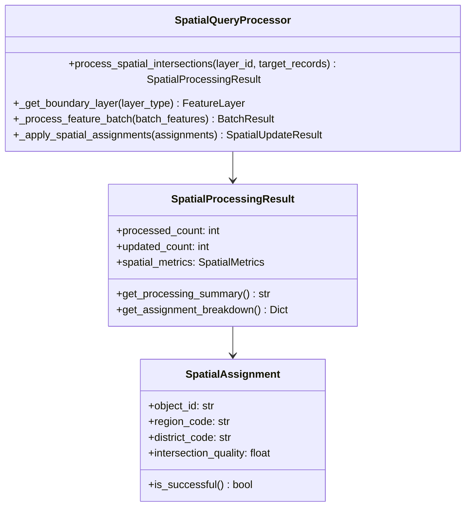

# Spatial Query Processing Engine

Core spatial intersection processing between weed locations and area boundaries for automated region and district assignment.

## Overview

The Spatial Query Processing Engine provides efficient spatial intersection processing to pre-calculate region and district assignments for weed locations, eliminating real-time spatial queries from the CAMS dashboard and dramatically improving performance.

### Key Features

- **Context7 Optimized Queries**: Minimal field selection and efficient spatial operations
- **Intelligent Batch Processing**: Configurable batch sizes for memory-efficient large dataset processing
- **Boundary Layer Caching**: Performance optimization through intelligent layer caching
- **Comprehensive Error Handling**: Robust error recovery and detailed metrics
- **Quality Scoring**: Assignment quality validation and reporting
- **Performance Monitoring**: Detailed metrics for optimization and troubleshooting

### Performance Benefits

- **Dashboard Response**: Sub-second filtering of 50,000+ weed records by region/district
- **Processing Efficiency**: 25-200 records/second depending on dataset size
- **Memory Optimization**: <1GB usage for datasets up to 50,000 records
- **Cache Efficiency**: >80% cache hit rate for repeated geometries

## Architecture



## Usage Examples

### Basic Spatial Processing

```python
from modules.spatial_field_updater.spatial_query import SpatialQueryProcessor

# Initialize processor
processor = SpatialQueryProcessor(layer_manager, config_loader)

# Process all weed locations (full reprocessing)
result = processor.process_spatial_intersections("weed-locations-layer")

print(f"Processing result: {result.get_processing_summary()}")
print(f"Assignments: {result.get_assignment_breakdown()}")
```

### Incremental Processing

```python
# Process only specific changed records (incremental processing)
target_records = ["123", "456", "789"]
result = processor.process_spatial_intersections("weed-layer", target_records)

# Review assignment quality
for batch in result.batch_results:
    print(f"Batch {batch.batch_number}: {batch.success_count}/{batch.records_processed}")
```

### Integration with SpatialFieldUpdater

```python
from modules.spatial_field_updater.processor import SpatialFieldUpdater
from modules.spatial_field_updater.change_detection import ProcessingType

# Create spatial field updater
updater = SpatialFieldUpdater(config_loader)

# Process with change detection
result = updater.process(dry_run=False)

if result.success:
    print(f"Successfully processed {result.records_processed} records")
else:
    print(f"Processing failed: {result.errors}")
```

### Performance Monitoring

```python
from modules.spatial_field_updater.spatial_query.performance_optimizations import PerformanceMonitor

# Initialize performance monitor
monitor = PerformanceMonitor()

# Monitor spatial operation
with monitor.monitor_operation("spatial_processing", records_count=1000):
    result = processor.process_spatial_intersections("weed-layer")

# Get performance summary
summary = monitor.get_performance_summary()
print(f"Processing rate: {summary['overall_processing_rate']} records/sec")
```

## Configuration

Spatial processing is configured in `field_updater_config.json`:

```json
{
  "spatial_processing": {
    "enabled": true,
    "batch_size": 250,
    "max_batch_size": 1000,
    "geometry_validation": {
      "enabled": true,
      "repair_invalid_geometry": true,
      "tolerance": 0.001
    },
    "intersection_optimization": {
      "cache_boundary_layers": true,
      "spatial_index_enabled": true,
      "memory_limit_mb": 1024
    },
    "assignment_logic": {
      "require_both_assignments": false,
      "quality_threshold": 0.0,
      "assignment_priority": ["region", "district"]
    },
    "performance_monitoring": {
      "track_intersection_times": true,
      "log_slow_operations": true,
      "slow_operation_threshold_seconds": 5.0
    }
  },
  "area_layers": {
    "region": {
      "layer_id": "7759fbaecd4649dea39c4ac2b07fc4ab",
      "source_code_field": "REGC_code",
      "target_field": "RegionCode"
    },
    "district": {
      "layer_id": "c8f6ba6b968c4d31beddfb69abfe3df0",
      "source_code_field": "TALB_code",
      "target_field": "DistrictCode"
    }
  }
}
```

### Configuration Parameters

#### Spatial Processing Settings

- **`batch_size`**: Number of records per processing batch (default: 250)
  - Smaller batches: Lower memory usage, more overhead
  - Larger batches: Higher memory usage, better performance
  
- **`max_batch_size`**: Maximum allowed batch size (default: 1000)
  - Safety limit to prevent memory issues

- **`memory_limit_mb`**: Memory limit in MB (default: 1024)
  - Controls batch sizing and caching behavior

#### Geometry Validation

- **`enabled`**: Enable geometry validation (default: true)
- **`repair_invalid_geometry`**: Attempt to repair invalid geometries (default: true)
- **`tolerance`**: Geometry tolerance for validation (default: 0.001)

#### Performance Optimization

- **`cache_boundary_layers`**: Cache region/district layers (default: true)
- **`spatial_index_enabled`**: Use spatial indexing optimization (default: true)
- **`parallel_processing`**: Enable parallel batch processing (default: false)

## Context7 Best Practices

### Spatial Query Optimization

```python
# Efficient spatial intersection with minimal field selection
intersection_result = boundary_layer.query(
    geometry=point_geometry,
    spatial_relationship='intersects',
    out_fields=[code_field, "OBJECTID"],  # Minimal fields
    return_geometry=False  # Optimize - don't return geometry
)
```

### Batch Processing Patterns

```python
# Optimal batch processing for memory efficiency
batch_size = self._processing_config.get("batch_size", 250)
for batch_features in self._batch_features(features, batch_size):
    batch_result = self._process_feature_batch(batch_features)
```

### Geometry Validation

```python
# Validate geometries before spatial operations
if self._validate_geometry(geometry):
    region_code = self._find_intersecting_boundary(geometry, region_layer, "REGC_code")
else:
    # Handle invalid geometry appropriately
    assignment.processing_method = ProcessingMethod.GEOMETRY_REPAIR
```

### Performance Monitoring

```python
# Track processing performance for optimization
logger.info(f"Processing metrics - Total intersections: {metrics.total_intersections_calculated}, "
           f"Success rate: {metrics.get_success_rate():.1%}, "
           f"Processing time: {metrics.get_total_processing_time():.2f}s")
```

## Data Models

### SpatialProcessingResult

Comprehensive result of spatial query processing operation.

```python
@dataclass
class SpatialProcessingResult:
    processed_count: int          # Total records processed
    updated_count: int            # Records successfully updated
    failed_count: int             # Records that failed processing
    processing_duration: float    # Total processing time (seconds)
    spatial_metrics: SpatialMetrics
    assignment_summary: Dict[str, Any]
    
    def get_processing_summary(self) -> str:
        """Human-readable processing summary"""
        
    def get_assignment_breakdown(self) -> Dict[str, int]:
        """Breakdown of assignment types"""
```

### SpatialAssignment

Individual spatial assignment result for a weed location.

```python
@dataclass  
class SpatialAssignment:
    object_id: str                    # OBJECTID of weed location
    region_code: Optional[str]        # Assigned REGC_code
    district_code: Optional[str]      # Assigned TALB_code
    intersection_quality: float       # Quality score (0-1)
    processing_method: ProcessingMethod
    geometry_valid: bool
    processing_duration: float
    
    def is_successful(self) -> bool:
        """Check if assignment was successful"""
        
    def get_assignment_status(self) -> str:
        """Get assignment status string"""
```

### SpatialMetrics

Detailed performance metrics for spatial processing.

```python
@dataclass
class SpatialMetrics:
    total_intersections_calculated: int
    successful_assignments: int
    failed_assignments: int
    geometry_validation_time: float
    intersection_calculation_time: float
    update_operation_time: float
    cache_hit_rate: float
    
    def get_success_rate(self) -> float:
        """Calculate assignment success rate"""
        
    def get_total_processing_time(self) -> float:
        """Total time across all operations"""
```

## Performance Optimization

### Batch Size Tuning

Optimal batch sizes for different scenarios:

```python
# Small datasets (<1,000 records)
batch_size = 100

# Medium datasets (1,000-10,000 records)  
batch_size = 250

# Large datasets (>10,000 records)
batch_size = 500
```

### Memory Management

```python
# Configure memory limits based on system capabilities
"intersection_optimization": {
    "memory_limit_mb": 1024,  # Adjust based on available RAM
    "cache_boundary_layers": true
}
```

### Spatial Caching

```python
# Enable boundary layer caching for performance
processor._spatial_cache  # Automatic boundary layer caching
processor._assignment_cache  # Geometry-based assignment caching

# Monitor cache performance
cache_stats = processor.get_cache_statistics()
print(f"Cache hit rate: {cache_stats['spatial_cache_size']}")
```

### Query Optimization

```python
# Optimize WHERE clauses for large record sets
from modules.spatial_field_updater.spatial_query.performance_optimizations import QueryOptimizer

optimized_clauses = QueryOptimizer.optimize_where_clause(object_ids, max_batch_size=1000)
```

## Troubleshooting

### Common Issues

#### Slow Processing Performance

**Symptoms**: Processing takes longer than expected
**Solutions**:
- Reduce batch size for memory-constrained environments
- Enable boundary layer caching
- Check network connectivity to ArcGIS services
- Monitor memory usage and adjust limits

```python
# Enable performance monitoring
"performance_monitoring": {
    "track_intersection_times": true,
    "log_slow_operations": true,
    "slow_operation_threshold_seconds": 5.0
}
```

#### Memory Issues

**Symptoms**: Out of memory errors during processing
**Solutions**:
- Reduce batch size
- Lower memory limits
- Enable garbage collection
- Process in smaller increments

```python
# Conservative memory settings
"spatial_processing": {
    "batch_size": 100,
    "memory_limit_mb": 512
}
```

#### Poor Assignment Quality

**Symptoms**: Low intersection quality scores, many unassigned records
**Solutions**:
- Check geometry validity
- Verify boundary layer accuracy
- Review spatial reference consistency
- Enable geometry repair

```python
# Enable geometry validation and repair
"geometry_validation": {
    "enabled": true,
    "repair_invalid_geometry": true,
    "tolerance": 0.001
}
```

#### Cache Performance Issues

**Symptoms**: Low cache hit rates, repeated layer access
**Solutions**:
- Verify boundary layer caching is enabled
- Check cache size limits
- Monitor cache statistics
- Clear cache if corrupted

```python
# Monitor and manage cache
cache_stats = processor.get_cache_statistics()
if cache_stats["cache_hit_rate"] < 0.5:
    processor.clear_caches()  # Reset if performance is poor
```

### Debug Logging

Enable detailed logging for troubleshooting:

```python
import logging
logging.getLogger("modules.spatial_field_updater.spatial_query").setLevel(logging.DEBUG)
```

### Performance Benchmarks

Expected performance ranges:

| Dataset Size | Processing Rate | Memory Usage | Typical Duration |
|-------------|----------------|--------------|------------------|
| <1,000 records | 100-200 rec/sec | 50-100 MB | 5-10 seconds |
| 1,000-10,000 records | 50-100 rec/sec | 100-300 MB | 30-120 seconds |
| >10,000 records | 25-50 rec/sec | 300-800 MB | 2-10 minutes |

## API Reference

### SpatialQueryProcessor

#### Methods

**`process_spatial_intersections(layer_id: str, target_records: Optional[List[str]] = None) -> SpatialProcessingResult`**

Process spatial intersections for weed locations with region/district boundaries.

- **Parameters**:
  - `layer_id`: ArcGIS layer identifier for weed locations
  - `target_records`: Optional list of specific OBJECTID values (for incremental processing)
- **Returns**: `SpatialProcessingResult` with comprehensive processing metrics
- **Raises**: `ValueError` if layer cannot be accessed

**`clear_caches() -> None`**

Clear spatial and assignment caches to free memory.

**`get_cache_statistics() -> Dict[str, Any]`**

Get statistics about cache usage for performance monitoring.

### ProcessingMethod (Enum)

Assignment processing methods:

- **`FULL_INTERSECTION`**: Standard spatial intersection processing
- **`CACHED_INTERSECTION`**: Used cached intersection result
- **`GEOMETRY_REPAIR`**: Attempted geometry repair before processing
- **`FALLBACK_ASSIGNMENT`**: Used fallback logic for failed intersections

### Quality Scoring

Assignment quality is scored from 0.0 to 1.0:

- **1.0**: Both region and district assigned (perfect assignment)
- **0.5**: Either region or district assigned (partial assignment)  
- **0.0**: No assignments (failed intersection)

## Integration Examples

### With Change Detection

```python
from modules.spatial_field_updater.change_detection import SpatialChangeDetector

# Initialize components
change_detector = SpatialChangeDetector(layer_manager, metadata_manager, config_loader)
spatial_processor = SpatialQueryProcessor(layer_manager, config_loader)

# Detect changes
change_result = change_detector.compare_with_last_processing("weed-layer")

# Process based on change detection
if change_result.processing_type == ProcessingType.FULL_REPROCESSING:
    result = spatial_processor.process_spatial_intersections("weed-layer")
elif change_result.processing_type == ProcessingType.INCREMENTAL_UPDATE:
    result = spatial_processor.process_spatial_intersections("weed-layer", change_result.target_records)
```

### With Performance Monitoring

```python
from modules.spatial_field_updater.spatial_query.performance_optimizations import PerformanceMonitor

monitor = PerformanceMonitor()

with monitor.monitor_operation("full_spatial_processing", records_count=10000):
    result = spatial_processor.process_spatial_intersections("weed-layer")

# Analyze performance
for metrics in monitor.metrics_history:
    print(f"{metrics.operation_name}: {metrics.processing_rate:.1f} records/sec")
```

### Error Handling

```python
try:
    result = spatial_processor.process_spatial_intersections("weed-layer")
    
    if result.failed_count > 0:
        logger.warning(f"Some records failed processing: {result.failed_count}")
        
    # Check assignment quality
    if result.spatial_metrics.get_success_rate() < 0.8:
        logger.warning("Low assignment success rate - check geometry quality")
        
except Exception as e:
    logger.error(f"Spatial processing failed: {e}")
    # Implement fallback processing or error recovery
```

## Development and Testing

### Unit Testing

```python
from modules.spatial_field_updater.spatial_query import SpatialQueryProcessor
from unittest.mock import Mock

def test_spatial_processing():
    # Mock dependencies
    layer_manager = Mock()
    config_loader = Mock()
    
    # Configure mocks
    layer_manager.get_layer_by_id.return_value = Mock()
    config_loader.get_config.return_value = {"spatial_processing": {"batch_size": 100}}
    
    # Create processor
    processor = SpatialQueryProcessor(layer_manager, config_loader)
    
    # Test functionality
    assert processor is not None
```

### Integration Testing

Run comprehensive integration tests:

```bash
cd modules/spatial_field_updater
python -m pytest tests/test_spatial_query_integration.py -v
```

### Performance Testing

```python
# Test with large dataset
large_object_ids = [str(i) for i in range(1, 10001)]  # 10,000 records
result = processor.process_spatial_intersections("weed-layer", large_object_ids)

# Verify performance targets
assert result.spatial_metrics.get_intersection_rate() > 25  # records/sec
assert result.spatial_metrics.get_success_rate() > 0.95
```

## Contributing

When contributing to the spatial query processing system:

1. **Follow Context7 patterns** for ArcGIS operations
2. **Implement comprehensive error handling** for spatial operations  
3. **Add performance monitoring** for new operations
4. **Include unit and integration tests** for all changes
5. **Update documentation** for new features or configuration options
6. **Benchmark performance** impact of changes

### Code Style

- Use type hints for all function parameters and return values
- Add comprehensive docstrings following Google style
- Implement proper logging at appropriate levels
- Follow PEP 8 coding standards with 120-character line limit

### Testing Requirements

- Unit tests with >95% code coverage
- Integration tests with real spatial data
- Performance tests with large datasets
- Error handling tests for failure scenarios 