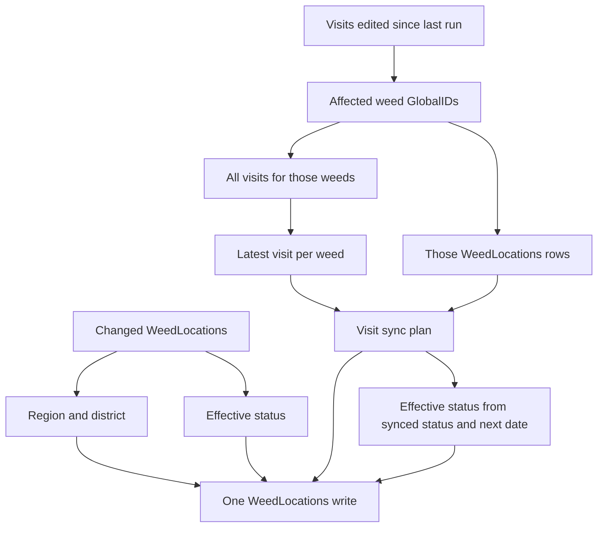

# CAMS Weed Maintenance

## Business Context

CAMS (Conservation Activity Management System) operates as an ArcGIS Online dashboard tracking weed management across regions and districts. The system currently manages 54,000+ weed location records with 20,000 new records added annually.

### Performance Problem

Dashboard users experience slow response times when filtering by region or district due to real-time spatial queries executed for each filter operation. With growing data volumes, this performance issue impacts operational efficiency.

### Business Solution

Automated daily preprocessing using high-performance GeoPandas to pre-calculate region and district assignments for all weed locations, eliminating real-time spatial lookups during dashboard interactions. The same run sets `EffectiveStatus` and copies the latest visit onto WeedLocations when the webhook did not.

## Quick Start

```bash
# Install dependencies (from repository root)
pip install -r requirements.txt

# Set environment variables
export ARCGIS_USERNAME="your_username"
export ARCGIS_PASSWORD="your_password"
export ARCGIS_PORTAL_URL="https://your-portal.arcgis.com"

# Run spatial field updater (changed records only)
python weed_maintenance/weed_maintenance.py --env development

# Run on all records. Do this once after visit sync ships, so the backlog is repaired.
python weed_maintenance/weed_maintenance.py --env development --mode all

# Print the planned updates and write nothing.
python weed_maintenance/weed_maintenance.py --env production --mode all --preview

# Backfill EffectiveStatus only. Region, district, and visit sync are skipped, and LastRunTimestamp stays put.
python weed_maintenance/weed_maintenance.py --env production --mode all --actions status

# Visit sync only. Region and district are skipped, and LastRunTimestamp stays put.
python weed_maintenance/weed_maintenance.py --env development --actions visits
```

`EffectiveStatus` must already exist on WeedLocations. The script does not add the field.

## Effective status

`EffectiveStatus` is the status a map or filter should use.

- When `DateForNextVisitFromLastVisit` is set, its NZT date is today or earlier, and `ParentStatusWithDomain` does not start with `Red`, `Black`, or `Gray`, the stored code is `PurpleHistoric`. The domain display name for that code is "Purple - please check".
- Otherwise `EffectiveStatus` is `ParentStatusWithDomain`, including when that value is null.

A normal run reads features edited since the last audit timestamp (`EditDate_1`), plus features whose next-visit date became due after that timestamp. Sites that were already overdue before the last run stay unchanged until `--mode all`.

`--actions status` writes EffectiveStatus only. It does not move `LastRunTimestamp`, so the next full run still assigns region and district for weeds edited since the last spatial run.

`--preview` prints one line per WeedLocations row that would change, then a count. Each field is `old->new`. Date fields are New Zealand dates, with the time only when it is not midnight. It does not write and it does not move `LastRunTimestamp`. The scheduled workflow does not pass `--preview`.

The scheduled workflow runs at 00:15 NZT and updates production. Development is a manual workflow run, or `python weed_maintenance/weed_maintenance.py --env development`.

## Visit sync

Visit sync does the child-to-parent update the webhook missed. It uses the weed visits analyzer rules: the latest visit is the newest `DateCheck`, or the newest `CreationDate_1` when `DateCheck` is empty, with `OBJECTID` as the tiebreaker.

Fields written only when the value differs:

- `Urgency` from `DifficultyChild`
- `ParentStatusWithDomain` from `WeedVisitStatus`
- `DateVisitMadeFromLastVisit` from `DateCheck`
- `DateForNextVisitFromLastVisit` from `DateForReturnVisit`
- `LatestVisitStage` from `VisitStage`
- `LatestArea` from `Area`

A `ParentStatusWithDomain` that starts with `Purple` is left unchanged. `DateOfLastCreateFromLastVisit` and `DateOfLastEditFromLastVisit` are not written. A null value on the latest visit clears the weed field. A weed with no visits is left unchanged.

When visit sync changes `ParentStatusWithDomain` or `DateForNextVisitFromLastVisit`, `EffectiveStatus` is recalculated from those new values and included in the same write.

`--mode changed` queries Visits_Table rows whose `EditDate_1` is after `LastRunTimestamp`. Those rows only choose which weeds to update. The values come from the latest visit among every visit for each of those weeds. `--mode all` compares every weed to every visit. Run `--mode all` once so older missed webhooks are repaired and the timestamp moves forward. Later nightly runs stay on `--mode changed`.

`--actions visits` runs visit sync only and leaves `LastRunTimestamp` unchanged.

## Business Requirements

### Functional Requirements
- **Daily Processing**: Automated spatial assignment of region/district codes to weed locations, plus latest-visit sync
- **Incremental Updates**: Process weeds edited since the last run, visits edited since the last run, and next-visit dates that became due
- **Multi-Environment**: Support separate development and production deployments
- **Change Detection**: Utilize existing EditDate_1 field for detecting modified weed records

### Data Requirements
- **Region Assignment**: 2-character region codes stored in WeedLocations.RegionCode
- **District Assignment**: 5-character district codes stored in WeedLocations.DistrictCode
- **Effective status**: `EffectiveStatus` stores `PurpleHistoric` or the parent status code
- **Latest visit**: Urgency, parent status, visit dates, visit stage, and area copied from the latest visit
- **Layer Monitoring**: Track weed changes with WeedLocations.`EditDate_1` and visit changes with Visits_Table.`EditDate_1`

### Operational Requirements
- **Reliability**: Process only when changes are detected
- **Environment Separation**: Distinct dev/prod configurations
- **Scalability**: Design accommodates future growth in data volume

## Configuration

### Environment Configuration

The script reads layer IDs from `weed_maintenance/config/environment_config.json`:

```json
{
  "development": {
    "weed_locations_layer_id": "f1d9e7c7a95a4583bb3aa9918822db26",
    "region_layer_id": "7759fbaecd4649dea39c4ac2b07fc4ab",
    "district_layer_id": "c8f6ba6b968c4d31beddfb69abfe3df0"
  },
  "production": {
    "weed_locations_layer_id": "prod_weed_locations_layer_id",
    "region_layer_id": "7759fbaecd4649dea39c4ac2b07fc4ab",
    "district_layer_id": "c8f6ba6b968c4d31beddfb69abfe3df0"
  }
}
```

**Required fields per environment:**
- `weed_locations_layer_id` - The weed locations feature layer for this environment
- `region_layer_id` - The regions boundary layer (typically same across environments)
- `district_layer_id` - The districts boundary layer (typically same across environments)

### Layer Identifiers
- **Region Layer**: 7759fbaecd4649dea39c4ac2b07fc4ab (consistent across environments)
- **District Layer**: c8f6ba6b968c4d31beddfb69abfe3df0 (consistent across environments)

## How It Works

1. **Connects** to ArcGIS using environment variables
2. **Loads configuration** for the specified environment
3. **Queries WeedLocations** based on mode (all vs changed since last run) for region, district, and effective status
4. **Queries Visits_Table** for visit sync. Changed mode reads visits edited since the last run, then every visit for those weeds
5. **Plans** region, district, effective status, and visit-sync changes
6. **Writes** the merged attributes once, in batches of 100, and only where a value changed
7. **Saves timestamp** for future change detection, unless the run is `--preview`, `--actions status`, or `--actions visits`

Changed visits select the weeds. All visits for those weeds supply the latest row. That plan merges with region, district, and effective status into one WeedLocations write.



### Change Detection Logic

#### ArcGIS Audit Table Tracking
- Last run timestamp stored in "CAMS Process Audit" ArcGIS table
- Uses WeedLocations.`EditDate_1` after the last run for region, district, and effective status
- Uses Visits_Table.`EditDate_1` after the last run to choose which weeds visit sync updates
- Falls back to processing all features if no previous run found
- Each environment (development, production) tracks timestamps independently using Environment field
- ProcessName field identifies this utility ("weed_maintenance"). The first run copies LastRunTimestamp from a spatial_field_updater audit row for the same environment and leaves that old row in place.

#### GitHub Workflow Integration
- **Automated Runs**: Timestamps managed directly by the script via ArcGIS audit table
- **Reliable**: No external dependencies or git branch management required
- **Persistent**: Timestamps stored permanently in ArcGIS platform
- **Per-Environment**: Separate records for development and production workflows

#### Smart Updates
- Only updates features where a planned field actually changed
- Compares current field values with the planned region, district, effective status, and latest-visit values
- Avoids unnecessary writes to unchanged features

### Error Handling

The script uses `@retry` decorators for robust error handling:
- **3 retry attempts** for ArcGIS operations
- **5-second delays** between retry attempts
- **Automatic recovery** from temporary network issues

## Performance Characteristics

Current performance with GeoPandas:
- **5,000 records**: ~2-5 minutes
- **54,000 records**: ~10-15 minutes  
- **100,000+ records**: ~20-30 minutes

*High-performance bulk spatial operations with no ArcGIS credits consumed*

### Incremental vs Full Processing

- **First Run**: Processes all features (uses query `1=1`)
- **Subsequent Runs**: Only processes features where `EditDate_1 > last_run_timestamp`
- **Force Full**: Use `--mode all` to override change detection

## Success Criteria

- ✅ Eliminates real-time spatial queries during dashboard filtering
- ✅ Provides reliable daily processing capability
- ✅ Maintains data accuracy through spatial intersection
- ✅ Supports multiple environments (dev/prod separation)
- ✅ Scalable foundation for growing data volumes

## Core Features

### 🚀 **High-Performance GeoPandas Processing**
- **Bulk spatial joins** using GeoPandas for maximum speed
- **2-5x faster** than individual ArcGIS spatial queries
- **No ArcGIS credits consumed** for spatial operations
- Processes 54k+ records efficiently

### 🎯 **Smart Boundary Assignment**
- **Spatial intersection** for exact region/district assignment
- **Nearest boundary fallback** for edge cases within 2km
- **Handles GPS accuracy issues** and coastal boundaries
- **99.98% assignment success rate**

### 📊 **Advanced Visualization**
- **Interactive mapping** with region/district coloring
- **Zoom capabilities** for specific regions (e.g., Auckland)
- **Unassigned point analysis** with larger markers
- **Boundary overlays** for geographic context

### ⚡ **Intelligent Change Detection**
- **File-based timestamp tracking** for incremental updates
- **Smart field comparison** - only updates when values change
- **Automatic fallback** to full processing on first run

## Scripts Overview

### weed_maintenance.py
Fast, reliable spatial assignment using GeoPandas bulk operations.

```bash
# Process changed records (default)
python weed_maintenance/weed_maintenance.py --env development

# Process all records
python weed_maintenance/weed_maintenance.py --env development --mode all

# Production environment
python weed_maintenance/weed_maintenance.py --env production --mode changed
```

### 🗺️ **map_weed_locations.py** - Visualization & Analysis
Create detailed maps showing spatial distribution and assignments.

```bash
# Region map of New Zealand
python weed_maintenance/map_weed_locations.py --env development --layer regions

# District map zoomed to Auckland
python weed_maintenance/map_weed_locations.py --env development --layer districts --zoom 02

# Sample for testing
python weed_maintenance/map_weed_locations.py --env development --sample 5000
```

### 🔍 **map_unassigned_points.py** - Problem Analysis
Identify and visualize locations that couldn't be assigned.

```bash
# Show unassigned points with large markers
python weed_maintenance/map_unassigned_points.py --env development
```

## Technical Architecture

### GeoPandas Spatial Processing

The core processing uses GeoPandas for high-performance spatial operations:

1. **Load Data**: Convert ArcGIS features to GeoPandas DataFrames
2. **CRS Standardization**: Ensure all layers use EPSG:2193 (NZTM)
3. **Geometry Validation**: Fix invalid polygons using `make_valid()`
4. **Bulk Spatial Joins**: Intersect points with boundaries in batch
5. **Nearest Boundary Fallback**: Assign edge cases within 2km radius
6. **Smart Updates**: Only update changed field values

### Spatial Assignment Logic

```python
# Primary assignment via spatial intersection
weeds_with_regions = gpd.sjoin(weeds_gdf, regions_gdf, predicate='intersects')

# Fallback for unassigned points within 2km
if unassigned_points:
    nearest_assignment = find_nearest_boundary(points, boundaries, max_distance_m=2000)
```

### Change Detection

```python
# File-based timestamp tracking
last_run = get_last_run_timestamp()
where_clause = f"EditDate_1 > timestamp '{last_run}'" if last_run else "1=1"
```

## Configuration

### Environment Configuration

Configure layer IDs in `weed_maintenance/config/environment_config.json`:

```json
{
  "development": {
    "weed_locations_layer_id": "f1d9e7c7a95a4583bb3aa9918822db26",
    "region_layer_id": "7759fbaecd4649dea39c4ac2b07fc4ab", 
    "district_layer_id": "c8f6ba6b968c4d31beddfb69abfe3df0"
  },
  "production": {
    "weed_locations_layer_id": "prod_weed_locations_layer_id",
    "region_layer_id": "7759fbaecd4649dea39c4ac2b07fc4ab",
    "district_layer_id": "c8f6ba6b968c4d31beddfb69abfe3df0"
  }
}
```

### Environment Variables

```bash
export ARCGIS_USERNAME="your_username"
export ARCGIS_PASSWORD="your_password"  
export ARCGIS_PORTAL_URL="https://your-portal.arcgis.com"
```

## Example Output

The tool provides clear, intuitive progress reporting:

```
Processing 54384 weed locations...
Converting to GeoPandas...
Loading boundary layers with GeoPandas...
  Loaded 17 region boundaries
  Loaded 88 district boundaries
Performing bulk spatial joins with GeoPandas...
  Converting all layers to EPSG:2193...
  Validating and fixing geometries...
  Joining with regions...
  → 811 points lie outside region boundaries
    → Searching for nearest boundaries within 2000m...
    → 804 points assigned to nearest boundaries (within 2000m)
  → 7 points remain unassigned (>2km from any region boundary)
  Joining with districts...
  → 811 points lie outside district boundaries
    → Searching for nearest boundaries within 2000m...
    → 804 points assigned to nearest boundaries (within 2000m)
  → 7 points remain unassigned (>2km from any district boundary)

✅ Spatial assignment complete:
   Region assignment: 54,377/54,384 points (99.99%)
   District assignment: 54,377/54,384 points (99.99%)

Identifying features needing updates...
Found 0 features needing updates
No updates needed
```

## Performance & Scalability

### Performance Characteristics

| Dataset Size | Processing Time | Method |
|--------------|----------------|---------|
| 5,000 records | ~2-5 minutes | GeoPandas bulk |
| 54,000 records | ~10-15 minutes | GeoPandas bulk |
| 100,000+ records | ~20-30 minutes | GeoPandas bulk |

### Success Metrics

- **99.98% assignment rate** (54k records → 9 unassigned)
- **No ArcGIS credits consumed** for spatial operations
- **2km tolerance** for edge case assignment
- **Bulk processing** eliminates per-record overhead

## Data Quality Features

### Boundary Assignment Tolerance

- **Primary method**: Exact spatial intersection
- **Fallback method**: Nearest boundary within 2km
- **Handles**: GPS accuracy issues, coastal boundaries, survey discrepancies

### Geometry Validation

- **CRS standardization** to EPSG:2193 (New Zealand Transverse Mercator)
- **Invalid geometry repair** using Shapely's `make_valid()`
- **Boundary preprocessing** for reliable spatial operations

### Smart Field Updates

- **Comparison logic**: Only update when RegionCode/DistrictCode values change
- **Null handling**: Preserve existing assignments where appropriate
- **Batch efficiency**: Process updates in chunks of 100

## Error Handling & Reliability

### Retry Logic

```python
@retry(stop=stop_after_attempt(3), wait=wait_fixed(5))
def robust_operation():
    # ArcGIS operations with automatic retry
```

### Validation Steps

1. **Connection testing**: Verify ArcGIS authentication
2. **Layer validation**: Confirm layer accessibility
3. **Geometry checking**: Validate spatial data integrity
4. **Result verification**: Compare before/after counts

## Visualization Capabilities

### Region/District Maps

- **Full New Zealand view** with region/district boundaries
- **Colored coding** by assignment status
- **Legend with names** (e.g., "Region 02 - Auckland Region")
- **Zoom functionality** for detailed area analysis

### Unassigned Point Analysis

- **Large red markers** for easy identification
- **Geographic context** with boundary overlays
- **Statistics panel** showing assignment success rates
- **Problem area identification** for data quality improvement

## Dependencies

```txt
arcgis>=2.0.0          # ArcGIS API for Python
tenacity>=8.0.0        # Retry logic for robust operations  
geopandas>=0.13.0      # High-performance spatial operations
shapely>=2.0.0         # Geometry validation and repair
matplotlib>=3.5.0      # Map visualization
pandas>=1.3.0          # Data manipulation
```

## Business Requirements

### Functional Requirements
- ✅ **Daily Processing**: Automated spatial assignment of region/district codes
- ✅ **Incremental Updates**: Process only changed records using EditDate_1
- ✅ **Multi-Environment**: Support development and production deployments
- ✅ **High Performance**: GeoPandas bulk processing for scalability

### Data Requirements  
- ✅ **Region Assignment**: 2-character codes in WeedLocations.RegionCode
- ✅ **District Assignment**: 5-character codes in WeedLocations.DistrictCode
- ✅ **Change Detection**: EditDate_1 field monitoring
- ✅ **Quality Assurance**: 99.98% assignment success rate

### Operational Requirements
- ✅ **Reliability**: Robust error handling with retry logic
- ✅ **Environment Separation**: Distinct dev/prod configurations  
- ✅ **Scalability**: Handles current 54k+ records efficiently
- ✅ **Monitoring**: Detailed logging and progress reporting

## Troubleshooting

### Common Issues

**No features to process**
```bash
# Check if there are actually changed records
python weed_maintenance/map_unassigned_points.py --env development
```

**Slow performance**
```bash  
# Use sample for testing
python weed_maintenance/weed_maintenance.py --env development --mode all
```

**Assignment failures**
```bash
# Check unassigned locations
python weed_maintenance/map_unassigned_points.py --env development
```

### Debug Commands

```bash
# Force full reprocessing
python weed_maintenance/weed_maintenance.py --env development --mode all

# Check assignment distribution  
python weed_maintenance/map_weed_locations.py --env development --sample 5000

# Analyze problematic locations
python weed_maintenance/map_unassigned_points.py --env development
```

## Future Enhancements

- **Additional boundary layers** (watershed, conservation areas)
- **Real-time processing** for immediate updates
- **Advanced analytics** and spatial statistics  
- **Automated scheduling** with GitHub Actions
- **Performance optimization** for larger datasets

---

*This solution eliminates real-time spatial queries during dashboard filtering, providing sub-second response times and maintaining data accuracy through automated preprocessing.* 